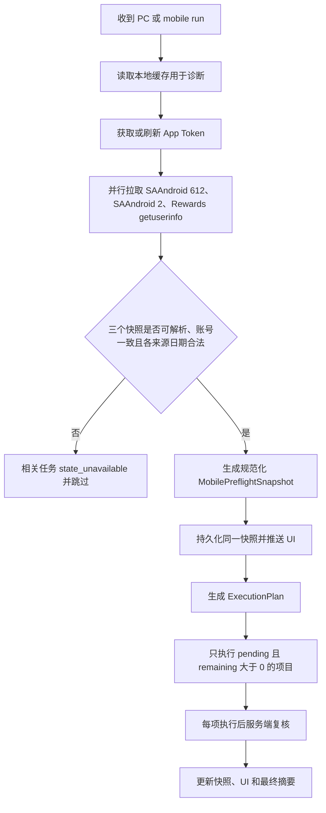

# 需求历史快照（截至 2026-09-06）

> 历史证据，非现行工作指令。以下保留整理前正文和验收记录，未因归档重新验收任何功能。旧流程、契约及交接表不再作为现行规则；现行入口见 [开发需求文档](../../开发需求文档.md)，字段语义见 [接口注册表](../API_INTERFACE_REGISTRY.md)。只按本次相关 REQ 编号读取，不要求通读。
>
> 已替代规则：后台 30 秒云同步由 REQ-SYNC-RATE-001 替代；跨端完成结果复用由各终端同源复核取代；Daily Set 仅展示不跳过由 REQ-MOBILE-INTERACTIVE-SKIP-001 替代。2026-09-04 交接表的“三卡均自动完成”不再是统一验收门槛；交互卡验收零提交，普通卡仍须按需验证原生完成链。全任务 CodeGraph 与固定文档流水线由 REQ-DOC-CONTEXT-CLEANUP-001 替代。历史“已验收”只代表当时范围，不推翻后续失败证据。

---

# 开发需求文档

<a id="REQ-REWARDSAPP-ONLY-RESEARCH-001"></a>

## REQ-REWARDSAPP-ONLY-RESEARCH-001：Rewards App 专属任务程序支持研究

- 状态：待确认（研究未完成，未修改执行代码）。
- 目标：确认 Rewards App only 是否有程序可使用的合法执行链，区别应用资格、交互能力与完成状态，不将 App only 默认等同手机 Bing 或人工任务。
- 2026-09-05 证据：使用当前 PC 会话 GET 官方 getuserinfo，HTTP 200；五张截图任务的 ID 为 `WW_Moreactivities_RewardsApp_offer_20260905_1` 至 `_5`，分类 `exclusiveLockedFeatureCategory=rewardsApp`、状态 `locked`、均 0/10、complete=false。本地展示集合未找到这些卡，不能据此认为官方没有投放。
- 代码现状：`isAppInteractivePromotion` 直接将此 ID 前缀归为交互；PC MorePromotions 与 UrlReward 同时检查 locked。不能仅取消前端锁或删除执行检查就宣称支持。
- 待验证：官方 Rewards 应用运行环境、同账号同 offer 解锁条件和实际请求链；官方 Windows 商店存在 Microsoft Rewards 产品 9mw3cmw8jksd，但尚未实测此应用与五张卡的执行关联。未验证 SAAndroid 是否有对应 offer。
- 验收：获取官方可用上下文后只测试一张、完成前后读取同 offer，官方进度与完成均变化才算成功。不伪造完成或设备证明，不批量盲试；现有已验证接口不变。

<a id="REQ-MOBILE-INTERACTIVE-SKIP-001"></a>

## REQ-MOBILE-INTERACTIVE-SKIP-001：移动交互任务逐卡跳过

- 状态：已验收（本地行为回归；未执行真实积分任务）。
- 用户确认：首次同步识别交互卡；执行时重新读取官方状态，已完成优先跳过，未完成交互卡零提交、零页面交互，其余子卡继续执行。适用于移动 Daily Set 与 More activities，不影响 PC、积分口径和完成真值。
- 实现范围：Daily Set 使用与同步相同的 destination 分类器；保留 More 既有门控。此需求覆盖此前 Daily Set“仅展示、不跳过”的约定，不把整个栏目判为人工任务。
- 验收：混合卡逐项执行、交互卡无写入、最新完成优先、普通卡继续；回归与编译通过。
- 验证：`npx tsc --moduleResolution node --ignoreDeprecations 6.0` 通过并更新 dist；`node --test scripts/api/*.test.js` 84/84 通过。旧自动点击交互卡测试替换为五类 destination 的零提交/后续普通卡继续测试，以及新状态重读与完成优先测试。CodeGraph sync/status 最新，diff 检查通过。

<a id="REQ-DAILYSET-INTERACTIVE-DISPLAY-001"></a>

## REQ-DAILYSET-INTERACTIVE-DISPLAY-001：移动 Daily Set 交互卡二态显示

- 状态：`待测试`
- 日期：2026-09-05
- 用户明确要求：今天移动 Daily Set 的测验、投票、推荐落地页卡也应显示“交互任务”，官方完成后显示“已完成”。
- 范围：按官方 destination 的测验/投票参数或推荐路径识别，向页面传递仅用于展示的 requiresAppInteraction；不按日期或标题硬编码，不把所有 Daily Set 永久判为交互任务。
- 禁止：不增加 requiresManualInteraction 或 skip 门控，不修改执行器、积分口径、官方 complete、不扩散 PC。
- 验收：今天三种链接、普通 URL、外域、嵌套 checkuser、完成/未完成、运行/错误覆盖均有回归；服务重启同步后观察真实卡片。
- 实现与验证：仅新增 destination 展示分类、移动 dailySetCards 展示字段及前端作用域支持；87/87 API 回归、页面/Web 语法通过。已在无子任务运行时重启 web 服务，POST /api/mobile/sync 返回 success=true；今天推荐、测验、投票三卡均为 complete=false、requiresAppInteraction=true。浏览器验证过程中用户切换窗口，尚未完成新版可视验收，故不写完成变更记录。执行器及官方积分/完成逻辑未改。

<a id="REQ-EXPLORE-INTERACTIVE-TWO-STATE-001"></a>

## REQ-EXPLORE-INTERACTIVE-TWO-STATE-001：Explore 交互任务严格二态

- 状态：`待测试`
- 日期：2026-09-05
- 范围：移动 More activities 中已识别的 Explore/App 交互卡；仅修改展示，不扩展至 Daily Set 或 PC，不增加 AI 执行。
- 行为：官方未完成只显示“交互任务”，官方完成只显示“已完成”；不重复显示标题徽章和底部状态，不继承组级执行中、异常或待完成。详情使用相同规则。
- 验收：覆盖仅 requiresAppInteraction 标记、组级 RUNNING/ERROR、完成与未完成、Daily Set/PC 不受影响；保持积分和官方完成字段不变。
- 实现：共享 `isInteractivePromotion` 限定 mobile/appPromotions；卡片单独记录交互类型，屏蔽组运行/错误徽章，官方完成优先；删除重复标题标签，底部只显示交互任务或已完成，详情同步。
- 测试：状态测试 42/42、全部 API 回归 86/86、页面脚本语法和 diff 检查通过；CodeGraph 索引最新（HTML 无映射测试，额外显式运行页面行为回归）。
- 页面验收限制：刷新前确认旧页面八张 Explore 卡各重复显示两次交互任务；刷新后 localhost:3888 返回 ERR_CONNECTION_REFUSED，服务当前不可用，尚未完成新版真实页面验收，故保留待测试且不写完成变更记录。

<a id="REQ-AI-INTERACTION-FEASIBILITY-001"></a>

## REQ-AI-INTERACTION-FEASIBILITY-001：交互任务 AI 辅助可行性与配置方案

- 状态：`待测试`
- 登记日期：2026-09-05
- 用户意图：先测试 AI 能否完成浏览器交互任务；通过后再考虑“交互任务 / AI”标识及现有设置页面中的 AI API 配置。OpenDesign 视觉优化暂缓。
- 本轮范围：以当前官方任务入口做一次有界浏览器测试。AI 负责读取题目和选择页面动作，官方任务完成字段负责验收；不以模型回答、页面成绩或 HTTP 成功代替入账。
- 实测结果：Edge 的 Show what you know 已由 AI 操作到 `3 of 3 correct`；立即重开 Flyout 后仍为 `0/3` 且同卡未完成。只通过了页面交互验证，计分验证未通过，详细方法见排障手册 2026-09-05 条目。未验证独立第三方模型 API 集成。
- 后续验收：查清浏览器任务关联/计分请求；从同账号、同日期、同 offer 未完成开始，AI 操作后由同源官方状态确认完成，并与移动数据复核，才能把该任务类型标记为“AI 可执行”。
- 拟议配置（尚未实现）：在现有设置页提供默认关闭的 AI 辅助开关、服务地址、模型、服务端保管的密钥、连接测试、调用预算/动作次数/超时限制；前端不得回传保存后的完整密钥，模型只接收必要的脱敏题目和选项，不接收 Cookie、Token、账号或设备标识。
- 执行边界：已有确定性流程优先，AI 仅在已验证的可交互类型中辅助选择；已关闭、明日解锁、需第三方行为的任务不得因接入 AI 宣称可完成。模型返回动作必须由执行器校验范围，成功后仍官方重读；失败保留原因，不无限重试。
- 展示方案：执行方式与完成状态分开建模；“交互任务 / AI”仅在真实支持该类型时显示，未验证时不得冒充支持。需要用户偏好的投票保留用户选择；锁定/关闭原因应在详情中可见。
- 本轮仅登记方案和证据，未新增 AI API 设置或修改执行/积分逻辑，不写完成变更记录。

> 本文件是本项目唯一的功能需求入口。所有新增功能、行为变更和缺陷修复，必须先登记在这里，再修改实现代码。

## 文档流程

1. 开发前：登记稳定的需求编号、背景、范围、验收标准，状态设为 `待开发`；
2. 开发中：状态更新为 `开发中`，不得提前写入 `CUSTOM_CHANGELOG.md`；
3. 开发完成：状态更新为 `待测试`，记录实际执行的测试命令和结果；
4. 测试失败：状态更新为 `测试失败`，保留问题与结果，不得在变更文档中宣称完成；
5. 相关测试全部成功：状态更新为 `已验收`，然后才可向 `CUSTOM_CHANGELOG.md` 追加一条引用需求编号的变更记录；
6. 仅讨论、调查或尚未落地的设想保留在本文件，不写入完成变更记录。

需求状态统一使用：`待确认`、`待开发`、`开发中`、`待测试`、`测试失败`、`已验收`。

界面视觉与交互约束记录在 `UI_DESIGN_SPEC.md`；接口语义、字段口径、终端归属和验证状态记录在 `docs/API_INTERFACE_REGISTRY.md`；代码、模块和调用关系由 `.codegraph/codegraph.db` 自动索引；已经开发并测试成功的历史变更记录在 `CUSTOM_CHANGELOG.md`。人工代码拓扑文档已经废弃，当前及后续需求不得再要求手工绘制或更新调用图。

## 项目硬性开发约束

以下规则优先于普通功能需求，后续修改代码时必须遵守。

### 1. 受保护接口对齐契约

已经通过真实官方页面或接口验证的字段属于受保护契约。除非对应官方接口确实失效、字段结构发生变化或实测数据不再一致，否则不得改变数据源、字段含义、计算口径或终端归属。

| 受保护数据                       | 官方真值来源                                                                                                                                                                                                                                                                                                 | 本项目字段与硬性要求                                                                                                                                                                                                                                                                                                                                                                                                                                                         |
| -------------------------------- | ------------------------------------------------------------------------------------------------------------------------------------------------------------------------------------------------------------------------------------------------------------------------------------------------------------ | ---------------------------------------------------------------------------------------------------------------------------------------------------------------------------------------------------------------------------------------------------------------------------------------------------------------------------------------------------------------------------------------------------------------------------------------------------------------------------- |
| 公共可用总积分                   | Rewards Web `dashboard.userStatus.availablePoints`；SAAndroid `GET /dapi/me?channel=SAAndroid&options=612` 的 `response.balance`                                                                                                                                                                             | PC/移动端可刷新同一账户余额，但不得用余额差代替任务完成状态                                                                                                                                                                                                                                                                                                                                                                                                                  |
| PC 官方今日累计                  | `/earn` RSC `EarnHeader_TodaysStat.data.totalPoints`                                                                                                                                                                                                                                                         | `officialAccountTodayEarned` 和主卡 `dailyEarned` 必须与该值相等                                                                                                                                                                                                                                                                                                                                                                                                             |
| PC 任务小计                      | Rewards Web 的 PC Search、当天 Daily Set、More Promotions                                                                                                                                                                                                                                                    | 只能写入 `pcDailyEarned/pcDailyMax`，不得冒充 PC 官方今日累计                                                                                                                                                                                                                                                                                                                                                                                                                |
| PC Search                        | Rewards Web `userStatus.counters.pcSearch`                                                                                                                                                                                                                                                                   | 动态聚合 `pointProgress/pointProgressMax`，不得固定假设 `30/30` 或 `60/60`                                                                                                                                                                                                                                                                                                                                                                                                   |
| Daily Set                        | PC 从 Rewards Web Dashboard 当前展示的任意 `*DailySet_YYYYMMDD_Child*` offer 解析日期并索引 `getuserinfo.dailySetPromotions`；移动使用 SAAndroid `options=612` 的 `BingFlyout_Layout_DailyCheckIn.attributes.markettime` 解析市场日期，再筛选同 `daily_set_date`、带 `offerid`、正分且符合任务类型的官方子项 | ID 前缀不是契约，必须兼容已验证的 `Global_DailySet_*`、`Gamification_DailySet_*` 及未来同属性结构；两端可能在跨时区窗口先后重置，必须分别按各自官方来源日期展示、判断和执行；禁止使用宿主机日期、两端互相覆盖或由 streak 强制打勾；官方日期无法唯一解析时安全跳过                                                                                                                                                                                                            |
| PC More Promotions               | Rewards Web 两个 More Promotions 集合去重结果                                                                                                                                                                                                                                                                | 按 offer ID、进度和完成状态汇总，不得写死总分；只排除同次响应中当天 `dailySetPromotions` 实际列出的精确 offer ID，不得仅因名称符合历史 `*DailySet_YYYYMMDD_Child*` 而过滤（微软可能将其重新投放到 Keep earning）；按最终产品决策继续过滤 `_exploreonbing_activation_` APP 交互任务，此类卡只在移动 More activities 展示                                                                                                                                                      |
| PC Edge Browsing                 | `/earn` 官方 Edge streak/task 卡                                                                                                                                                                                                                                                                             | 独立读取 `complete/total`，不得由 Daily Set 或其他任务推算                                                                                                                                                                                                                                                                                                                                                                                                                   |
| Bing App Today’s points 主卡     | SAAndroid 当前账号日期 Daily Set 的 `progress/max` + 当前有效 Search offer 的 `progress/max` + Read offer 的 `pointprogress/pointmax`                                                                                                                                                                        | `officialAppTodayEarned/todayEarned` 必须等于三项已获积分之和，`todayMax` 必须等于三项上限之和；当前实测为 `0 + 60 + 30 = 90/120`                                                                                                                                                                                                                                                                                                                                            |
| `level_info.todays_points`       | SAAndroid `options=612` 中 `level_info` promotion                                                                                                                                                                                                                                                            | 这是范围更广的账号当日累计诊断字段，当前实测为 `137` 而 Bing App 主卡为 `90/120`；只能保存为 `levelInfoTodayPoints/accountTodayPoints` 供诊断，不得覆盖移动主卡                                                                                                                                                                                                                                                                                                              |
| 移动端任务小计                   | SAAndroid 当前日期 Daily Set、当前有效 Search offer、Read offer                                                                                                                                                                                                                                              | `mobileTaskEarned/mobileTaskMax` 与 Bing App Today’s points 主卡使用同一口径；不得加入 Sapphire Check-in、streak 奖励或 More activities                                                                                                                                                                                                                                                                                                                                      |
| App Search                       | SAAndroid `options=612` 中当前等级/资格对应的有效 `type=search` promotion；当前实测为 `WW_NewLevel3_search_PC` / `offerid=WW_search_global_NewLevel3`                                                                                                                                                        | 名称会随等级、地区和活动变化，不得硬编码当前名称，也不得无条件累加所有历史、安装或试用 Search promotion；使用 `progress/max/complete`                                                                                                                                                                                                                                                                                                                                        |
| Read to Earn                     | SAAndroid `options=612` 中 `type=msnreadearn`；当前实测为 `ENUS_readarticle3_30points_Default` / `offerid=ENUS_readarticle3_30points`                                                                                                                                                                        | 优先使用 `pointprogress/pointmax`，兼容 `progress/max`；完成后零 POST 跳过                                                                                                                                                                                                                                                                                                                                                                                                   |
| Sapphire Check-in                | SAAndroid `options=2` 当天 `DailyCheckIn_SapphireYYYYMMDD`                                                                                                                                                                                                                                                   | 当天计数器存在即完成；当天计数器不存在即待签到；完成后零 POST 跳过，不得用前一天计数器冒充当天完成                                                                                                                                                                                                                                                                                                                                                                           |
| App Promotions / More activities | SAAndroid `options=612` 中当前可见、符合资格、分值大于零且不带 `daily_set_date` 的 `type=urlreward`，并兼容同条件的 `type=sapphire` promotion                                                                                                                                                                | 任务归属以官方属性为准，不能仅凭 offer ID 名称判断：无 `daily_set_date` 的历史式 `*DailySet_YYYYMMDD_Child*` 可被微软重新投放为 More；逐卡完成只认明确的 `complete=True` 或 `progress/pointprogress >= max/pointmax`，通用投放字段 `State=Complete` 不代表用户完成；分母包含全部合资格可见卡，`_exploreonbing_activation_` 卡保留展示并计入分母，但当前进度不计入 More 主汇总分子；排除安装说明、TrialUser、Impression、隐藏、无资格、零分、配置或归档项；完成后零 POST 跳过 |
| 等级与月度进度                   | PC `userStatus.levelInfo`；移动 `level_info`                                                                                                                                                                                                                                                                 | 两端分别读取对应官方字段，不得使用固定示例数字                                                                                                                                                                                                                                                                                                                                                                                                                               |

任务归属的通用优先级固定为：**同次官方响应的当前集合归属 > 官方结构化属性 > 精确 offer ID 交集 > 名称/ID 规则回退**。offer ID、标题和日期字符串不是稳定类型系统，微软可能复用旧 ID、改名或跨栏目重新投放；不得仅凭命名正则永久排除任务。所有基于命名的回退必须安全、局部，并由“官方复用历史 ID”行为夹具覆盖。

同步与执行还必须保持：

- PC、移动端状态分别保存，只有账户总余额可以共用；
- 两个手动同步按钮互不触发、互不覆盖；后台每 30 秒分别刷新，任务运行时避免并发同步；
- 云端同步失败必须报告失败，缓存不能标记成实时云同步成功；
- 执行前重新读取官方状态，`DONE` 使用 `skip_complete`，状态缺失使用 `skip_state_unavailable`，配置关闭使用 `skip_disabled`；
- Daily Set 是账号级共享任务，但 PC 与移动端在跨时区重置窗口必须使用各自官方来源和账号日期；同一时间只允许一个运行进程，执行前先刷新当前入口对应的官方状态，只有日期和 offer ID 对齐时才允许复用另一端的完成结果；More Promotions、Punch Cards 仍默认由 PC 流程拥有。

修改受保护契约的唯一允许流程：

1. 先保存官方页面、接口响应或可复现日志作为问题证据；
2. 在本文件登记独立缺陷需求，说明旧字段为什么失效以及新字段来源；
3. 只修改受影响的最小代码范围；
4. 同一次测试中对比官方原始值、后端返回值和页面显示值；
5. 测试成功后更新本表和变更记录。没有证据时不得“顺便优化”这些字段。

### 2. 增量修改与禁止整体重写

- 所有实现必须基于用户已经确认的沟通内容和现有代码，在对应函数、字段或组件上做最小范围修改；
- 禁止为了局部需求整文件重写、整模块替换、重新生成整个页面或大范围格式化；
- 禁止删除、覆盖或回退用户已有的无关代码与未提交修改；
- 修改前先定位调用链和实际数据源，修改后检查 diff，只保留与本需求直接相关的变化；
- 只有现有结构客观无法支持需求、且用户明确同意重构时，才允许扩大范围；扩大前必须在需求文档写明原因、迁移方案、兼容性和回滚方式；
- 自动生成工具、格式化器和批量替换不得触碰任务范围之外的文件；
- 修复一个接口时不得改变另一个已经验证通过的 PC、移动端或公共字段口径。

### 3. 可分发版本的账号与设备隐私

- 源代码、默认配置、文档、测试夹具和发布包不得包含任何真实用户邮箱、RUID、EPUID、MUID、Cookie、Token、OAuth code、设备序列号、Android ID、广告 ID、手机型号、系统 Build 指纹或抓包关联 ID；
- App 请求头只能包含协议所需的通用兼容信息。`Authorization`、国家、语言和账号区域必须在运行时从当前登录用户生成；不得把某次真机抓包中的个人值固化为全局常量；
- User-Agent 不得硬编码开发者手机型号或系统 Build。需要兼容 App 协议时使用不含真实设备标识的通用 Android UA，或为每个用户独立生成并保存在其本地 Session；
- `sessions/`、`.env`、账号配置和本地状态只能保存在使用者自己的设备上，必须继续排除在版本控制和发布包之外；程序不得上传这些文件；
- `dapi_dump.json`、`rsc_dump.txt`、HTTPS 抓包、日志和截图属于诊断资料，发布前必须删除或生成彻底脱敏的最小测试夹具；仅加入 `.gitignore` 不能替代发布包检查；
- Session 数据库包含可恢复登录态的 Cookie/storage state 和浏览器指纹。文件权限 `0600` 只是本机访问控制，不等于应用层加密；界面和文档不得宣称“已加密”，除非确实实现并测试了静态加密；
- 多用户运行时必须按当前账号和终端隔离 Token、Cookie、指纹、国家、语言、缓存及当日状态，不得使用开发者账号或上一位用户的回退值；
- 日志、API 响应和环境监察输出不得回显 Authorization、Cookie、OAuth code、完整邮箱、RUID/EPUID 或设备唯一标识。

<a id="REQ-POLICY-001"></a>

## REQ-POLICY-001：接口契约保护与增量修改规则

- 状态：`已验收`
- 类型：开发流程与回归保护
- 目标：将已验证的 PC/移动端接口对齐关系固化为不可随意修改的契约，并强制后续开发采用最小增量补丁。
- 验收标准：
    - `开发需求文档.md` 明确记录全部受保护数据源、字段映射和修改条件；
    - 项目开发流程 skill 在实现前强制检查受保护契约；
    - skill 明确禁止无授权的整文件重写、整模块替换和范围外格式化；
    - skill 校验成功。
- 测试记录（2026-08-30）：
    - `quick_validate.py /Users/junzhuang/.codex/skills/ms-rewards-development-workflow`：成功，输出 `Skill is valid!`；
    - `agents/openai.yaml` YAML 解析：成功；
    - 受保护契约包含 PC `/earn`、PC 任务小计、SAAndroid 今日积分、移动任务小计、各主要任务与等级字段：检查成功；
    - skill 包含“无证据不得改接口口径”“最小增量补丁”“禁止整文件重写和范围外格式化”：检查成功；
    - `git diff --check`：成功。

<a id="REQ-WORKFLOW-001"></a>

## REQ-WORKFLOW-001：统一需求与变更记录流程

- 状态：`已验收`
- 类型：开发流程
- 目标：建立唯一的开发需求文档，并提供项目技能，确保新功能先登记需求，开发及测试成功后才写入变更文档。
- 验收标准：
    - 项目根目录存在 `开发需求文档.md`，并作为唯一需求入口；
    - 原有自动化功能需求内容完整迁移到本文件；
    - 项目分析报告不再引用旧文件名；
    - 安装一个可自动触发的项目开发流程 skill；
    - skill 明确阻止在测试未通过时写入完成变更记录；
    - skill 结构校验成功。
- 测试记录（2026-08-30）：
    - `quick_validate.py /Users/junzhuang/.codex/skills/ms-rewards-development-workflow`：成功，输出 `Skill is valid!`；
    - `agents/openai.yaml` YAML 解析、隐式触发策略及默认提示词检查：成功；
    - 新文件存在、旧文件不存在、项目内无旧路径引用检查：成功。

<a id="REQ-MOBILE-API-001"></a>

## REQ-MOBILE-API-001：移动端官方接口对齐与可分发隐私修复

- 状态：`已验收`
- 类型：接口契约修正、安全与隐私
- 调查日期：2026-08-31
- 证据置信度：只读接口与字段为高置信度；会产生积分的写接口仅根据 Bing App 当前脚本静态确认，未实际提交领取请求，标记为中等置信度或待安全复测。
- 背景：项目使用的 URL 表面上与 Bing App 相同，但请求头、App 上下文、日期来源和字段筛选并未完全对齐。后续实测进一步确认 `level_info.todays_points` 不是 Bing App Today’s points 主卡字段：接口返回 `137` 时 App 主卡为 `90/120`。同时代码中存在开发者邮箱回退值、开发者手机型号和系统 Build，诊断转储也包含账号关联标识，不满足多用户分发要求。

- 用户决策（2026-08-31）：移动搜索的展示、剩余分数和执行门控统一使用 SAAndroid `options=612` 中当前有效 Search offer；Rewards Web `mobileSearch` 不再作为移动入口的执行依据。Bing App Today’s points 主卡统一使用“当前日期 Daily Set + 当前有效 Search + Read”汇总，`level_info.todays_points` 只保留为账号级诊断字段。

### A. 2026-08-31 Bing App 只读实测基线

本次通过 Bing App 自身开放的 WebView 调试通道调用 App 已加载的服务模块，不使用 Root、不导出 Authorization/Cookie、不执行积分任务。当前 App 服务返回：

- `GET https://prod.rewardsplatform.microsoft.com/dapi/me?channel=SAAndroid&options=612`：HTTP 200；`response.balance` 与 App 总积分一致（具体账号余额不写入可分发文档）；响应包含 `level_info.todays_points` 和 `level_info.bing_search_daily_points`，但二者不能替代下方三个当前活动 offer 的主卡汇总；
- Search to earn：当前有效 promotion 为 `type=search`、`offerid=WW_search_global_NewLevel3`，进度 `0/60`；名称包含 `PC` 不能据此归类为 PC 任务，终端归属必须以 App 当前模型和活动类型判定；
- Read to Earn：`type=msnreadearn`、`offerid=ENUS_readarticle3_30points`，进度 `0/30`；
- 移动端 Daily Set：`daily_set_date=08/31/2026` 的三个子项均为 `0/10`、`complete=False`；同一响应还包含 08/30 已完成和 09/01 未开始的数据，证明必须按移动端账号日期过滤，不能按数组位置或只按名称包含 `DailySet` 聚合；
- `GET .../dapi/me?channel=SAAndroid&options=2`：HTTP 200；当天没有 `DailyCheckIn_Sapphire20260831`，与 App “待签到”一致；
- App 页面 Today’s points 为 `0/120`，分母与当前移动 Daily Set `30` + Search `60` + Read `30` 一致；Sapphire Check-in、streak 和 More activities 不在该分母内；
- 同日后续复测：`level_info.todays_points=137`，App 页面为 `90/120`，当前日期 Daily Set `0/30` + Search `60/60` + Read `30/30` 正好等于 App 页面；该证据推翻了“主卡直接使用 `todays_points`”的旧映射；
- App 主任务读取函数对 `options=612` 额外合并 `X-Rewards-PartnerId: startapp` 与 `X-Rewards-Flights: rwgobig`。这两个值是 App 协议常量，不是用户或设备指纹。
- 已安装 APK 的只读静态字符串同时包含 `ENUS_readarticle3_30points`、`/dapi/me/activities` 和 `/rewardsapp/reportActivity`，可确认这些标识仍存在于当前版本；但字符串共存不能证明 Read 的精确 payload 绑定，因此 Read 写入仍保持“待安全复测”，不得伪标为已完全确认。

### B. 移动接口用途与当前结论

| 接口/动作                                    | 官方用途                                                                                                 | 当前项目结论                                                                                            | 必须修改或保护的要求                                                                                                                                                             |
| -------------------------------------------- | -------------------------------------------------------------------------------------------------------- | ------------------------------------------------------------------------------------------------------- | -------------------------------------------------------------------------------------------------------------------------------------------------------------------------------- |
| `GET /dapi/me?channel=SAAndroid&options=612` | App 主任务、总余额、等级、Search、Read、Daily Set、App Promotions，以及账号级 `level_info.todays_points` | URL 正确；Bing App 主卡必须聚合当前三类活动，不能直接使用 `level_info.todays_points`                    | 统一通过一个 App 请求头构造器调用；强制实时刷新；至少包含运行时 Token、通用 App UA、AppId、Country、Language、IsMobile，以及协议常量 PartnerId/Flights；禁止复用 PC 响应和旧缓存 |
| `GET ...&options=2`                          | 当天签到、连续奖励及细粒度 counters                                                                      | URL 正确                                                                                                | 使用账号日期而非单纯本机日期；计数器不存在表示当天待完成，不得取前一天计数器后推断为完成                                                                                         |
| `GET ...&options=1`                          | Profile/基础账号资料                                                                                     | URL 正确，但不是今日任务真值                                                                            | 仅在需要 Profile 时使用，不得替代 `options=612` 的任务状态                                                                                                                       |
| `GET ...&options=105`                        | Profile + catalog/兑换目录                                                                               | App 当前脚本存在；本项目主任务不依赖                                                                    | 不得为了“数据更多”替换 `options=612`                                                                                                                                             |
| `POST /dapi/me/activities`，Daily Check-in   | 签到上报；App 当前脚本使用公共 payload 构造器和 `type=103`，并合并 PartnerId/Flights                     | 路径和 type 基本正确                                                                                    | 提交前读 `options=2`，最多 POST 一次；提交后再次读当天 counter；HTTP 200 或余额差不能代替完成验证                                                                                |
| `POST /dapi/me/activities`，Report offer     | App promotion/Daily Set 上报；body 包含 offer 数据、公共上下文和加密 `meta`                              | 路径与完整 payload 已按真机 mini-app 调用链补齐；仍待下一周期真实未完成任务验收                         | RUID 取同次账号响应、设备 ID 使用本地按账号持久化匿名 UUID；禁止复制真机 ADID。按 offer ID 单项复核，HTTP 200 不等于完成                                                        |
| Read to Earn 写入                            | 阅读行为由 App/MSN 阅读链路触发，`options=612` 只提供权威状态                                            | 状态读取已确认；现有固定 `type=101` POST 未在本次 Rewards mini-app 脚本中得到完整验证                   | 保留为待安全复测，不得把“HTTP 200/余额增加”当作接口完全正确；每次动作后以 Read offer 进度复核                                                                                    |
| Bing Search 执行                             | 正常 Bing 搜索行为产生积分，`options=612` 提供 App 当前 Search 进度                                      | 现有浏览器搜索可作为执行方式；`/rewardsapp/reportActivity` 是 Web 流程，不能标记为已确认的 App 原生 API | 执行前后必须读同一个 SAAndroid Search offer；不得用 Rewards Web `counters.mobileSearch` 决定 App 是否完成                                                                        |
| Daily Set 执行                               | PC 使用 Rewards Web 活动链路；移动使用 SAAndroid 当前日期 offer 的 App 活动上报链路                      | 两端必须隔离；普通浏览器打开移动 destination 不等于完成                                                 | 移动入口按 SAAndroid 当前日期和 offer ID 执行，提交前后都读取同一移动 offer；PC 入口按 Rewards Web 账号日期执行/复核；移动端禁止回退到 PC `UrlReward`，日期不一致时不得互相覆盖  |

### C. 2026-08-31 修复前确认的代码偏差

1. `BrowserFunc.getAppDashboardData()`、`getAppEarnablePoints()` 和 `web.mjs` 的 SAAndroid 读取没有完整复用 App 的 PartnerId/Flights/AppId 请求上下文；
2. `SearchProgress`/`SearchManager` 仍以 Rewards Web `counters.mobileSearch` 作为移动搜索执行门控，与 Bing App `options=612` Search offer 不一致；
3. `web.mjs` 无条件累加全部 `type=search` promotion，存在同时计入历史、重复或非当前等级活动的风险；
4. 移动 Daily Set 展示/执行仍混用 Rewards Web 数据，无法处理“手机周期已重置、PC 周期尚未重置”的真实场景；
5. Read/AppReward 的 `/activities` 请求缺少当前 App 公共上下文，AppReward 还缺少当前脚本的 `meta`；
6. 签到状态使用本机日期并会读取最近历史 counter 推导奖励，只能用于展示下一档奖励，不能作为当天完成证据；
7. `src/constants/userAgents.ts` 固化了开发者手机型号、系统 Build 和精确 App 版本；`web.mjs` 存在开发者邮箱回退值；
8. `dapi_dump.json` 含 RUID、EPUID、correlationId 和账户活动数据，`rsc_dump.txt` 也含账号活动快照；这些未跟踪诊断文件若随目录打包会泄露信息；
9. `sessions.db` 保存各用户自己的 Cookie/storage state 和浏览器指纹，目录已被 `.gitignore` 排除且文件权限为 `0600`，但内容当前不是应用层加密。

### D. 多用户分发要求

1. 删除所有真实邮箱回退；查不到 Session 账号时同步失败并提示用户登录，绝不回退到开发者账号；
2. 将真机型号/Build 从 User-Agent 常量移除，使用设备无关的兼容 UA 或为每个用户独立生成的本地指纹；App 版本属于兼容配置，不得和开发者设备绑定；
3. Token、Cookie、OAuth code、RUID、EPUID、MUID、Session、指纹和抓包数据只能属于当前使用者并保存在其本机，不写入仓库、发布包、日志或 Web API；
4. 发布前增加敏感标记扫描，至少覆盖邮箱、Bearer/Cookie、RUID/EPUID、Android serial/model/build 和诊断 dump 文件；
5. 将 `dapi_dump.json`、`rsc_dump.txt`、`https_dump.txt`、抓包文件和本地运行日志加入发布排除清单；需要测试数据时只保留人工构造的脱敏最小夹具；
6. 更正“Session 已加密”的界面描述，或实现经过测试的静态加密；在此之前只能描述为“本机权限受限存储”；
7. 多账号必须以 `email + platform` 隔离 Session，并以 `account + channel + accountDate + schemaVersion` 隔离当日状态；不得跨用户复用 Token、Cookie、指纹或缓存。

### E. 验收标准

1. 同一次移动同步中，后端 `officialAppTodayEarned`、页面 `todayEarned` 和“当前日期 Daily Set + 当前有效 Search + Read”的已获积分之和三者相等；`level_info.todays_points` 单独保存且不得覆盖主卡；
2. 在移动已重置而 PC 尚未重置的窗口，移动端显示 SAAndroid 新日期三张 Daily Set，PC 仍显示自己的日期，两端互不覆盖；
3. Search、Read、Daily Set 分母与 App Today’s points 分母一致，Check-in/streak/More activities 不被错误加入；
4. 所有 SAAndroid 主任务请求使用同一个无个人设备值的请求头构造器；单元测试断言 PartnerId/Flights/AppId/Country/Language/IsMobile 存在且 Authorization 不进入日志；
5. 当前 Search offer 完成时移动搜索零执行；Rewards Web `mobileSearch` 缺失或不同不得改变该决策；
6. Read、Check-in、App Promotion 每项执行后都以对应官方状态复核；未验证的写接口不得标记完成；
7. `git grep` 和发布包扫描不再出现开发者邮箱、真实手机型号/Build、RUID/EPUID 值或诊断 dump；
8. 新用户登录后只生成自己的 Session/指纹，删除一个账号不会影响其他账号；
9. 文档、界面和实际 Session 安全属性一致，不再把未加密 SQLite 描述为加密存储；
10. 只做受影响函数的增量修改，构建、接口解析测试、隐私扫描和真机只读对照全部通过后，状态才可改为 `已验收` 并写入变更文档。

### F. 2026-08-31 增量实现与测试记录

- 已实现：统一 `AppRequest.buildAppHeaders`，补齐 AppId、PartnerId、Flights、Country、Language、IsMobile，并将真实机型/Build 替换为版本化通用兼容 UA；
- 已实现：`SearchProgress` 的移动分支只读取当前 SAAndroid Search offer；PC 分支继续使用 Rewards Web counters；
- 已实现：新增 `MobileDailySet`，只选择移动账号日期的三张卡；后续 REQ-AUTOMATION-003 已将无效的 destination/PC Web 回退替换为 AppReward 单项上报，并在每项前后用 SAAndroid 复核；PC `DailySet` 执行器保持不变；
- 已实现：Read、签到、App Promotion 统一请求上下文并在动作后重新读取对应 SAAndroid 状态；App Promotions 每项执行前刷新，避免复用旧快照；
- 已实现：移动模式初始和最终余额使用 SAAndroid `response.balance`；移动 Punch Cards 继续由模式配置关闭；
- 已实现：移除源代码和页面中的开发者邮箱回退、真实手机型号和 Build；补充 Git/Docker 诊断资料排除规则；
- 测试通过：`npm run build`；
- 测试通过：`npm run test:mobile-state`，5/5；覆盖当前等级 Search 选择、相邻日期 Daily Set 排除、Read 进度、通用请求头和移动 Search 不读取 Rewards Web；
- 测试通过：`node --check web.mjs`、页面内联脚本解析、针对本次新增/修改移动模块的 ESLint、`git diff --check`；
- 只读实测通过：修改后的 `/api/mobile/sync` 返回 `source=saandroid`、Today `0/120`、Search `0/60`、Read `0/30`、Daily Set 三张且 `source=saandroid`；同次 PC 只读同步仍为 `source=rewards-web`；
- 口径纠正并只读复测通过：手机 Bing App 显示 `90/120` 时，SAAndroid `level_info.todays_points=137`；修复后 `/api/mobile/sync` 返回主卡 `90/120`、`officialAppTodayEarned=90`、`mobileTask=90/120`，并单独保留 `levelInfoTodayPoints=137`；
- CodeGraph：`codegraph sync .` 与 `codegraph status .` 成功，索引为最新；人工逻辑图见 `docs/CODE_LOGIC_TOPOLOGY.md`；
- 后续状态：AppReward/Daily Set 的精确 `meta` 已于 2026-09-04 按真机 mini-app 结构完成最小实现与静态回归，但仍缺下一周期真实未完成卡验收；Read 原生写入 payload 仍缺少独立安全实测证据。Session 静态加密及正式发布 `release:check` 属于后续独立需求。因此本需求保持 `开发中`，不得写入完成变更记录。

<a id="REQ-SYNC-001"></a>

## REQ-SYNC-001：PC 与移动端独立完整状态同步

- 状态：`已验收`
- 类型：数据同步与界面行为
- 背景：PC 与移动端共用同一账户总余额，但今日积分口径、任务集合和官方数据源不同；现有同步混用了账户总分、PC 任务分和 Bing App 任务分，并存在硬编码任务状态。
- 范围：
    - 保留 PC、移动端现有两个同步按钮，不新增第三个按钮；
    - PC 同步只刷新公共账户数据、PC 今日积分和 PC 任务；
    - 移动端同步只刷新公共账户数据、Bing App 今日积分和移动任务；
    - 项目运行期间每 30 秒分别刷新两个终端，手动同步与自动同步使用同一逻辑；
    - 同步可用总积分、终端今日获取/可获取积分、等级以及主要任务的完成数量和积分进度；
    - 云端失败必须明确返回失败，不得把缓存标记为云同步成功。
- 数据隔离：
    - 公共账户余额可以被任一终端刷新；
    - PC 与移动端今日积分、任务状态和更新时间分别保存，禁止互相覆盖或相加；
    - Daily Set 等账号级任务允许两端展示同一官方状态，但执行权必须唯一，不能重复累计。
- 验收标准：
    - 两个按钮只更新自己的终端状态；
    - 自动同步周期为 30 秒，任务执行期间暂停或防止并发同步冲突；
    - PC Search 不再依赖固定 `30/30` 判断；Edge 等任务不再由 Daily Set 状态推算；
    - 移动端保留官方 App/SAAndroid 字段，不把聚合搜索冒充纯移动搜索；
    - 同步日志按真实返回值输出，且包含数据来源和更新时间；
    - 页面可展示主要任务的 `已获取积分/总积分` 与完成状态。
- 测试记录（2026-08-30）：
    - `npm run build`：成功，TypeScript 编译及资源复制通过；
    - 修改文件定向 `eslint`、`node --check web.mjs`、页面脚本语法检查：成功；
    - PC 实时同步：成功，来源 `rewards-web`，返回总余额 `16,376`、PC 任务积分 `65/95`、等级 `Gold Member`、PC Search `60/60 DONE`、Daily Set `0/30 PENDING`、Edge `20/30 PENDING`；
    - 移动实时同步旧记录曾把 `level_info.todays_points=102` 当作 App 主卡；2026-08-31 后续以手机页面复核确认该映射错误，现行契约改为当前日期 Daily Set + Search + Read 汇总；
    - 后台自动同步观察：33 秒窗口内 `syncedAt` 从 `12:19:32` 更新至 `12:20:20`，确认 30 秒周期生效；
    - 终端模式隔离：移动模式禁用 PC Search、Daily Set、More Promotions、Punch Cards、Visual Search 和公共 Bonus Claim；桌面模式禁用移动搜索、签到、阅读和 App Promotions；
    - 执行门控静态断言：移动搜索无固定 30 分回退，签到/阅读均在首次 POST 前读取官方状态，两个运行入口均要求实时 Preflight；
    - `npm run test:log-parser`：9/9 通过；`node --test scripts/api/urlReward.test.js`：2/2 通过；`git diff --check`：通过。

<a id="REQ-SYNC-002"></a>

## REQ-SYNC-002：PC 官方今日积分与 `/earn` 对齐

- 状态：`已验收`
- 类型：缺陷修复
- 背景：PC 页面“官方今日总赚取”主卡片显示了 PC 专属任务小计 `65/95`，而 Microsoft Rewards `/earn` 官方页面显示账户今日累计 `102`，字段含义不一致。
- 预期行为：
    - 主卡片已获取分数必须直接使用 `/earn` 的 `EarnHeader_TodaysStat.data.totalPoints`；
    - PC 专属任务小计继续以 `pcDailyEarned/pcDailyMax` 独立保存，用于任务进度和执行计划；
    - 主卡片总数按“官方今日累计 + 当前 PC 未完成可得积分”动态计算，不得把 PC 小计作为官方累计；
    - 同步日志同时明确输出“官方今日累计”和“PC 任务小计”。
- 验收标准：
    - 在同一次实时同步中，接口 `dailyEarned` 与 `/earn` 官方 `totalPoints` 相等；
    - 当前账号页面主卡显示 `102`，不再显示 `65`；
    - PC Search、Daily Set、More Promotions、Edge 等任务状态不受影响；
    - 构建、语法检查和实时接口验证成功。
- 测试记录（2026-08-30）：
    - PC 实时接口同步成功，来源 `rewards-web`；
    - 同一次响应中 `/earn` 原始 `officialAccountTodayEarned=102`，主卡 `dailyEarned=102`，断言相等；
    - PC 专属任务小计保持 `pcDailyEarned=65`、`pcDailyMax=95`；主卡动态总数为 `132`；
    - PC Search `60/60 DONE`、Daily Set `0/30 PENDING`、Edge `20/30 PENDING`，任务状态未受影响；
    - `npm run build`、服务端与页面脚本语法、11 项回归测试、`git diff --check` 均通过。

<a id="REQ-AUTOMATION-002"></a>

## REQ-AUTOMATION-002：移动端执行 Daily Set

- 状态：`已验收`
- 类型：缺陷修复与任务归属调整
- 问题证据：用户在移动端执行完整任务流后，App Search、Read to Earn 和签到均完成，但 Daily Set 仍为 `0/3`；修复前的移动模式配置明确把 `doDailySet` 设为 `false`。
- 预期行为：
    - 点击移动端“执行任务”时，Daily Set 必须进入移动端 Preflight 与执行计划；
    - 官方状态为 `0/3` 或部分完成时，只执行未完成卡片；官方状态为 `3/3` 时零请求跳过；
    - PC 与移动端不能并发运行；任一入口完成 Daily Set 后，另一入口再次运行必须从官方状态识别完成并跳过；
    - 移动端仍不得执行 PC Search、More Promotions、Punch Cards、Visual Search 等 PC 专属或 PC 默认拥有任务；
    - 不改变 PC `/earn` 今日积分、SAAndroid 今日积分和其他受保护字段口径。
- 最小修改范围：移动模式 worker 配置、移动 Preflight 计划以及 Daily Set 任务归属元数据；不得重写任务执行器或页面。
- 验收标准：
    - `REWARDS_MODE=mobile` 时 `doDailySet=true`，其他 PC 专属 worker 仍关闭；
    - 移动执行计划包含 Daily Set 的 `run_pending/skip_complete`；
    - TypeScript 构建、语法、模式隔离与相关回归测试通过；
    - 有条件时以实时运行后的官方 `dailySetPromotions` 状态确认完成。
- 测试记录（2026-08-31）：
    - `REWARDS_MODE=mobile` 实测配置为 `doDailySet=true`、`doMobileSearch=true`，PC Search、More Promotions、Punch Cards、Visual Search 仍为关闭；
    - 移动实时只读同步成功，来源 `saandroid`；Rewards Web 当天 Daily Set 为 `0/30 PENDING`，三张未完成卡片均正确进入状态快照；
    - 移动 Preflight 执行计划已包含 `dailySet`，会按 `DONE/PENDING/UNAVAILABLE` 输出 `skip_complete/run_pending/skip_state_unavailable`；
    - 现有 Daily Set 执行器确认只筛选未完成卡片，执行后重新读取当天官方集合进行复核；
    - 未自动触发整套真实写入运行，避免同时执行当时仍为待完成的 Sapphire Check-in；用户重启服务后可从移动入口完成最终账号实测；
    - `npm run build`、`node --check web.mjs`、定向 ESLint、模式隔离、11 项回归测试和 `git diff --check` 均通过。

<a id="REQ-AUTOMATION-003"></a>

## REQ-AUTOMATION-003：移动端 Daily Set 原生完成链路

- 状态：`已验收`
- 类型：缺陷修复与终端隔离
- 问题证据（2026-08-31）：
    - 项目移动任务运行结束后，SAAndroid 当前日期 Daily Set 仍为 `0/3`；现有 `MobileDailySet` 只打开带 `rnoreward=1` 的 destination，并在失败后尝试 PC Rewards Web 回退，没有执行 App offer 的原生上报；
    - PCAPdroid 在 Bing App 启用 MITM 时所有相关连接均显示“解密错误”，点击卡片后 SAAndroid 仍为 `0/3`，该次结果只证明抓包干扰了 App 请求，不能作为请求体依据；
    - 完全停止 PCAPdroid 后，用户在官方 Bing App 点击 `Dry season wonders`，同一次只读 SAAndroid 同步从 `90/120` 变为 `100/120`，该 offer 从未完成变为完成，另外两张保持未完成；证明移动 Daily Set 存在独立于“普通浏览器打开 destination”的 App 完成动作；
    - 对已安装 Bing `34.0.440821006` APK 的只读静态检查确认：App 对 offer 使用 `POST /dapi/me/activities`、`type=101`、随机请求 ID 和 `attributes.offerid`，并携带 SAAndroid App 请求头；该结构与项目现有 `AppReward` 一致，但 Daily Set 仍必须以提交后的 SAAndroid 单项状态作为唯一成功依据。
- 预期行为：
    - 移动入口只选择 SAAndroid 当前账号日期且未完成的 `Global_DailySet_*_Child*`；
    - 每张卡执行前重新读取 SAAndroid；已完成则零 POST 跳过，状态缺失则停止该卡，不得使用初始旧快照提交；
    - 待完成卡通过现有 `AppReward` 原生 offer 上报链路最多提交一次；不得用 PC `UrlReward`、PC Daily Set 或余额差标记移动卡完成；
    - 提交后重新读取 SAAndroid 的同日期、同 offer ID；只有 `complete/progress` 达标才输出完成，否则明确输出异常/未完成；
    - 不修改 PC Daily Set、PC `/earn`、移动 Today’s points 公式、Search、Read、Check-in 或 App Promotions。
- 最小修改范围：`MobileDailySet.ts`、针对性测试以及本需求对应的逻辑拓扑；不得重写 `AppReward`、PC Daily Set 或同步接口。
- 验收标准：
    - 单元测试证明待完成卡调用一次 `doAppReward`，提交后以 SAAndroid 复核；
    - 单元测试证明执行前已完成卡零提交；
    - 移动执行器不再调用 PC Web Daily Set 回退，也不把单纯 destination 加载视为完成；
    - TypeScript 构建、移动状态回归测试、定向 ESLint 和 `git diff --check` 通过；
    - 用户最终真机执行后，以 `/api/mobile/sync` 确认剩余卡片状态和 Today’s points 增量；真机验收前状态保持 `开发中`，不得写入完成变更记录。
- 增量实现与自动测试记录（2026-08-31）：
    - `MobileDailySet` 已在每张卡执行前刷新 SAAndroid；同日期、同 offer 已完成时输出 `skip_complete` 并零提交，状态缺失时输出 `skip_state_unavailable`；
    - 待完成卡调用现有 `AppReward` 一次，移除 destination 加载和 PC `UrlReward` 回退；提交后重新读取同日期、同 offer ID，只有 SAAndroid 完成才输出成功；
    - `AppReward` 定向测试确认请求为单次 POST，body 使用 `amount=1`、`type=101`、随机 UUID、运行时 country 和 `attributes.offerid`，请求头使用通用 SAAndroid AppId；
    - `npm run build`、`node --test scripts/api/*.test.js`（25/25）、`node --check web.mjs`、定向 ESLint、`git diff --check` 全部通过；
    - `codegraph sync .` 与 `codegraph status .` 成功，索引为最新；人工拓扑已同步到 `docs/CODE_LOGIC_TOPOLOGY.md`；
    - 尚待用户从移动入口运行剩余两张卡，并用 SAAndroid 真值完成最终验收。

<a id="REQ-AUTOMATION-001"></a>

## REQ-AUTOMATION-001：PC 与移动端任务执行前状态门控

状态：已验收  
适用入口：`POST /api/run`、`POST /api/mobile/run` 及所有直接调用任务执行器的入口  
适用渠道：Microsoft Rewards Web、`SAAndroid`

本文档是项目的正式功能需求，当前覆盖：

1. PC/移动端任务执行前状态门控；
2. 当日任务数据与运行日志保留；
3. PC/移动端通用环境监察。

## 1. 背景与问题

PC 与移动端任务流目前已经具备服务端数据拉取能力，但没有形成统一的“先读取状态，再决定是否执行”机制。移动端的问题最明显：

- 主流程会读取 Rewards 官网数据、SAAndroid 任务数据和签到计数器；
- App Promotions、Daily Set、More Promotions 已按完成状态过滤；
- Daily Check-In 与 Read to Earn 即使服务端显示已完成，仍会提交一次活动请求；
- 移动搜索使用 Rewards 官网 `mobileSearch` 计数器，而不是 Bing App 官方 SAAndroid 进度；字段缺失时还会假设剩余 30 分；
- `sessions/mobile_state.json` 仅用于网页展示，任务执行器不会读取它；
- “拉取到的数据”与“是否执行任务”之间缺少统一的数据契约和执行计划。

因此会出现已经签到、阅读或搜索满额，程序仍先执行一次，然后以“没有获得积分”结束或告警的情况。PC 端虽然 Daily Set、More Promotions 和搜索已有局部门控，也仍需纳入同一执行契约，避免数据源缺失、缓存残留或共享任务重复执行。

## 2. 目标

每次 PC 或移动端运行在产生任何积分活动、搜索或任务上报之前，必须先取得服务端权威状态并生成执行计划：

1. 判断每个任务是否适用、是否已完成、还差多少；
2. 已完成的任务零请求跳过；
3. 部分完成的任务只执行剩余量；
4. 状态缺失、过期、账号不一致或服务端不可用时禁止盲目执行；
5. 执行后再次从服务端验证，不以“请求成功”或“页面已打开”代替完成状态；
6. 网页展示、执行计划和运行日志使用同一份规范化快照；
7. 每日任务数据和运行日志只保留账号当天内容，跨天后在首次同步或首次运行时清除昨日内容。

页面上的绿色打勾只能展示服务端快照，不能直接作为执行器唯一依据。用户点击“执行任务”后，执行器必须先刷新服务端状态；服务端仍为完成时才按 `skip_complete` 跳过，避免因为旧页面打勾而误跳过当天新任务。

## 3. 核心原则

### 3.1 服务端真值优先

- 本地缓存只能加快展示，不能单独授权一次积分任务执行；
- 每次新的移动端运行必须至少完成一次服务端 Preflight；
- 服务端与本地缓存冲突时，无条件以服务端为准；
- 禁止根据缺失字段推测“尚未完成”，尤其禁止用固定上限制造待执行量。

### 3.2 不确定时停止该项任务

如果某项任务无法取得可信的当前状态，该项必须标记为 `state_unavailable` 并跳过。其他状态明确的任务可以继续执行。

禁止以下行为：

- 接口缺少移动搜索字段时默认剩余 30 分；
- 本地没有签到记录时直接提交签到；
- 只看总余额没有增长就把已完成任务记成失败；
- 服务端拉取失败后使用过期缓存继续产生写请求。

### 3.3 完成必须经过验证

以下结果都不能单独视为完成：HTTP 200、服务端 Action acknowledged、页面打开成功、余额未报错。

完成条件必须来自对应官方进度字段，例如 `complete=true`、`progress >= max` 或当天签到计数器存在且表示完成。

## 4. 统一状态快照

新增规范化快照概念 `ExecutionPreflightSnapshot`。移动端建议结构如下：

```ts
type PreflightState = 'complete' | 'pending' | 'not_eligible' | 'unavailable'

interface MobileTaskState {
    id: string
    state: PreflightState
    progress: number | null
    max: number | null
    remaining: number | null
    source: 'saandroid-promotions' | 'saandroid-counters' | 'rewards-dashboard'
    reason: string
}

interface MobilePreflightSnapshot {
    account: string
    country: string
    channel: 'SAAndroid'
    accountDate: string
    fetchedAt: string
    balance: number
    tasks: {
        mobileSearch: MobileTaskState
        readToEarn: MobileTaskState
        sapphireCheckIn: MobileTaskState
        appPromotions: MobileTaskState[]
        dailySet: MobileTaskState[]
        morePromotions: MobileTaskState[]
        punchCards: MobileTaskState[]
    }
}
```

快照必须带账号、渠道、国家/市场、账号日期和服务端获取时间，防止跨账号、跨区域或跨天复用。

PC 端必须建立对应的 `DesktopPreflightSnapshot`，至少包含 PC Search、Daily Set、More Promotions、Punch Cards、Edge/Visual Search 等已启用项目。两种快照使用相同的状态枚举、原因码、日期和数据来源约束。

## 5. 数据源与优先级

| 项目            | 权威数据源                                                                                                              | 判定规则                                                                                              |
| --------------- | ----------------------------------------------------------------------------------------------------------------------- | ----------------------------------------------------------------------------------------------------- |
| 移动搜索        | SAAndroid `GET /dapi/me?channel=SAAndroid&options=612` 中与 Bing App “Search to earn” 对应的当前有效 `type=search` 活动 | 按当前等级、资格和可见性选择 App 使用的活动；不得无条件累加所有 `type=search`；`progress >= max` 跳过 |
| Read to Earn    | SAAndroid `options=612` 中 `type=msnreadearn` 或规范化后的 Read offer ID                                                | 优先按 `pointprogress/pointmax`，兼容 `progress/max`；`complete=true` 或进度满额时跳过                |
| Sapphire 签到   | SAAndroid `options=2` 的 `DailyCheckIn_SapphireYYYYMMDD` 当天计数器                                                     | 当天计数器确认完成则跳过；不得仅凭余额差判断                                                          |
| App Promotions  | SAAndroid `options=612` 中当前可见、符合资格的 `type=sapphire` 活动                                                     | 排除说明/配置/安装/试用/归档项；仅执行明确 `complete=false` 的活动                                    |
| 移动 Daily Set  | SAAndroid `options=612` 中 `daily_set_date=移动账号日期` 的 `Global_DailySet_*_Child*`                                  | 只汇总同一日期的三张当前卡；相邻日期数据不得混入；仅执行未完成项                                      |
| PC Daily Set    | Rewards `GET /api/getuserinfo` 当天 `dailySetPromotions[accountDate]`                                                   | 仅执行 PC 账号日期未完成子项；不得覆盖移动端不同日期的状态                                            |
| More Promotions | Rewards `getuserinfo` 的两个 More Promotions 集合                                                                       | 去重后仅执行未完成且未锁定项                                                                          |
| Punch Cards     | Rewards 页面快照与 `getuserinfo.punchCards`                                                                             | 仅执行未完成、已解锁且可上报的子项                                                                    |

不得把 Rewards 官网缺失的 `counters.mobileSearch` 当作 Bing App 移动搜索未完成。两个界面的计分口径可能不同。

所有 SAAndroid 主任务读取必须通过统一请求构造器完成。`options=612` 除当前账号 Bearer Token、通用 App User-Agent、AppId、Country、Language 和 IsMobile 外，还必须带 `X-Rewards-PartnerId: startapp` 与 `X-Rewards-Flights: rwgobig`；任何请求头不得包含开发者手机型号、Build、序列号或开发者账号值。

## 6. Preflight 流程



PC 与移动端共同遵守以下本地缓存规则：

- 缓存不存在：必须拉取服务端；拉取失败则停止对应任务；
- 缓存日期、账号、渠道或 schema 不匹配：忽略缓存并拉取服务端；
- 缓存显示未完成但服务端显示完成：跳过；
- 缓存显示完成但服务端显示未完成：按服务端剩余量执行；
- 缓存与服务端都不可用：跳过，禁止猜测。

## 7. 各任务执行要求

### 7.0 PC 端任务

1. PC Search 使用 Rewards `getuserinfo` 的 PC/Edge 官方计数器；已满时不得创建搜索队列；
2. Daily Set 只执行账号当天未完成子项，执行后重新读取当天集合；
3. More Promotions 必须按 offer ID 去重，跳过已完成、锁定和不适用项目；
4. Punch Cards、Edge、Visual Search 必须在 Preflight 中明确可执行性，不能仅依赖页面是否出现；
5. PC 服务端状态缺失时标记 `unavailable`，不得假定默认积分上限；
6. 账号共享任务必须串行执行；Daily Set 可由本轮选定的 PC 或移动入口执行，另一入口再次运行时必须先读取官方状态并跳过已完成卡片。

### 7.1 移动搜索

1. Preflight 必须使用 SAAndroid 官方搜索进度；
2. `remaining=0` 时不得打开 Bing 搜索页，不得生成搜索词队列；
3. `remaining>0` 时按真实剩余量执行，并设置安全的最大搜索次数；
4. 每次搜索后刷新同一官方进度，进度不增长达到阈值时停止；
5. 官方搜索活动缺失时标记 `unavailable/not_eligible`，不得默认 `0/30`；
6. 日志必须展示服务端来源和原始 `earned/max`。

### 7.2 Read to Earn

1. Preflight 若 `progress >= max` 或 `complete=true`，零 POST 跳过；
2. 部分完成时只处理剩余积分所需的文章数；
3. 每次提交后重新读取 Read offer 进度；
4. HTTP 200 但进度不变时记录 `no_progress`，不能记录完成；
5. Read offer 不存在时区分“不适用”和“接口异常”，不得盲目发送活动。

### 7.3 Sapphire Daily Check-In

1. 先读取当天 `DailyCheckIn_SapphireYYYYMMDD`；
2. 已签到时输出正常 `skip_complete`，不得使用 WARN；
3. 未签到时最多提交一次；
4. 提交后再次读取当天计数器确认；
5. 余额没有增加但计数器显示完成，结果仍为完成；
6. HTTP 200 但计数器仍未完成，结果为 `submitted_unverified`，不得伪报成功。

### 7.4 App Promotions

1. 使用本次 Preflight 的同一份 `options=612` 数据；
2. 只执行明确未完成的可用活动；
3. 每项执行后按 offer ID 复核；
4. 不允许使用执行开始前的旧 `appData` 连续提交已在本轮完成的项目。

### 7.5 账号共享任务

Daily Set、More Promotions、Punch Cards 属于账号级任务，不应同时由 PC 和移动任务流竞争执行；但 Daily Set 在跨时区窗口可能由两端官方源返回不同账号日期，不能把“账号共享”误解为“两端任何时刻状态完全相同”：

- Daily Set 标记为 `shared-account`，可从本轮选定的 PC 或移动入口执行；
- 同一时刻只允许一个任务进程运行，PC 与移动入口不得并发；
- PC 入口执行前读取 Rewards Web 的 PC 账号日期集合；移动入口执行前读取 SAAndroid 的移动账号日期集合；只处理本入口当前日期的未完成卡片；
- 另一入口随后运行时，只有 `account + accountDate + offerId` 对齐且官方重新读取为完成，才允许零请求跳过；日期不同不得拿另一端旧集合覆盖；
- More Promotions、Punch Cards 仍由 `desktop` 拥有，`mobile` 只展示状态、不执行。

## 8. 执行计划与日志契约

执行前必须输出一份可读计划，例如：

```text
MOBILE [PREFLIGHT] source=SAAndroid fetched=true accountDate=2026-08-30
MOBILE [PLAN] sapphireCheckIn skip_complete progress=1/1
MOBILE [PLAN] readToEarn skip_complete progress=30/30
MOBILE [PLAN] mobileSearch skip_complete progress=60/60
MOBILE [PLAN] appPromotions skip_no_pending completed=4/4
```

统一原因码：

- `run_pending`
- `skip_complete`
- `skip_disabled`
- `skip_not_eligible`
- `skip_wrong_owner`
- `skip_state_unavailable`
- `stop_no_progress`
- `submitted_verified`
- `submitted_unverified`

已完成重复运行必须是 INFO，不得是 WARN。WARN 仅用于状态异常、服务端拒绝、无法验证或进度停滞。

## 9. 错误处理与并发

- `/api/mobile/run` 已有运行实例时返回明确的 `409` 或 `{started:false, reason:'already_running'}`，不能仍返回“started”；
- Preflight 拉取允许有限重试，但不得在重试期间执行任务；
- 单个数据源失败只阻断依赖该数据源的任务；
- Token 失效允许刷新一次，仍失败则所有 App API 写操作跳过；
- 每次写请求携带唯一幂等标识；同一任务在同一运行中不得重复提交；
- 运行结束后持久化最终服务端快照，而不是根据本地余额差推算状态。

## 10. 建议代码结构

建议新增：

- `src/functions/preflight/MobilePreflightService.ts`：拉取并规范化三个服务端数据源；
- `src/functions/preflight/DesktopPreflightService.ts`：拉取并规范化 PC/Rewards 服务端状态；
- `src/functions/preflight/MobileExecutionPlanner.ts`：把快照转换为执行/跳过计划；
- `src/functions/preflight/DesktopExecutionPlanner.ts`：生成 PC 执行/跳过计划；
- `src/interface/MobilePreflight.ts`：统一状态与原因码；
- `src/functions/activities/app/MobileStateParser.ts`：供执行器和 `web.mjs` 共用解析规则，消除两套不同口径。

建议调整：

- `src/index.ts`：先生成计划，再调用活动；
- `DailyCheckIn.ts`、`ReadToEarn.ts`：接收对应 `MobileTaskState`，禁止自行盲跑；
- `SearchProgress.ts`：移动模式使用 SAAndroid 官方进度，删除 `max=0 -> remaining=30`；
- `AppPromotions.ts`：每项后复核并更新快照；
- `web.mjs`：展示任务执行器生成的同一份规范化快照。

## 11. 当日数据与日志保留需求

### 11.1 保留范围

只保留当前账号日期内的运行状态与运行日志：

- PC 当日任务快照；
- 移动端当日任务快照；
- PC 当日运行日志；
- 移动端当日运行日志；
- 当日执行计划、跳过原因和最终复核结果。

以下长期数据不得随跨天清理：登录 Cookie、OAuth/Session、账号配置、机器人配置、总积分余额的最新值以及用户明确要求保留的非每日设置。

### 11.2 日期定义

- 使用账号市场/Rewards 服务端对应的账号日期，不使用 UTC 日期直接切日；
- 每份状态和日志必须记录 `account`、`accountDate`、`timezone/market`、`schemaVersion`；
- 同一设备切换账号时，不得复用另一个账号的当天数据。

### 11.3 跨天清理时机

在以下任一事件首次发生时检查是否跨天：

1. Web 服务启动；
2. 页面调用 PC/移动同步；
3. 用户点击 PC/移动执行任务；
4. 前端读取状态或日志。

若保存的 `accountDate` 不等于本次服务端确认的账号日期，必须在应用新快照前原子清空昨日每日数据和昨日运行日志。用户所说的“第二天应用同步时刷掉”即为此规则。

### 11.4 同一天内的同步语义

- 第二次及后续同步必须使用服务端完整快照替换当天任务字段，不得用浅层 merge 保留服务端已经不再返回的旧任务；
- 允许保留本次同步未负责的长期字段，但必须维护明确的每日字段白名单；
- 同一天多次运行的日志可以追加；
- 同一天手动同步不能清除当天日志，只更新服务端状态；
- 用户点击“清空当日日志”时可以手动清除，但不影响任务状态。

### 11.5 日志持久化

- PC 与移动端日志分别保存，避免串流；
- 日志必须落盘，而不是只存在浏览器 DOM；
- 页面刷新后应能重新加载当天日志；
- 日志文件只保存当前账号日期，跨天清空或覆盖，不做长期归档；
- 日志必须设置单日大小上限和行数上限，超限时从最旧行开始裁剪；
- 敏感 Token、Cookie、密码、完整认证响应不得写入日志。

建议状态文件继续使用：

- `sessions/daily_state.json`：PC 当天完整快照；
- `sessions/mobile_state.json`：移动端当天完整快照。

建议新增：

- `sessions/desktop_today.log`；
- `sessions/mobile_today.log`；
- `GET /api/logs?platform=desktop|mobile` 用于页面刷新后恢复当天日志；
- `DELETE /api/logs?platform=desktop|mobile` 用于手动清空当天日志。

## 12. 通用环境监察需求

### 12.1 当前实现审计

现有 PC 与移动端“环境监察”是两套独立脚本，不能视为完整接口检查：

- PC 脚本只检查构建文件、配置文件、Session DB 是否存在、清理 Chromium 进程以及 Rewards 首页连通；
- 移动脚本只检查构建文件、Session DB、清理 Chromium 进程、旧版 SAAndroid `options=613` 与一个 OAuth 地址；
- 两个脚本都没有验证实际账号登录态和关键接口返回结构；
- 部分网络失败仍会增加通过计数，可能错误输出“全部正常”；
- 检查会执行 `pkill` 和自动构建，违反只读健康检查原则；
- stdout 会通过 SSE 显示，但 stderr 只累积在 HTTP 返回中，页面看不到实时详情。

### 12.2 通用性

- PC 页面与移动页面的“环境监察”按钮调用同一个检查服务；
- 建议统一为 `POST /api/doctor`，请求体允许 `{ "scope": "all" }`；
- 默认 `scope=all`，一次检查公共环境、PC 链路和移动链路；
- 两个页面的按钮只是同一功能的入口，不得维护两套不同判断规则；
- 检查运行时按钮禁用，重复点击不能启动第二个检查进程。

### 12.3 只读约束

环境监察不得改变系统、账号或任务状态：

- 不得杀死任何 Chromium/Node 进程；
- 不得自动执行 `npm install`、`npm run build` 或修改文件；
- 不得执行搜索、签到、阅读、Daily Set 或任何积分上报；
- 不得刷新或覆盖任务状态缓存；
- 只能执行本地读取、DNS/TLS/HTTP 连通、认证有效性和只读 API 请求；
- 写接口只能检查配置、主机连通和认证前置条件，不能发送会产生积分的测试 POST。

### 12.4 检查项

#### 公共环境

1. Node.js 版本是否满足 `package.json`；
2. 依赖是否完整，`dist/index.js` 是否存在且不早于相关源码；
3. `config.json` 是否能通过 schema 校验；
4. 账号配置是否存在，但日志不得输出密码或 Secret；
5. `sessions.db` 是否可打开、表结构是否正确、PC/移动 Session 行是否存在及是否过期；
6. Patchright Chromium 可执行文件是否存在；
7. 日志/状态目录是否可读写、磁盘空间是否足够；
8. DNS、TLS、代理配置和系统时间是否正常。

#### PC/Rewards 链路

1. `https://rewards.bing.com/earn` 可访问且未跳转到登录页；
2. `GET https://rewards.bing.com/api/getuserinfo` 返回当前账号 dashboard；
3. PC Search、Daily Set、More Promotions、Punch Cards 关键字段可以解析；
4. Rewards 页面构建信息和只读 Server Action 元数据可以发现；
5. 账号地区、语言和日期与本地解析一致；
6. 若启用 Edge/Visual Search，检查所需只读元数据是否存在。

#### 移动/SAAndroid 链路

1. 使用项目实际 OAuth 授权和 Token 交换地址验证移动 Token 能否获取；
2. `GET /dapi/me?channel=SAAndroid&options=612` 返回任务和活动结构；
3. `GET /dapi/me?channel=SAAndroid&options=2` 返回签到/连击计数器；
4. `GET /dapi/me?channel=SAAndroid&options=1` 返回 Profile（若运行逻辑依赖）；
5. Mobile Search、Read to Earn、Sapphire Check-In 和 App Promotions 字段可以解析；
6. Channel、User-Agent、AppId、Country、Language 等请求参数与执行器一致；
7. Activities 写接口只检查目标地址和前置认证，不发送积分活动。

#### 本地 Web 控制台

1. `/api/state`、`/api/mobile/state` 返回合法 JSON；
2. SSE `/api/stream` 可建立连接；
3. PC/移动运行进程锁状态可读取；
4. 当日状态和日志文件 schema、账号日期正确；
5. 不调用 `/api/run`、`/api/mobile/run` 或任何会启动任务的接口。

### 12.5 实时日志输出

环境监察日志仅用于本次检查，不保存到当日日志文件：

- 点击按钮后自动展开当前页面控制台；
- 开始前清除上一次环境监察的临时输出，但不清除任务运行日志；
- stdout 和 stderr 都必须逐行实时显示；
- 每项输出检查编号、范围、名称、目标、结果、耗时和原因；
- 结果级别使用 `PASS`、`WARN`、`FAIL`、`SKIP`；
- 敏感 URL 参数、Token、Cookie、账号密码必须脱敏；
- 检查结束输出通过/警告/失败/跳过数量及总耗时；
- `FAIL` 项存在时总体结果必须失败，不能仍显示“状态完美”；
- 页面刷新后无需恢复环境监察日志，服务端也不写入磁盘。

示例：

```text
[DOCTOR][PASS][COMMON-01] Node.js 26.7.0 satisfies >=24 | 4ms
[DOCTOR][PASS][PC-02] getuserinfo authenticated | HTTP 200 | 182ms
[DOCTOR][WARN][PC-04] Daily Set field absent for account date | 204ms
[DOCTOR][PASS][MOBILE-02] SAAndroid options=612 schema valid | 231ms
[DOCTOR][FAIL][MOBILE-03] SAAndroid counters unavailable | HTTP 401 | 190ms
[DOCTOR][SUMMARY] pass=18 warn=1 fail=1 skip=0 duration=2.8s
```

### 12.6 环境监察验收标准

1. PC 与移动按钮调用同一个检查实现，结果一致；
2. 检查覆盖公共、PC、移动和本地 Web 四组项目；
3. 实际使用 `options=612/2/1`，不再使用旧的 `options=613`；
4. 无效 Session、401、登录跳转和响应 schema 错误能被识别为 FAIL；
5. 网络失败不会增加通过计数；
6. 运行检查不会终止正在运行的浏览器或 Node 进程；
7. 缺少构建产物只报告 FAIL，不自动构建；
8. stdout/stderr 都在当前控制台实时输出；
9. 检查日志不写入当天日志文件，刷新页面后消失；
10. 检查过程产生零积分写请求、零搜索、零签到、零任务执行；
11. 所有敏感认证信息保持脱敏；
12. 总体状态严格由项目结果汇总，不允许“失败但总体通过”。

## 13. 执行与数据保留验收标准

以下场景必须有自动化测试：

1. 本地缓存不存在，服务端签到/阅读/搜索均满额：三项零写请求、零搜索；
2. 本地缓存显示未完成，服务端显示完成：全部跳过；
3. 本地缓存显示完成，服务端显示部分完成：严格按服务端剩余量执行；
4. Rewards 官网移动搜索字段为空，但 SAAndroid 显示 `60/60`：必须跳过，不得产生 `0/30`；
5. SAAndroid 搜索活动缺失：标记不可用，不执行；
6. Read to Earn 为 `15/30`：只执行剩余部分，服务端达到 `30/30` 后立即停止；
7. 当天签到计数器已存在：不提交 type 103，不产生 WARN；
8. 签到提交 HTTP 200、余额不变、计数器完成：判定完成；
9. 服务端状态拉取失败：相关活动零写请求；
10. 缓存属于其他账号、其他日期或旧 schema：忽略并重新同步；
11. 移动模式不得执行归属于 PC 的共享任务；
12. Preflight、执行日志、最终 UI 三处的 `progress/max` 完全一致；
13. 重复点击运行不会启动第二个进程；
14. 所有执行结果都能追溯到数据源、获取时间、决策原因和复核结果。
15. PC Search、Daily Set 和 More Promotions 已满时，PC 运行产生零对应写请求；
16. 第二天首次同步前，页面不得继续展示昨日进度；
17. 第二天首次同步会清除 PC/移动昨日运行日志，再写入当天同步日志；
18. 同一天第二次同步替换每日任务集合，已从服务端消失的旧任务不得残留；
19. 刷新浏览器后可以恢复当天日志；
20. 跨天清理不得删除登录 Session、账号配置或机器人配置；
21. PC 和移动端日志相互隔离，且不得包含 Token、Cookie 或密码。

## 14. 非目标

- 本需求不改变微软任务的积分规则或上限；
- 不通过设备伪造绕过服务端资格判断；
- 不在状态不明确时为了“尽量获取”而强制执行；
- 不把 PC 和移动端官方口径强行合并为同一个积分池；
- 不长期归档每日运行日志或历史任务快照；
- 本文档只定义需求和验收标准，不代表相关代码已经实现。

<a id="REQ-TERMINAL-ISOLATION-001"></a>

## REQ-TERMINAL-ISOLATION-001：PC 与移动端状态及执行边界

- 状态：`已验收`
- 类型：数据隔离与执行安全
- 用户决策日期：2026-08-31
- 目标：在保留账号级公共信息复用的前提下，确保 PC 与移动入口分别使用各自官方数据源完成展示、执行前判断和执行后复核。

### 可共用的数据

1. 当前登录的 Microsoft 账号身份；
2. 同一账号的可用总积分余额，但 PC/移动同步仍分别记录来源和获取时间；
3. 与终端无关的配置，例如通知方式、随机延迟和账号区域；
4. Daily Set 的 offer ID 可用于判断是否指向同一账号级活动，但只有来源日期和 offer ID 同时一致时才可复用“已完成”结论。

### 必须隔离的数据与执行依据

1. PC 今日累计与移动今日累计；
2. PC Search 与 SAAndroid Search offer；
3. PC Daily Set 快照与移动 Daily Set 快照、账号日期及执行后复核；
4. PC More Promotions、Punch Cards、Edge/Visual 等 PC 任务；
5. 移动 Read to Earn、Sapphire Check-in、App Promotions；
6. PC/移动 Token、Cookie、浏览器指纹、同步时间、当日缓存和日志。

### 当前已确认的混用点

1. 移动 Search 执行门控仍读取 Rewards Web `counters.mobileSearch`；
2. 移动模式调用的 `DailySet.run(data)` 仍接收 Rewards Web `DashboardData`，执行后也用 Rewards Web 复核；
3. `getCurrentPoints()` 固定从 Rewards Web 读取；总余额结果可以共用，但移动同步应优先使用同次 SAAndroid 响应的 `response.balance`，避免来源和时间错配；
4. 移动 Punch Cards 调用接收 Rewards Web `DashboardData`；该功能默认归 PC 所有，移动模式必须关闭或明确登记为共享任务后再实现；
5. 本地 PC/移动缓存和 Session 已有部分分离，但所有回退路径仍需测试，禁止跨账号、跨日期或跨终端回退。

### 验收标准

1. 移动运行前只用 SAAndroid Search、Read、Check-in、App Promotions 和移动日期 Daily Set 制定计划；
2. PC 运行前只用 Rewards Web 的 PC 任务制定计划；
3. 两端来源日期不一致时，任一端不得覆盖另一端 Daily Set；
4. 已完成任务产生零写请求，状态不可用时安全跳过；
5. 单元测试覆盖“手机先重置、PC 后重置”和相反顺序。

### 当前实现记录

- Search、Daily Set、移动余额和移动同步来源已经隔离；PC 执行器未改写；
- 相邻日期 Daily Set 过滤单元测试已通过，真实跨重置窗口仍需下一次自然跨日观察，因此状态保持 `待测试`。

<a id="REQ-FIRST-RUN-001"></a>

## REQ-FIRST-RUN-001：首次使用与移动授权引导

- 状态：`已验收`
- 类型：首次使用体验与隐私
- 目标：普通用户只完成必要的账号授权，不要求理解或填写 User-Agent、PartnerId、Flights、AppId、Build 等协议细节。

### 硬性决策

1. 正常使用不得强制连接实体 Android 手机；Docker、NAS 和远程服务器通常无法稳定使用 USB，强制绑定会破坏主要部署场景；
2. 首次使用向导分别完成 PC Web 会话授权和移动 SAAndroid OAuth 授权，两者均绑定当前用户自己的 Microsoft 账号；
3. AppId、PartnerId、Flights、通用 Android/Bing App User-Agent 由程序的兼容配置自动生成，不要求用户输入真实手机型号或系统 Build；
4. 实体手机连接只作为开发者诊断模式的可选功能，用于官方接口发生变化后的重新验证，不保存或分发设备唯一标识；
5. 设置页只显示“PC 授权状态”“移动授权状态”“账号是否一致”“最后验证时间”和“重新授权”，高级协议字段默认隐藏；
6. PC 与移动授权必须校验属于同一 Microsoft 账号；不一致时禁止执行并明确提示。
7. 移动 App API 使用项目内置且经过验证的“通用兼容配置”，包含协议需要的 App 版本、AppId、PartnerId、Flights 和不含真实机型/Build 的通用 User-Agent；不维护真实手机型号库，也不从用户实体手机复制设备信息；
8. 通用 App API 兼容配置按项目版本管理，正常运行期间保持稳定。只有官方接口变化并完成重新验证后才升级配置版本，不得每次运行随机更换；
9. 浏览器自动化所需的合成指纹与 App API 兼容配置分开管理：浏览器指纹可在账号首次授权时为 `账号 + 终端` 生成一次并保存在其本地 Session 中，后续复用；不得每次启动随机生成新指纹；Session 静态加密由 `REQ-DOCKER-SESSION-001` 单独实现；
10. 合成指纹不得包含开发者或用户真实手机的序列号、Android ID、广告 ID、真实机型或系统 Build；配置升级时必须有明确版本和迁移记录。

### 未登录访问控制

1. 应用启动时先读取 PC、移动两类授权状态；若两端均未授权，首页直接显示“账号与登录”页面，不展示可操作的任务首页；
2. PC 未授权时，PC 同步、执行任务及相关自动运行入口置灰并禁止调用后端执行接口；移动端同理，按终端分别门控；
3. 仅一端授权时，只启用该端功能，另一端保持置灰并显示“需要完成对应授权”，不得强迫已授权端一起失效；
4. Session 过期、账号不一致或授权验证失败时，立即禁用对应终端的同步与执行功能，并引导重新授权；
5. 前端置灰只是交互提示，后端 `/api/run`、`/api/mobile/run` 和同步接口必须执行同样的授权校验，不能仅依赖按钮不可点击；
6. 登录成功且授权验证通过后，自动进入对应任务首页并执行一次只读同步；同步失败不得自动执行任务。

### 验收标准

1. 无实体手机的 Docker 环境可完成首次授权并读取 PC/移动只读状态；
2. 普通用户无需填写设备型号、Build、完整 User-Agent 或抓包字段；
3. 移动授权失败不会回退到开发者账号或 PC 今日任务数据；
4. 可选诊断模式关闭时不调用 ADB、USB 或本地手机工具。
5. 两端均未登录时强制进入登录页，直接请求执行 API 也被后端拒绝；
6. 只登录 PC 时 PC 功能可用、移动功能置灰，只登录移动时行为相反；
7. 重启应用后复用同一账号/终端的兼容配置和合成浏览器指纹，不发生每次运行随机漂移；
8. 项目中不存在真实机型库、真实设备标识或要求普通用户填写手机参数的表单。

### 当前实现记录

- 新增 `/api/account/status`，按 PC/移动 Session 和账号一致性返回授权状态；
- 未授权终端的同步/执行按钮置灰，切换到未授权任务页会进入账号页；后端同步与执行接口同步返回 401；
- 新增 `REWARDS_MODE=login`，首次授权时关闭全部积分 worker，只建立 PC Web Session 并验证 SAAndroid OAuth；
- 浏览器合成指纹默认按账号和终端首次生成后复用，App API 使用单一版本化通用兼容配置；
- 已通过模式配置、状态接口和页面脚本测试；仍需在清空 Session 的隔离测试环境验证“首次启动→登录→两端启用”的完整交互，因此状态保持 `待测试`。

<a id="REQ-PC-EDGE-001"></a>

## REQ-PC-EDGE-001：PC 执行入口与 Edge 30 分钟任务修复

- 状态：`已验收`
- 类型：PC 自动化修复
- 目标：点击 PC“执行任务”后必须进入桌面任务模式；Edge Browsing 未完成且功能启用时，任务进程必须等待后台浏览上报完成或明确异常，不能在登录验证结束后提前关闭。

### 硬性要求

1. `/api/run` 只能启动 `REWARDS_MODE=desktop`，不得误用仅授权、不执行积分任务的 `login` 模式；
2. `REWARDS_MODE=login` 只允许由账号授权入口调用；
3. Edge Browsing 的执行前判断必须使用 PC 官方 Edge streak 状态，已完成跳过，未完成才执行，状态不可用时安全跳过并显示原因；
4. Edge Browsing 运行时主任务必须等待后台上报流程结束；失败、重复上报或服务端始终未确认完成时必须显示异常，不能显示成功；
5. Web 服务每 30 秒的只读同步不得触发任何积分任务。

### 验收标准

1. PC 执行日志显示“桌面端专用自动化任务流”，不再显示“首次授权验证”；
2. Edge 为 `20/30` 时执行计划为 `run_pending`，任务不会在一分钟内因登录流程结束而退出；
3. Edge 已为 `30/30` 时执行计划为 `skip_complete`，不发送写请求；
4. macOS 无项目定时任务时，启动 Web 服务只同步状态，不会自动执行任务。

### 当前实现记录

- `/api/run` 已改为 `desktop`，`/api/account/login` 已恢复为只授权的 `login`，并新增自动回归测试防止两个入口再次互换；
- 当前本机配置已启用 `experimental.edgeBrowsing`，PC 执行器会等待 Edge 后台任务结束；
- 用户停止流程不再提前清空子进程引用，而是等待真实退出后统一收尾；
- 已通过构建、服务端/页面语法和入口回归测试；尚未代替用户发送真实 30 分钟 Edge 写请求，保留为 `待测试`。

<a id="REQ-UI-TASK-STATUS-001"></a>

## REQ-UI-TASK-STATUS-001：PC/移动任务层级状态图标

- 状态：`测试失败`
- 类型：运行可观测性与界面
- 目标：PC 与移动端的大项及其小项目都直观显示当前状态，用户无需依赖底部日志判断任务是否正在执行或发生异常。

### 状态定义

| 状态          | 图标 | 含义                                 |
| ------------- | ---- | ------------------------------------ |
| `DONE`        | `✅` | 官方同步确认已完成                   |
| `RUNNING`     | `🔄` | 本次任务流正在处理该项目             |
| `ERROR`       | `❌` | 请求失败、状态无法验证或进度异常停滞 |
| `PENDING`     | `⏳` | 官方确认尚未完成，等待执行           |
| `UNAVAILABLE` | `⚪` | 官方未返回状态或该账号不适用         |
| `DISABLED`    | `⏸️` | 配置明确关闭，本次不执行             |

### 硬性要求

1. PC 至少覆盖 Daily Set、Keep Earning、PC Search、Edge Browsing 及其可枚举子卡片；
2. 移动端至少覆盖 App Search、Read to Earn、Check-in、Daily Set、App Promotions 及其可枚举子卡片；
3. 大项显示汇总状态；动态小卡片按各自官方 `complete` 状态显示 `DONE/PENDING`，运行期间仅未完成卡片随所属大项显示 `RUNNING/ERROR`；
4. 后端通过结构化 SSE 状态事件传递执行状态，前端不得仅凭中文日志文本猜测；
5. 执行结束后必须重新同步对应终端官方状态，并以同步结果覆盖临时运行状态；
6. PC/移动状态事件必须按终端隔离，不得让一端运行状态覆盖另一端卡片；
7. 任务失败退出时仍未完成的运行项目显示 `ERROR`；用户主动停止时显示 `PENDING`，不得误报异常。

### 验收标准

1. 执行前，完成项显示 `✅`、未完成项显示 `⏳`；
2. 点击执行后，计划为 `run_pending` 的大项及未完成子项立即显示 `🔄`；
3. 明确错误时对应大项和未完成子项显示 `❌`，其他终端不受影响；
4. 执行完成并同步后，界面状态与官方终端快照一致；
5. 页面刷新后不保留虚假的 `RUNNING` 状态。

### 当前实现记录

- 后端新增终端隔离的结构化 `taskStatus` SSE，Preflight、开始运行、明确错误、用户停止和进程结束均会更新状态；
- PC 已绑定 Daily Set、Keep Earning、PC Search、Edge Browsing；移动已绑定 App Search、Read、Check-in、Daily Set、App Promotions；
- 动态子卡片保存自身完成状态，大项运行或异常时已完成子项继续显示 `✅`，只更新未完成子项；
- 已通过 5 项状态回归测试、页面脚本语法和 TypeScript 构建；等待用户在真实 PC/移动任务中确认视觉与异常路径，因此状态为 `待测试`。

<a id="REQ-RELEASE-PRIVACY-001"></a>

## REQ-RELEASE-PRIVACY-001：正式发布隐私门禁

- 状态：`待开发`
- 类型：发布工程与隐私
- 目标：把发布清理变成可重复的自动检查，不能只依赖发布者手工记忆。

### 当前测试阶段处理

1. 真实 `dapi_dump.json`、`rsc_dump.txt`、`https_dump.txt`、抓包文件和截图只作为本地临时诊断资料，不提交、不复制进测试夹具；
2. 真实 dump 使用完成后应移出仓库或安全删除；如需保留证据，存入仓库外的私有诊断目录；
3. `.gitignore` 与 `.dockerignore` 必须同时排除 `.env`、`sessions/`、`*_dump.*`、抓包格式、运行日志和本地账号配置；
4. 当前 Dockerfile 的 builder 使用 `COPY . .`，在补全 `.dockerignore` 前不得通过远程构建服务上传构建上下文。

### 正式发布自动门禁

1. 新增 `npm run release:check`，扫描受跟踪文件和待发布包中的邮箱、Authorization、Cookie、RUID、EPUID、MUID、OAuth code、私有密钥、真实设备型号和系统 Build；
2. 使用白名单生成发布产物，只包含运行必需文件；不得直接压缩整个工作目录；
3. 对生成的源码包、Docker build context 和最终镜像分别检查；任一敏感匹配使发布失败；
4. 默认页面、通知测试和示例配置只能使用 `user@example.com` 等虚构数据；
5. 发布前必须验证 Git 历史中没有提交过真实凭据；发现后需轮换凭据并清理历史；
6. 生成软件物料清单或至少输出发布文件清单，便于人工复核。

### 验收标准

1. 在仓库中放入模拟敏感值时 `release:check` 必须失败；删除后通过；
2. Docker 构建上下文不包含 `.env`、Session、dump 或日志；
3. 发布压缩包解包检查不包含任何本地状态；
4. 源码扫描不再出现开发者邮箱、真实手机型号或 Build。

<a id="REQ-DOCKER-SESSION-001"></a>

## REQ-DOCKER-SESSION-001：Docker 会话持久化与静态加密

- 状态：`待开发`
- 类型：会话安全与容器部署
- 目标：在容器重建后保留登录状态，同时避免把 Session 明文烘焙进镜像或源代码。

### 设计要求

1. `sessions.db` 只能位于 Docker volume/bind mount，不得 `COPY` 进镜像；现有 `./sessions:/usr/src/microsoft-rewards-script/sessions` 持久卷设计可以保留；
2. 增加运行时主密钥，例如 Docker Secret 或只读挂载的 key file；不得将密钥写入镜像、Git、默认配置或与数据库相同的可分发目录；
3. 使用带认证的静态加密（建议 AES-256-GCM）分别加密 `storage_state` 和 `fingerprint`，每条记录使用随机 nonce，并保存加密格式版本；
4. 数据库继续按 `email + platform` 隔离；容器启动时密钥缺失或错误必须安全失败，不得静默清空或创建另一套明文会话；
5. 支持从当前明文 schema 单次迁移到加密 schema；迁移前备份由用户明确触发，成功验证后再移除明文；
6. 提供“退出并删除某账号 PC/移动会话”功能；日志只记录脱敏账号和结果；
7. Docker 部署文档必须说明：丢失主密钥等同于丢失已有登录会话，需要重新授权；复制数据库时不得忘记独立、安全地迁移密钥；
8. 页面在加密功能验收前只能显示“本地持久化”，不得声称“已加密”。

### 验收标准

1. 直接查看 SQLite 文件无法读出 Cookie、Token 或完整浏览器 storage state；
2. 重建容器并挂载同一 volume 与同一 Secret 后会话可用；
3. 使用错误 Secret 时拒绝加载且不破坏原数据库；
4. 最终镜像和 `docker save` 内容不包含 Session 数据或主密钥；
5. PC/移动和不同账号的加密记录不能相互覆盖。

<a id="REQ-LIVE-TASK-001"></a>

## REQ-LIVE-TASK-001：PC/移动任务实时决策与执行后复核

- 状态：`已验收`
- 类型：任务状态一致性与终端隔离修复
- 登记日期：2026-08-31
- 背景：审计确认两端并非全部依赖缓存，但 PC Keep earning 只在运行开始建立一次完整卡片集合，无法发现运行期间新增或解锁的任务；Punch Cards、Search Perk 等弱验证项目缺少最终官方复核；移动端 Keep earning 页面错误复用了 Rewards Web 的 PC More Promotions，而实际执行器读取 SAAndroid sapphire promotions；PC 进程结束时还会使用缺少 `tasks` 的原始同步对象计算最终状态图标。

### 范围与硬性行为

1. 本地缓存仅用于页面快速展示和只读同步失败时的明确回退，不得作为是否执行积分任务的最终依据；
2. PC Keep earning 每轮处理前使用 Rewards Web 当前 More Promotions 集合，单项执行前继续实时复核，处理后至少再完整刷新一次集合，以发现本轮运行期间新增或解锁的卡片；必须设置有限轮次并记录仍未完成项，禁止无限循环；
3. PC Daily Set、Search、Edge 以及移动 Search、Read、Check-in、Daily Set 保持现有已验证的实时判断与官方复核口径，不改变其受保护接口；
4. Punch Cards 和 Search Perk 在提交后重新读取对应官方状态；请求被接受或余额变化不能单独作为最终完成依据；
5. 移动 Keep earning 的展示、汇总、执行前门控和执行器统一使用 SAAndroid `options=612` 中当前可见、符合资格且 `type=sapphire` 的 App Promotions；不得从 Rewards Web 的 PC More Promotions 填充移动卡片；
6. 移动 Daily Set 同步按 SAAndroid `daily_set_date` 与移动账号日期筛选，名称只作为兼容条件，不能只按本机日期字符串包含关系判断；
7. PC/移动任务进程结束后，必须先保存并规范化最新官方状态，再以规范化后的 `tasks` 生成最终 `DONE/PENDING/ERROR/UNAVAILABLE` 图标；
8. `dailySetPending`、`promoPending` 和 `allTasksDone` 等兼容字段必须由同次实时卡片集合重算，不得继续保留旧日志或旧日期的值；
9. 所有修改必须是现有函数上的最小增量补丁，不改变 PC `/earn` 今日积分、Bing App Today’s points、总余额、搜索、Read、签到和等级字段口径。

### 验收标准

1. 移动同步返回的 Keep earning 卡片不再包含仅来自 PC Rewards Web 的任务，`tasks.appPromotions` 与移动执行器使用同一 SAAndroid offer 集合；
2. PC Keep earning 首轮处理后新增一个官方卡片时，后续复扫能发现并处理；已经完成或本轮已经尝试的卡片不重复提交；
3. PC Keep earning 最终仍有未完成卡片时输出明确警告，不能只输出笼统的“处理完成”；
4. Punch Cards、Search Perk 的成功状态具有执行后官方复核依据；
5. PC 任务结束后的结构化状态事件能够读取最新 `tasks`，不会因原始同步对象缺少派生字段而错误显示 `UNAVAILABLE`；
6. 30 秒自动同步继续只读运行，执行期间不并发同步；同步失败仍明确报告失败且不触发任务；
7. TypeScript 构建、Web/前端语法检查、现有移动状态与任务状态测试以及本需求新增回归测试全部通过；
8. 测试成功后更新 `CUSTOM_CHANGELOG.md` 与 `docs/CODE_LOGIC_TOPOLOGY.md`。

### 实现与测试记录（2026-08-31）

- 移动同步已移除 Rewards Web `morePromotions` 依赖；`promoCards`、`tasks.appPromotions` 和移动执行器统一筛选 SAAndroid 当前可见、符合资格且 `type=sapphire` 的 offer；
- 移动 Daily Set 同步优先按 `daily_set_date=MM/DD/YYYY` 精确筛选，仅在该属性缺失时兼容名称日期；PC Daily Set 不再回退到任意日期集合，也不再用 streak 强制全部卡片完成；
- PC More Promotions 最多执行三轮“处理当前待办 → 刷新完整官方集合 → 发现新增 offer”，同一轮任务会记录已尝试 offer ID，避免重复提交；最终仍未完成时输出 offer ID 警告；
- Punch Cards 在全部提交后重新读取 `/earn` 父任务，Search Perk 在提交后重新读取 dashboard/offer；只有官方状态确认后才输出验证成功；
- PC 进程结束后先通过 `saveState()` 生成含 `tasks` 的规范化快照，再产生最终状态事件；兼容字段 `dailySetPending`、`promoPending`、`allTasksDone` 和 `isNewDay` 均由同次卡片/任务快照重算；
- `npm run build`：成功；
- `npm run test:task-status`：12/12 成功，包含移动数据源隔离、PC Daily Set 日期/完成状态、PC Keep earning 新增卡片复扫、弱验证项目和最终状态回写；
- `npm run test:mobile-state`：8/8 成功；`npm run test:log-parser`：9/9 成功；`node --test scripts/api/urlReward.test.js`：2/2 成功；
- `node --check web.mjs`、页面内联脚本解析、相关 TypeScript 文件定向 ESLint、`git diff --check`：成功；
- 独立 `3889` 实例只读接口验收：移动 `source=saandroid`、Today `120/120`、Daily Set 三张、移动 Keep earning 不再含 PC Golfing/Panda，`tasks.appPromotions.source=saandroid`；PC `source=rewards-web`、Today `172/202`、Daily Set `0` 项待办、Keep earning `2` 项待办、`allTasksDone=false`。全过程未调用任何执行接口或积分写请求。
- `codegraph sync .` 与 `codegraph status .`：成功，机器调用图为最新；人工拓扑同步更新 `docs/CODE_LOGIC_TOPOLOGY.md`。

<a id="REQ-UI-POINTS-DRAWER-001"></a>

## REQ-UI-POINTS-DRAWER-001：PC/移动卡片专属积分详情

- 状态：`已验收`
- 类型：界面交互与终端数据隔离修复
- 登记日期：2026-08-31
- 背景：PC 与移动页面的总余额、今日积分、搜索、签到等多张卡片全部调用无参数 `openDrawer()`；公共抽屉只由 PC 状态填充，因此点击移动卡片也会显示 PC 官方今日累计 `205`。动态任务卡则直接打开任务 URL，无法查看自身的已获取/总积分。

### 预期行为

1. 详情抽屉必须按 `platform + scope` 渲染，禁止 PC 与移动端共用上一终端遗留的数值；
2. 公共可用总积分卡展示账户余额、月度/年度/Lifetime 等账号级信息，不得把 PC 今日累计作为余额卡主值；
3. PC 今日积分卡展示 `/earn` 官方今日累计、PC 任务小计，以及 PC Search、Daily Set、Keep earning 等当前任务分项；无法从现有官方字段归类的差额必须明确标为“其他/额外积分”，不得强行分配给某个任务；
4. 移动今日积分卡只展示 SAAndroid 当前 Daily Set、App Search、Read to Earn 三项，分项之和必须与 `todayEarned/todayMax` 相等；签到、streak 和 App Promotions 可在各自卡片详情展示，但必须注明不计入 Bing App Today’s points；
5. PC Search、移动 Search、Read、Sapphire Check-in、Bing Search streak 等项目卡点击后只展示该项目的进度、积分/次数、状态和官方来源，不得显示无关的账户 `205`；
6. PC/移动 Daily Set 与 Keep earning 的单张动态卡点击后展示该卡的标题、说明、已获取/总积分和状态；若存在 `destinationUrl`，抽屉底部保留“打开官方任务”按钮；
7. Edge Browsing 继续使用现有专属抽屉，按分钟展示，不冒充积分；
8. 不改变任何后端积分接口、数据口径或任务执行逻辑，只修改现有页面点击绑定、抽屉内容渲染和必要的 UI 规范；
9. 所有抽屉内容必须使用文本节点或经过转义的安全渲染方式，任务标题与说明不得直接作为未转义 HTML 注入。

### 验收标准

1. 点击 PC 总余额、PC 今日、PC Search 时，三者的标题、主值和明细互不相同且符合各自作用域；
2. 点击移动总余额、移动今日、签到、Search to earn、Read to earn 时，不显示 PC 今日累计 `205`；
3. 当前移动今日详情严格显示 Daily Set `30/30`、App Search `60/60`、Read `30/30`，合计 `120/120`；
4. 当前 PC 今日详情显示官方累计与 PC 任务小计，PC Search、Daily Set、Keep earning 使用各自实时字段；
5. 单张动态任务卡详情显示该卡自己的积分，存在官方 URL 时可从抽屉打开；
6. 页面内联脚本语法、自动化交互测试、现有任务状态测试和 `git diff --check` 全部通过；
7. 测试成功后更新 `UI_DESIGN_SPEC.md`、`CUSTOM_CHANGELOG.md` 与 `docs/CODE_LOGIC_TOPOLOGY.md`。

### 实现与验收记录（2026-08-31）

- 公共抽屉入口已改为 `openDrawer(platform, scope)`；PC、移动端分别保存最近一次官方状态，打开时按终端与项目即时组装明细；
- 总余额、两端今日主卡、PC Search、移动 Search/Read/Sapphire Check-in/Bing Search streak 已绑定各自作用域；动态 Daily Set、Keep earning/App Promotions 卡改为打开自身详情，存在 `http(s)` 官方地址时才显示操作按钮；
- 真实状态页面验证：PC 余额 `16,686`、PC 今日 `205/205`、PC Search `60/60`；移动余额 `16,686`、移动今日 `120/120`（Daily Set `30/30`、App Search `60/60`、Read `30/30`），各详情互不串值；
- 单张移动 Daily Set 卡验证显示自身 `10/10`，不再显示 PC 今日 `205`；余额卡主值不再使用今日积分；
- 抽屉任务文本使用 `textContent` 和 `replaceChildren()` 安全渲染；Edge Browsing 专属抽屉保持不变；
- 验证通过：`npm run build`、`npm run test:task-status`（14/14）、`npm run test:mobile-state`（8/8）、`npm run test:log-parser`（9/9）、`node --test scripts/api/urlReward.test.js`（2/2）、服务端与页面脚本语法、真实页面点击渲染及 `git diff --check`。

<a id="REQ-MOBILE-MORE-ACTIVITIES-001"></a>

## REQ-MOBILE-MORE-ACTIVITIES-001：移动 More activities 动态发现修复

- 状态：`已验收`
- 类型：SAAndroid 接口契约修正与动态任务发现
- 登记日期：2026-08-31
- 背景：移动页面已有 More activities 分区，但同步与执行器只接受 `type=sapphire`。2026-08-31 对当前账号执行只读 `SAAndroid options=612` 验证发现，手机当前可见的 `Complete this puzzle`、`Do you know the answer?` 为符合资格、非隐藏的 `type=urlreward`；四个 `type=sapphire` 项目反而均为隐藏、已完成且标题为空的历史 App Bonus。因此项目错误返回 `promoCards=[]`、`0/0` 和 `UNAVAILABLE`。

### 预期行为

1. 移动 More activities 必须从 SAAndroid 当前响应动态发现“有 offer ID、可见、符合资格、分值大于零”的非 Daily Set `urlreward`；项目数量、标题、分值、进度和完成状态不得写死；
2. 所有日期的 `Global_DailySet_YYYYMMDD_ChildN` 必须继续由 Daily Set 解析器独占，不能混入 More activities；安装、试用、说明、隐藏、无资格、归档和非积分项目继续排除；
3. 已验证的可见 `type=sapphire` 活动仍兼容展示与执行，但当前隐藏的历史 Sapphire Bonus 不得显示；
4. 页面 `promoCards`、`moreActivitiesEarned/Max`、`tasks.appPromotions`、执行前门控和移动执行器必须使用同一筛选口径；
5. 执行每项前重新读取 SAAndroid；已完成项目零 POST 跳过，提交后按同一 offer ID 重新读取并验证，不得仅凭 HTTP 200 或余额变化判定完成；
6. Bing App Today’s points 继续严格使用 Daily Set + App Search + Read to earn，More activities、Check-in 和 streak 不加入 `todayEarned/todayMax`；
7. PC 端接口、PC More Promotions、公共余额和两端今日积分公式均不得改动；
8. 两端对官方项目的自动适配边界为：已支持类别中的项目数量、标题、分值和状态动态变化；未知任务类型允许记录/展示为未支持，但未经验证不得自动执行。

### 验收标准

1. 当前实时 SAAndroid 响应中的两个可见非 Daily Set `urlreward` 映射为 More activities `10/10`，页面显示两张自身积分卡；
2. 当前日期、未来日期 Daily Set 均不出现在 More activities；四个隐藏 Sapphire Bonus 不出现；
3. `tasks.appPromotions` 与 More activities 卡片汇总一致，并能正确生成 `skip_complete` 或 `run_pending` 计划；
4. 移动主卡仍为当前 Daily Set + Search + Read 的 `120/120`，不因 More activities 修复变为 `130/130`；
5. 构建、相关回归测试、页面/服务端语法、实时只读接口对账及 `git diff --check` 全部通过；
6. 验收成功后更新受保护接口契约、`CUSTOM_CHANGELOG.md` 与 `docs/CODE_LOGIC_TOPOLOGY.md`。

### 实现与验收记录（2026-08-31）

- `AppState.findAppPromotions()` 与 Web 同步使用相同白名单：动态接受当前可见、符合资格、分值大于零的非 Daily Set `urlreward`，兼容同条件 `sapphire`；所有日期 Daily Set、隐藏历史 Sapphire、试用/说明/无资格项目均被排除；
- `AppPromotions` 执行器改用同一发现函数；每项执行前重新读取 SAAndroid，状态消失使用 `skip_state_unavailable`，已完成使用 `skip_complete`，待办继续复用既有 AppReward `type=101` 与 offer ID 复核链路；
- 当前微软实时只读验收：`Complete this puzzle 5/5`、`Do you know the answer? 5/5`，More activities 合计 `10/10`，`tasks.appPromotions=DONE`；Daily Set `30/30` 未混入该分区；
- 同次验收中 Bing App Today’s points 保持 `120/120`（Daily Set `30` + Search `60` + Read `30`），More activities 未加入主卡；
- 验证通过：`npm run build`、`npm run test:mobile-state`（10/10）、`npm run test:task-status`（14/14）、`npm run test:log-parser`（9/9）、`node --test scripts/api/urlReward.test.js`（2/2）、服务端/页面脚本语法、实时独立实例对账及 `git diff --check`。

<a id="REQ-SYNC-RATE-001"></a>

## REQ-SYNC-RATE-001：后台云同步降频、退避与手动防重复

- 状态：`已验收`
- 类型：同步稳定性与请求频率控制
- 登记日期：2026-09-01
- 背景：定制 Web 服务当前每 30 秒并行请求 PC Rewards Web 与移动 SAAndroid；一次同步包含多次 OAuth、页面和状态接口请求，远高于上游默认每日运行一次的频率。实测浏览器可正常读取 `getuserinfo`，但 Node 同步间歇出现 `504/timeout`，持续高频轮询可能加剧微软网关限流或请求特征差异。

### 预期行为

1. 空闲后台同步成功后下一次同步间隔改为 5 分钟，不再每 30 秒请求微软；
2. 后台同步失败后按 1、2、5、10 分钟递增退避，连续失败封顶 10 分钟；任一次完整成功后恢复 5 分钟正常间隔；
3. 自动化任务运行期间继续暂停后台同步；若定时器到期时任务仍在运行，1 分钟后重新检查，不计为云同步失败；
4. PC 与移动手动同步仍立即请求，但同一终端 15 秒内不得重复发起；前端按钮和后端接口必须同时防重复，后端重复请求返回 HTTP 429 和剩余秒数；
5. PC/移动执行入口的 Preflight 实时读取、任务结束后的对应终端复核同步保持不变；
6. 页面状态和运行日志继续使用本地 SSE 即时推送，后台云同步降频不得让任务日志延迟；
7. 不修改 PC `/earn`、`getuserinfo`、SAAndroid、积分公式、任务归属、执行白名单或本地状态保存口径。

### 验收标准

1. 源码不再存在 `setInterval(..., 30000)` 云同步；启动后按 5 分钟递归调度；
2. 调度测试验证成功间隔 300 秒、失败退避 60/120/300/600 秒、运行中延期 60 秒；
3. PC 和移动手动接口在首次请求后 15 秒内再次请求返回 429，互不影响，响应包含 `retryAfterSeconds`；
4. 前端同终端 15 秒内重复点击不会产生第二次云请求，并提示剩余等待时间；
5. 执行前和执行后实时同步调用仍存在；
6. 构建、同步调度回归、现有任务/移动状态/日志测试、页面/服务端语法及 `git diff --check` 全部通过；
7. 验收成功后更新 `CUSTOM_CHANGELOG.md` 与 `docs/CODE_LOGIC_TOPOLOGY.md`。

### 实现与验收记录（2026-09-01）

- 后台调度由固定 30 秒 `setInterval` 改为递归 `setTimeout`：完整成功后 5 分钟；失败后依次 1、2、5、10 分钟，封顶 10 分钟；任务运行或已有同步时 1 分钟后重查且不增加失败次数；
- PC 与移动手动同步在浏览器和服务端分别维护独立 15 秒冷却；服务端重复请求返回 HTTP 429、`Retry-After` 和 `retryAfterSeconds`；
- 执行入口 Preflight 和进程退出后的对应终端复核仍直接调用实时同步，不经过后台降频调度；SSE 日志推送保持即时；
- 独立 `3889` 实例真实并发验收：PC 与移动首次手动同步均为 HTTP 200，100ms 后同终端第二次请求均为 HTTP 429，错误分别为 `desktop_sync_cooldown`、`mobile_sync_cooldown`，两者 `Retry-After=15`；
- 验证通过：`npm run build`、`npm run test:task-status`（17/17）、`npm run test:mobile-state`（10/10）、`npm run test:log-parser`（9/9）、`node --test scripts/api/urlReward.test.js`（2/2）、服务端/页面脚本语法、真实冷却接口验收及 `git diff --check`。

<a id="REQ-DAILY-CYCLE-001"></a>

## REQ-DAILY-CYCLE-001：PC/移动 Daily Set 官方活动周期对齐

- 状态：`已验收`
- 类型：跨时区 Daily Set 展示、门控与执行修复
- 登记日期：2026-09-01
- 背景：2026-09-01 12:35–12:50（Asia/Shanghai）实时对账时，Rewards 官方 Dashboard 仍显示约 3 小时后重置，当前 Daily Set 是 `08/31/2026` 的 `Upcoming comedy events`、`Dry season wonders`、`Pop Art Pioneer?`，三项均已完成。Rewards Web `getuserinfo` 与 SAAndroid `options=612` 同时返回 08/31、09/01、09/02 三个集合；现有 PC 同步、移动同步和移动执行器直接用 Mac/Docker 本地 `new Date()` 选中 `09/01/2026` 未完成集合，因而在官方重置前提前显示甚至尝试执行下一周期 offer。

### 范围与硬性行为

1. PC Daily Set 必须以 Rewards 官方 Dashboard 当前展示的 Daily Set offer 集合为活动周期真值，再到 `getuserinfo.dailySetPromotions` 中匹配同日期/同 offer；不得用宿主机日期直接索引。
2. 移动 Daily Set 仍只读 SAAndroid `options=612` 的卡片状态并使用 AppReward 执行；移动当前日期使用同一 SAAndroid 响应中 `BingFlyout_Layout_DailyCheckIn.attributes.markettime` 的 `YYYYMMDD` 部分，并必须在该响应的 `daily_set_date` 集合中存在。移动端不得继承 PC Web Dashboard 日期，也不得因 Mac、手机或 Docker 时区切日。
3. 同步、执行前 Preflight、单项提交前复核和提交后验证必须使用同一个已解析的官方活动日期；日期或 offer ID 不一致时使用 `skip_state_unavailable`，不得回退到本地日期的下一组任务。
4. 官方 Dashboard 活动集合无法解析时，Daily Set 状态必须明确不可用并跳过执行；不允许用“最新日期”、“第一个集合”或 streak `3/3` 猜测完成状态。
5. 只局部修改活动周期解析、Daily Set 选集和参数传递；不改 PC `/earn` 今日累计、PC/移动积分公式、Search、Read、Check-in、More activities、Edge、等级或公共余额契约。

### 验收标准

1. 在上海本地日期已进入 09/01、PC 官方 Dashboard 仍为 08/31、SAAndroid `markettime=20260901...` 的回归样本中，PC 选中 08/31 三张已完成卡，移动选中 09/01 三张未完成卡，两端不得互相覆盖。
2. PC Dashboard 或 SAAndroid `markettime` 切换日期后，对应终端随下一次实时同步独立切换，无需重启或清除缓存。
3. 移动执行计划只包含官方活动日期的 SAAndroid offer；未能解析官方日期时为零 Daily Set POST。
4. 单元回归覆盖 PC/移动跨本地子夜选集、相邻日期排除、官方日期缺失 fail-closed 以及移动提交前后保持同一日期。
5. TypeScript 构建、Web 语法、现有移动状态/任务状态回归、实时只读对账及 `git diff --check` 全部通过。
6. 测试成功后更新本需求状态、受保护 Daily Set 契约、`CUSTOM_CHANGELOG.md` 与 `docs/CODE_LOGIC_TOPOLOGY.md`。

### 实现与验收记录（2026-09-01）

- PC 同步先从 Rewards Web Dashboard 当前页面中的 `Global_DailySet_YYYYMMDD_Child*` offer ID 解析唯一活动日期，再精确读取 `getuserinfo.dailySetPromotions[date]`；不再读取 Mac/Docker 本地日期。
- 移动同步从 SAAndroid 同次 `options=612` 响应的 `BingFlyout_Layout_DailyCheckIn.attributes.markettime` 解析市场日期，并只选同 `daily_set_date` 的三张卡；不继承 PC 周期。
- Web Preflight 将对应终端的 `dailySetDate` 传给子进程；PC 执行器必须再与当前 Dashboard 卡片一致，移动执行器必须再与当前 SAAndroid `markettime` 一致，否则 fail-closed 跳过 Daily Set。
- 2026-09-01 实时只读对账通过：PC `dailySetDate=08/31/2026`，三张官方卡均已完成，`3/3、30/30、DONE`；移动 `dailySetDate=09/01/2026`，三张 SAAndroid 卡均未完成，`0/3、0/30、PENDING`。两端在同一账号下成功保留不同重置周期。
- 验证通过：`npm run build`、`npm run test:daily-cycle`（3/3）、`npm run test:mobile-state`（11/11）、`npm run test:task-status`（18/18）、`npm run test:log-parser`（9/9）、`node --test scripts/api/urlReward.test.js`（2/2）、Web 语法、定向 ESLint、`git diff --check`、独立 `3889` 实时只读对账，以及 `codegraph sync/status`。

<a id="REQ-UI-DRAWER-ACTION-001"></a>

## REQ-UI-DRAWER-ACTION-001：PC/移动任务详情抽屉底部操作统一

- 状态：`已验收`
- 类型：抽屉 UI 布局缺陷修复
- 登记日期：2026-09-01
- 背景：PC 单任务详情抽屉在存在官方链接时，底部同时纵向显示两个全宽蓝色按钮“打开官方任务”和“Close”，两者间距不足并且视觉黏连；右上角已有关闭按钮，底部 Close 操作重复。

### 预期行为与验收标准

1. PC/移动共用详情抽屉保留底部“打开官方任务”和“关闭”两个操作，并改为同一行横向排列；不修改 Edge 专用抽屉。
2. 任务存在经过校验的 `http(s)` 官方地址时，左侧主按钮“打开官方任务”约占可用宽度的 2/3，右侧次按钮“关闭”约占 1/3；两者高度一致、间距明确，不得重叠或视觉黏连。
3. 不存在安全官方地址时隐藏“打开官方任务”，底部“关闭”按钮自动占满可用宽度；右上角 `×` 和点击遮罩仍可关闭。
4. PC Daily Set/Keep earning 与移动 Daily Set/App Promotions 使用同一布局逻辑，不根据终端写两套按钮。
5. 保留官方任务跳转能力和 URL 安全白名单；不修改积分、任务状态、执行器或任何官方接口契约。
6. 页面内联脚本语法、抽屉结构回归、PC/移动卡片详情渲染及 `git diff --check` 通过后，更新 UI 规范和变更记录。

### 需求调整记录（2026-09-01）

- 用户在单按钮方案验收后明确改为双按钮方案：官方跳转与关闭均保留，横向分配主次尺寸；本轮只调整共用详情抽屉结构和样式，不触及受保护接口。

### 上一版实现记录（已由本轮双按钮需求取代）

- PC/移动共用详情抽屉删除重复的底部 `Close`；右上角 `×` 和遮罩关闭逻辑保持不变，Edge 专用抽屉未改动。
- 经安全校验的官方 URL 存在时仅显示一个全宽“打开官方任务”；无 URL 时同时隐藏按钮和底部容器，避免空白边框。
- 验证通过：`npm run test:task-status`（18/18）、`npm run build`、页面内联脚本语法、运行中 `http://localhost:3888/` 静态结构、`git diff --check` 与 `codegraph sync/status`。

### 双按钮版本实现与验收记录

- 底栏改为 `flex` 横向布局并设置 `12px` 间距；“打开官方任务”和“关闭”分别按约 `2:1` 分配宽度，统一最小高度 `44px`。
- “关闭”使用卡片背景、边框和正文色作为次按钮；不存在安全官方 URL 时，主按钮隐藏且关闭按钮占满底栏。
- 验证通过：`npm run test:task-status`（18/18）、`npm run build`、页面内联脚本语法、运行中 `http://localhost:3888/` HTML/CSS 结构、`git diff --check` 与 `codegraph sync/status`。

<a id="REQ-TASK-DISCOVERY-ELASTIC-001"></a>

## REQ-TASK-DISCOVERY-ELASTIC-001：两端任务弹性发现与移动 Daily Set 新 ID 兼容

- 状态：`已验收`
- 类型：官方接口兼容、数据分类修复与弹性 UI
- 登记日期：2026-09-01
- 官方证据：SAAndroid `options=612` 当前移动市场日期为 `09/01/2026`，三张 Daily Set 的名称和 offer ID 已由旧的 `Global_DailySet_*` 变为 `Gamification_DailySet_20260901_Child1/2/3`，但仍稳定携带 `daily_set_date=09/01/2026`、`type=urlreward`、`offerid`、`progress/max`；现有执行器因固定前缀匹配返回空集合，导致页面显示 `0/3` 而执行跳过。
- 数据错误证据：移动 SAAndroid More activities 返回了若干无 `daily_set_date` 的历史式 `Gamification_DailySet_20260825~20260828_Child2`。初版仅按 ID 过滤后错误显示 `2/13、10/115`；用户在 Bing App 手动操作后的官方值为 `115/195`，证明这些卡已被重新投放为 More，不能按名称排除。
- UI 证据：移动 More activities 已有 17 张卡，但位于 Daily activities 下方并被固定底部日志栏遮住标题和首排，用户无法直观看到。

### 范围与设计

1. Daily Set 分类以官方 `daily_set_date + offerid + 子任务语义` 为主，不再把某一个 ID 前缀作为唯一条件；同时兼容 `Global_DailySet_*`、`Gamification_DailySet_*` 及未来同结构 ID。不能仅因任意未知 ID 带分值就自动执行。
2. PC More Promotions 继续遵循 Rewards Web 的独立分类；移动 More activities 只排除携带 `daily_set_date` 的当前/相邻周期 Daily Set。无日期的历史式 ID 按当前官方属性归入 More，避免名称变化或任务复用造成误分类。
3. 两端已知官方分区继续按响应卡片数量自动扩容；对于符合资格、带正分值但不属于已知类型的新官方任务，后端以 `additionalTaskSections` 只读返回，页面自动生成独立分区，不塞入 Daily Set/Keep earning/More activities。
4. 未分类新分区只展示官方标题、状态、分值与来源；在完成协议和积分契约尚未验证前不自动执行、不计入两端今日主卡或既有任务小计，避免误操作。
5. PC 从 Rewards Web 新出现的任务型集合发现额外分区；移动从 SAAndroid 未知但符合资格的正分 promotion type 发现额外分区。已知 Search、Read、Check-in、streak、Daily Set 和 More activities 不得重复出现。
6. PC/移动页面增加底部安全留白，确保最后一个动态分区和首排卡片不被固定日志栏遮挡。

### 验收标准

- 新旧两种 Daily Set ID 的同步、执行筛选和执行后复核测试通过；未来名称变化但官方日期和子任务属性保持有效时仍可识别。
- 移动实时同步和页面均展示 17 张 More activities，官方汇总精确为 `115/195`；带 `daily_set_date` 的当天及相邻周期卡不得混入，当前三张只属于 Daily Set。
- 两端模拟新增未知官方任务集合/type 时自动生成独立展示分区，且不进入既有积分计算和自动执行列表。
- More activities 在折叠日志栏存在时仍可完整滚动到可见区域；构建、页面语法、相关回归、实时只读接口对账与 `git diff --check` 通过后更新契约、UI 规范、拓扑和变更记录。

### 实现与验收记录

- `AppState.findMobileDailySet` 改为按同一 SAAndroid 市场日期、offer ID、正分和任务类型选择，不再依赖 `Global_`/`Gamification_` 前缀；执行前后仍按同日期和同 offer ID 复核，未知无日期任务不会被盲目执行。
- 移动 Daily Set/More 以 `daily_set_date` 隔离；PC 保持 Rewards Web 独立分类。状态缓存协议升级为 v5，避免同日继续展示旧分类。
- 后端新增两端 `additionalTaskSections`：PC 扫描新增任务型 Rewards Web 集合，移动扫描未知合资格正分 promotion type；页面按集合/type 自动生成「只读发现」独立分区，不进入积分和执行计划。
- 页面为两端固定日志栏增加折叠 `96px`、展开 `340px` 底部安全区；移动 More activities 可完整滚动查看。
- 2026-09-01 首轮实时验收曾按 ID 误将无日期复用卡排除，得到 `2/13、10/115`，该结论已被后续 Bing App 官方值推翻；保留本条作为问题追踪，不作为最终契约。PC More Promotions 保持独立数据域，并自动生成 1 张 Punch Cards 只读分区。
- 验证通过：`npm run build`、`npm run test:mobile-state`（11/11）、`npm run test:task-status`（19/19）、`npm run test:daily-cycle`（3/3）、`node --check web.mjs`、页面真实渲染、PC/移动实时只读接口、`git diff --check` 与 `codegraph sync/status`。

### 移动 More activities 官方口径纠正（2026-09-01）

- 新官方证据：用户在 Bing App 手动完成任务后，官方 More activities 显示 `115/195`；同次 SAAndroid `options=612` 返回 17 张非当前 Daily Set 卡，总 `max=195`。
- 无 `daily_set_date` 的 `Gamification_DailySet_20260825~20260828_Child2` 虽保留历史式 ID，但微软已将其重新投放为 More activities，四张当前均完成、合计 `80/80`；不得仅凭 ID 名称将其排除。
- 同次原始卡片简单汇总为 `155/195`，与官方仍差 `40`；差额精确等于 `_exploreonbing_activation_` 已完成卡的 40 分。当前官方口径为：分母包含全部 17 张可见 More activities，上述 Explore 卡保留展示和上限，但其完成进度不计入 More activities 主汇总分子。
- 修正目标：移动端恢复无日期历史式卡片，展示 17 张；`moreActivitiesEarned/Max` 对齐官方 `115/195`。只有带 `daily_set_date` 的当前/相邻周期任务归 Daily Set 独占；PC 契约和 PC 数据不得随本次移动修复改变。
- 最终汇总验收：当次 SAAndroid 同步成功，More activities 共 17 张且官方主汇总为 `115/195`，四张无日期历史式卡正常保留，带日期卡混入数为 0；该记录只验证卡片归属与主汇总，逐卡完成数量的旧解析错误由 `REQ-MOBILE-MORE-STATUS-001` 后续纠正。

<a id="REQ-MOBILE-MORE-STATUS-001"></a>

## REQ-MOBILE-MORE-STATUS-001：移动 More activities 逐卡完成状态校验

- 状态：`已验收`
- 类型：移动官方状态字段缺陷修复
- 登记日期：2026-09-01
- 问题证据：Bing App 中 `Talk, text, save` 与 `Check options` 未完成，但项目页面错误显示完成。实时 SAAndroid `options=612` 逐卡对账确认，两卡均为 `complete=False`、`progress=0/10`、`State=Complete`；同样冲突还存在于 `Freshen up your routine`、`Set sail` 等 Explore on Bing 卡。
- 根因：项目同步解析器与共用 `progressOf` 把 promotion 的通用 `State=Complete` 当作用户完成状态；对于 `_exploreonbing_activation_`，该字段描述投放/配置状态，不能覆盖明确的 `complete=False` 和 `progress=0`。

### 范围与预期行为

1. 移动 More activities 每张卡使用 SAAndroid 明确的 `complete` 字段和 `progress/pointprogress` 与 `max/pointmax` 判断完成；不得再由 `State` 单独打勾。
2. 同步时检查当前全部合资格 More activities，而不是只修两个截图任务；任何 `complete=False` 且进度未满的卡都显示待完成。
3. 执行计划和执行后复核必须复用同一规则：已完成零提交，未完成保留待执行，提交后仍以重新读取的 `complete/progress` 验证。
4. 本修复只更正逐卡状态、完成数量和执行跳过门控；不改变已单独验证的 More activities 官方主汇总 `moreActivitiesEarned/moreActivitiesMax` 口径，不修改 PC 数据域。

### 验收标准

- 构造 `complete=False + State=Complete + progress=0/max` 时，解析结果必须为待完成；`complete=True` 或进度达到上限时仍为完成。
- 对当前 SAAndroid 全量 More activities 输出逐卡对账，项目完成状态与 `complete/progress/max` 一致，冲突数量为 0。
- 页面真实渲染中上述 Explore 卡不再显示“已完成”；移动执行器不再因 `State=Complete` 错误跳过。
- TypeScript 构建、移动状态测试、任务状态测试、实时只读同步、页面渲染和 `git diff --check` 全部通过后，方可更新受保护契约、拓扑与变更记录。

### 实现与验收记录

- `AppState.progressOf` 与 Web 移动同步统一移除 `State=Complete` 完成推断，保留明确 `complete=True` 和进度达到上限两种完成条件；AppPromotions 执行前刷新与执行后复核自动复用同一规则。
- 当前 SAAndroid 全量对账：17/17 张 More activities 的原始 `complete/progress/max` 与后端状态一致，差异 0；6 张完成、11 张待完成。此前误判的 `Freshen up your routine`、`Talk, text, save`、`Set sail`、`Check options` 均已恢复待完成。
- 真实页面验证：17 张卡正常渲染，上述四张均显示“待完成”；当前页面完成数量为 `6/17`。More 主汇总公式未在本需求中修改。
- 验证通过：`npm run build`、`npm run test:mobile-state`（12/12）、`npm run test:task-status`（19/19）、`npm run test:daily-cycle`（3/3）、`node --check web.mjs`、SAAndroid 17 张逐卡实时对账、真实 Chrome 页面渲染、`git diff --check` 与 `codegraph sync/status`。

<a id="REQ-MOBILE-APP-TASK-BADGE-001"></a>

## REQ-MOBILE-APP-TASK-BADGE-001：More activities 手动 APP 任务识别标记

- 状态：`已验收`
- 类型：移动任务分类与 UI 提示
- 登记日期：2026-09-01
- 背景证据：SAAndroid Explore on Bing promotion 明确返回 `isExploreOnBingTask=True`，需要在 Bing App 内打开底部提示并执行指定搜索；对 `Check options` 单次提交普通 `type=101 + offerId` 虽返回 HTTP 200/code 0，但任务仍为 `0/10` 且余额变化为 0，证明不能按普通 AppReward 自动完成。

### 范围与预期行为

1. 移动 More activities 同步时依据官方 `isExploreOnBingTask=True` 识别手动交互任务，并兼容已验证的 `_exploreonbing_activation_` offer ID 作为回退；不得按任务标题硬编码。
2. 识别出的卡片保留在 More activities 原位置，标题旁显示 `APP任务` 标记；点击详情时显示“需要 Bing App 手动交互”。
3. 标记只描述执行方式，不改变卡片完成状态、任务数、积分分子/分母、任务归属或 PC 页面。
4. 普通 More activities、Daily Set、Search、Read 和 PC 任务不得出现该标记。

### 验收标准

- 模拟官方属性和实时 SAAndroid 卡片均能正确标记 Explore on Bing；普通 URL Reward 不标记。
- 页面真实渲染中 `Talk, text, save`、`Check options` 等特殊卡显示 `APP任务`，普通 Quiz 卡不显示。
- 构建、任务状态回归、页面语法、实时同步、真实浏览器渲染和 `git diff --check` 全部通过后更新 UI 规范、拓扑和变更记录。

### 实现与验收记录

- Web 移动同步新增 `isAppInteractiveTask`，优先读取 `isExploreOnBingTask=True`，以 `_exploreonbing_activation_` offer ID 作为已验证兼容回退，并向对应卡片写入 `requiresAppInteraction`。
- 共用动态卡片标题新增蓝色 `APP任务` 胶囊；任务详情新增“📱 APP任务 · 需要 Bing App 手动交互”。普通任务保持原样。
- 实时 SAAndroid 验收：17 张 More activities 中 8 张 Explore on Bing 显示标记；`Talk, text, save`、`Check options` 各显示 1 个标记，Warpspeed quiz 显示 0 个；详情抽屉执行方式正确。
- 验证通过：`node --check web.mjs`、`npm run build`、`npm run test:mobile-state`（12/12）、`npm run test:task-status`（19/19）、`npm run test:daily-cycle`（3/3）、页面内联脚本语法、实时 SAAndroid 同步、真实 Chrome 渲染、`git diff --check` 与 `codegraph sync/status`。

<a id="REQ-PC-APP-TASK-BADGE-001"></a>

## REQ-PC-APP-TASK-BADGE-001：PC More Promotions APP任务标记

- 状态：`已验收`
- 类型：PC 官方任务恢复与执行方式提示
- 登记日期：2026-09-01
- 官方证据：Rewards Web `getuserinfo` 当前两个 More Promotions 集合去重后返回 26 张，其中 8 张 `_exploreonbing_activation_` 明确携带 `attributes.isExploreOnBingTask=True`；现有 PC 后端和页面各自再次过滤这 8 张，导致官方任务未展示，也无法显示用户要求的 `APP任务` 标记。

### 范围与预期行为

1. PC 只使用 Rewards Web 自身返回的 More Promotions，不从 SAAndroid 复制卡片；官方返回的 Explore on Bing 卡恢复进入 PC Keep earning。
2. PC 卡复用官方 `isExploreOnBingTask=True` 与已验证 offer ID 回退写入 `requiresAppInteraction`，标题显示 `APP任务`，详情显示需要 Bing App 手动交互。
3. 移除 PC 后端和页面对 `_exploreonbing_activation_` 的重复隐藏，但继续排除 Daily Set，并保持官方集合去重。
4. 恢复的卡按 Rewards Web 自身 `pointProgress/pointProgressMax/complete` 参与 PC More Promotions 小计；PC 官方 `/earn` 今日累计、移动任务集合和移动主卡口径不得改变。

### 验收标准

- 实时 PC 同步后，官方返回的 8 张 Explore on Bing 卡均显示 `APP任务`；普通 PC Quiz 卡不显示。
- PC 后端卡片数量、任务状态和积分来自同次 Rewards Web 原始集合，页面不得再次隐藏已分类 APP任务。
- 构建、任务状态回归、PC 实时对账、真实 Chrome 渲染、页面语法和 `git diff --check` 通过后更新受保护契约、UI 规范、拓扑与变更记录。

### 实现与验收记录

- PC 同步不再排除 `_exploreonbing_activation_`，继续对 Rewards Web 两个 More Promotions 集合按 offer ID 去重并排除 Daily Set；恢复的卡使用共用 `isAppInteractiveTask` 写入 `requiresAppInteraction`。
- PC 页面移除第二层 Explore 隐藏，复用共用 `APP任务` 胶囊和详情执行方式；移动实现与数据源保持不变。
- 实时 Rewards Web 验收：当前 PC More Promotions 去重并分类后共 22 张，8 张 Explore on Bing 全部显示 `APP任务`；`Talk, text, save`、`Check options` 标记各 1，普通 `Do you know the answer?` 标记 0；PC 页面小计为 `25/120`，官方今日累计仍为独立的 395。
- 验证通过：`node --check web.mjs`、`npm run build`、`npm run test:mobile-state`（12/12）、`npm run test:task-status`（20/20）、`npm run test:daily-cycle`（3/3）、页面内联脚本语法、PC 实时同步、真实 Chrome 渲染、`git diff --check` 与 `codegraph sync/status`。
- 后续决策：本需求曾按当时指示完成，但用户最终确认 PC 应保持原过滤行为；当前有效规则由 `REQ-PC-APP-TASK-FILTER-RESTORE-001` 覆盖。

<a id="REQ-PC-APP-TASK-FILTER-RESTORE-001"></a>

## REQ-PC-APP-TASK-FILTER-RESTORE-001：恢复 PC 端 Explore APP任务过滤

- 状态：`已验收`
- 类型：用户确认的终端展示边界修正
- 登记日期：2026-09-01
- 背景：用户确认 PC 端此前过滤 Explore on Bing／`APP任务` 的行为正确；这些任务应只在移动端 More activities 展示和标记。`REQ-PC-APP-TASK-BADGE-001` 恢复 PC 卡片后造成 PC Keep earning 出现移动交互任务，不符合最终产品决策。

### 范围与预期行为

1. PC 后端恢复过滤 `_exploreonbing_activation_`，PC 页面保留同样的防御性过滤，避免同日旧缓存继续显示。
2. PC Keep earning 不显示 `APP任务` 卡，也不将其计入 PC More Promotions 页面小计；普通 PC 任务保持不变。
3. 移动 More activities 的 8 张 Explore on Bing 卡、`APP任务` 标记、完成状态和积分口径全部保持不变。
4. 不改 PC `/earn` 官方今日累计、公共余额、Daily Set、Search 或其他卡片状态。

### 验收标准

- PC 实时同步和真实页面中 `_exploreonbing_activation_`/`APP任务` 数量均为 0。
- 移动实时页面仍显示官方返回的 Explore on Bing 卡及 `APP任务` 标记。
- 构建、任务状态回归、两端实时同步、真实 Chrome 渲染、页面语法和 `git diff --check` 通过后更新契约、UI 规范、拓扑及变更记录。

### 实现与验收记录

- PC 后端恢复 `_exploreonbing_activation_` + Daily Set 双重过滤，PC 页面恢复相同的缓存防御过滤；移动 `isAppInteractiveTask` 与卡片标记代码保持不变。
- 实时 PC 验收：Keep earning 共 14 张，Explore 卡 0、`APP任务` 标记 0，小计 `15/40`；PC 官方今日累计仍为独立的 395。
- 实时移动验收：More activities 仍为 17 张，Explore 卡 8、`APP任务` 标记 8，主汇总 `95/195`；`Talk, text, save` 仍正常存在。
- 真实 Chrome 页面与后端一致：PC 卡片 14/APP标记 0，移动卡片 17/APP标记 8。
- 验证通过：`node --check web.mjs`、`npm run build`、`npm run test:mobile-state`（12/12）、`npm run test:task-status`（20/20）、`npm run test:daily-cycle`（3/3）、页面内联脚本语法、PC/移动实时同步、真实 Chrome 渲染、`git diff --check` 与 `codegraph sync/status`。

<a id="REQ-PC-KEEP-EARNING-OFFICIAL-001"></a>

## REQ-PC-KEEP-EARNING-OFFICIAL-001：PC Keep earning 对齐 Rewards Web 官方集合

- 状态：`已验收`
- 类型：官方数据口径缺陷修复
- 登记日期：2026-09-01
- 背景：官方 `/earn` 当前显示 Keep earning `95/120`，项目同步仅为 `15/40`。差额来自 4 张仍使用历史 `*DailySet_YYYYMMDD_Child*` offer ID、但已被微软重新投放到官方 Keep earning 集合的任务，合计 `80/80`。现有 PC 代码按名称正则过滤全部历史式 Daily Set ID，误删了这些官方 Keep earning 卡。

### 范围与预期行为

1. PC Keep earning 以 Rewards Web 当前两个 More Promotions 集合为准，只排除“同次响应中当天 `dailySetPromotions` 实际列出的精确 offer ID”，不得因历史式名称误删官方 More 卡。
2. 继续按最终产品决策过滤 `_exploreonbing_activation_` APP 交互任务；移动 More activities、PC 官方今日累计、余额、Search 和 Daily Set 均不修改。
3. 保持现有去重、逐卡进度和完成状态计算，不重写同步流程。

### 验收标准

- 同次官方数据中，本地 PC Keep earning 的卡片集合与 `/earn` Keep earning 一致；当前应由 `15/40` 恢复为 `95/120`。
- 4 张被重新投放的历史式任务正常展示，当前 Daily Set 的 3 张任务及 Explore on Bing APP任务均不混入。
- 构建、任务状态回归、两端同步回归、真实页面渲染、页面语法、`git diff --check` 与 CodeGraph 检查通过后更新受保护接口契约、拓扑和变更记录。

### 实现与验收记录

- PC 同步在读取当天 `dailySetItems` 后建立 `currentDailySetOfferIds`，More Promotions 只排除该精确集合和 `_exploreonbing_activation_`；不再在 PC Keep earning 过滤器中调用名称正则 `isDailySetIdentity`。
- 实时 Rewards Web 同步：PC Keep earning 从 14 张 `15/40` 恢复为 18 张 `95/120`；恢复 `Know your celebrity news?`、两张 `Warpspeed quiz`、`Test your smarts` 共 4 张 `80/80` 历史式 ID 卡。当天 Daily Set 未混入，Explore 卡数量仍为 0。
- 真实页面渲染：`95/120 完成`、18 张卡、上述 4 张任务均出现，`APP任务` 和 Explore 卡均为 0。移动端复核保持 17 张、8 个 APP任务、`95/195`。
- 验证通过：`node --check web.mjs`、`npm run build`、`npm run test:mobile-state`（12/12）、`npm run test:task-status`（20/20）、`npm run test:daily-cycle`（3/3）、页面内联脚本语法、PC/移动实时同步、真实 Chromium 渲染、`git diff --check` 与 CodeGraph 检查。

<a id="REQ-TASK-CLASSIFICATION-REGRESSION-001"></a>

## REQ-TASK-CLASSIFICATION-REGRESSION-001：官方任务动态归属防复发机制

- 状态：`已验收`
- 类型：工程质量与受保护接口回归防护
- 登记日期：2026-09-01
- 背景：微软会复用历史 offer ID，并把看似 Daily Set 的旧任务重新投放到 Keep earning。仅靠 ID 名称正则判断任务归属会持续产生同类错分；现有源码文本断言只能检查实现写法，不能证明真实分类行为正确。

### 固化原则

1. 官方“当前集合归属”和明确结构化属性优先于 offer ID、标题、日期字符串等命名线索；命名只能用于诊断或无官方归属时的安全回退。
2. 排除跨栏目重复任务时，使用同次官方响应中的精确 offer ID 集合；不得用宽泛正则排除所有历史式 ID。
3. PC 与移动端分别使用 Rewards Web 和 SAAndroid 的当前集合，禁止为了统一逻辑而互相复制任务或复用另一端分类结果。
4. 每个受保护任务分区必须具备行为级回归夹具，至少覆盖：当前任务精确排除、历史式 ID 重新投放后保留、终端专属任务过滤、重复 offer 去重。

### 验收标准

- PC Keep earning 分类抽取为无网络、无账号副作用的纯函数，并由生产同步实际调用。
- 行为测试证明：当天 Daily Set 精确 ID 被排除；不同日期但同样符合 Daily Set 命名的官方 More 卡被保留；Explore APP任务被过滤；重复 offer 只保留一张。
- 原有 35 项回归、构建、语法检查、实时 PC/移动同步和页面渲染继续通过；更新代码拓扑与变更记录。

### 实现与验收记录

- 新增无网络、无账号副作用的 `selectPcKeepEarningPromotions` 纯函数；PC 生产同步直接调用该函数完成去重、当天 Daily Set 精确排除和 Explore APP任务过滤，测试与生产不再维护两套分类逻辑。
- 新增行为夹具同时构造当天 Daily Set、被微软重新投放的历史式 Daily Set ID、Explore APP任务及重复普通 offer；验证结果分别为排除、保留、过滤和去重保留最新对象。
- 项目硬性契约新增统一优先级：同次官方集合归属 > 结构化属性 > 精确 ID 交集 > 命名回退；名称正则不得充当长期类型系统。
- 验证通过：`node --check web.mjs`、`node --check promotion-classification.mjs`、`npm run build`、`npm run test:mobile-state`（12/12）、`npm run test:task-status`（21/21）、`npm run test:daily-cycle`（3/3）。真实同步保持 PC 18 张 `95/120`、历史式卡 4 张、Explore 0；移动保持 17 张、APP任务 8、`95/195`；真实 Chromium 页面为 18 张、`95/120 完成`、APP标记 0。

<a id="REQ-DOC-CODEGRAPH-WORKFLOW-001"></a>

## REQ-DOC-CODEGRAPH-WORKFLOW-001：以 CodeGraph 与接口注册表替代人工代码拓扑

- 状态：`已验收`
- 类型：开发流程与文档体系迁移
- 登记日期：2026-09-01
- 背景：`docs/CODE_LOGIC_TOPOLOGY.md` 同时混合手工调用图、接口语义和终端边界，代码关系与项目根目录 `.codegraph/` 的机器索引重复，容易过期并增加维护与排查 Token 成本。用户确认完整废弃人工代码拓扑，代码关系统一交给 CodeGraph，接口语义迁入完整接口注册表。

### 范围与预期行为

1. 新建 `docs/API_INTERFACE_REGISTRY.md`，完整记录外部官方接口、内部 Web API、终端归属、请求/响应字段、分类规则、读写安全、状态保存、页面与执行器消费者、对应 CodeGraph symbol、测试和验证状态。
2. 将旧拓扑中 CodeGraph 无法表达的 PC/移动隔离、同步/执行/复核链路、授权门控、缓存与冷却规则、未完全验证接口迁入注册表；函数调用图和文件职责列表不再手工维护。
3. 删除 `docs/CODE_LOGIC_TOPOLOGY.md`；历史需求与变更记录中已完成事项的原始文字保留为历史证据，当前有效流程不得再要求更新该文件。
4. 更新 `ms-rewards-development-workflow` Skill：开发前先查接口注册表并用 `codegraph query/callers/callees/impact` 定位；测试前使用 `codegraph affected`；完成时运行 `codegraph sync/status`。只有接口契约变化才更新接口注册表，普通代码关系变化由 CodeGraph 自动维护。
5. 不修改任何业务实现、接口口径、页面行为、任务状态或账号数据。

### 验收标准

- 接口注册表覆盖旧拓扑全部非重复语义，并能从接口条目定位到生产入口 symbol、状态字段、消费者和测试。
- 当前有效开发规则与 Skill 不再要求人工绘制或更新代码拓扑；明确 CodeGraph 与接口注册表的职责边界。
- 旧拓扑文件删除后，不存在面向未来的有效引用；Skill 校验、接口文档结构检查、`codegraph sync/status` 和 `git diff --check` 通过。

### 实现与验收记录

- 已新建 `docs/API_INTERFACE_REGISTRY.md`，迁移 PC/移动数据边界、官方与本地接口、积分公式、任务分类/完成规则、执行复核、缓存/同步/SSE、页面消费者、测试映射和未完全验证项；不在 Markdown 中复制函数调用图。
- 已更新项目开发流程 Skill：开发前查接口注册表并用 CodeGraph 定位，测试前使用 `codegraph affected`，完成时强制 `codegraph sync/status`；明确禁止继续维护人工代码拓扑。
- 已将本文件当前文档职责更新为“开发需求 + UI 规范 + 接口注册表 + CodeGraph + 变更记录”，历史需求中的旧拓扑措辞仅作为历史证据保留。
- 已删除 `docs/CODE_LOGIC_TOPOLOGY.md`；本次未修改业务实现、接口、页面或账号数据。
- 接口文档结构检查通过：覆盖 `options=612`、PC Keep earning 选择器、移动今日积分字段、两端状态域、`codegraph affected` 和未验证项；新文件无行尾空白。
- Skill 校验通过：使用带 PyYAML 的 `/opt/anaconda3/bin/python` 运行 `quick_validate.py`，输出 `Skill is valid!`。
- CodeGraph 验证通过：`query fetchLiveMicrosoftState`、`callers selectPcKeepEarningPromotions`、`impact resolveOfficialDailySetDate`、`affected promotion-classification.mjs` 均返回有效结果；`codegraph sync .` 无需增量更新，`codegraph status .` 显示 108 个文件、1,956 个节点、5,334 条边且索引最新。
- `git diff --check`：通过。

<a id="REQ-ID-RESILIENCE-001"></a>

## REQ-ID-RESILIENCE-001：两端任务 ID 与官方集合归属抗变化修复

- 状态：`已验收`
- 类型：任务分类、执行门控与官方 ID 兼容缺陷修复
- 登记日期：2026-09-01
- 背景：接口注册表审计确认，虽然页面端 PC Keep earning 和移动 Daily Set 已采用当前官方集合/结构化属性，部分生产执行路径仍依赖固定前缀、固定 offer ID 或未复用同一分类器。微软已经从 `Global_DailySet_*` 切换到 `Gamification_DailySet_*`，也会复用历史 ID，因此这些分叉会造成“页面显示正确但执行/汇总错误”或错误提交 APP 手动任务。

### 范围与硬性行为

1. PC Daily Set 日期解析必须接受当前 Dashboard 明确返回的任意 `*DailySet_YYYYMMDD_ChildN` 结构，兼容 `Global_`、`Gamification_` 及未来前缀；无 `DailySet`/`ChildN` 结构、非法日期或多个周期仍 fail-closed。
2. PC Keep earning 的 Web 同步、机器人日志/任务汇总、剩余积分计算和 `MorePromotions` 执行器必须复用同一个纯分类器：合并两个官方 More 集合、按 offer ID 去重、仅排除当前 Daily Set 精确 ID及 PC 产品决策排除的 Explore APP任务。
3. 移动 More activities 继续完整展示并统计 APP 交互任务，但执行器必须通过结构化 `isExploreOnBingTask`（offer ID 仅作兼容回退）识别并安全跳过，禁止把它们交给通用 `type=101`。
4. Read to Earn 写入的 `attributes.offerid` 必须来自同次 SAAndroid 当前 `type=msnreadearn` promotion；读取不到当前 offer ID 时使用 `skip_state_unavailable`，不得回退到固定 `ENUS_readarticle3_30points`。
5. Punch Card 父任务优先接受 `/earn/quest/{id}` 和 `quest_{id}` 当前结构化链接；名称中的 `pcparent/punchcard` 仅用于无结构链接时回退。Quest 子任务优先接受当前 Dashboard child ID 或带 hash/子任务状态的结构化对象，`pcchild` 仅作回退。
6. 不改变 PC `/earn` 今日累计、两端积分公式、公共余额、Search、Check-in、AppReward payload 类型或终端归属；所有写入仍须执行后按同一官方任务复核。

### 验收标准

- 行为夹具覆盖 `Global_`、`Gamification_`、未知前缀 Daily Set、非法/混合周期 fail-closed。
- 同一组 PC More 数据在同步分类器、机器人汇总、剩余积分和执行器中的候选 ID 完全一致；当前 Daily Set、重复项和 Explore APP任务均不被执行。
- 移动普通 More 卡仍可提交，APP交互卡零 POST并输出明确 `skip_manual_app_interaction`。
- Read 测试使用一个从未硬编码过的新 offer ID，POST body 必须使用该 ID；offer 缺失时零 POST。
- Punch Card 测试证明不含 `pcparent/pcchild/punchcard` 字样的新 ID 可由当前结构化链接/对象发现，同时无结构证据的任意 ID 不被执行。
- 构建、相关回归、CodeGraph 影响检查、接口注册表更新和 `git diff --check` 全部通过后才可验收并写入变更记录。

### 实现与测试记录

- 新增跨 Web ESM/机器人 CommonJS 共用的纯分类器：`promotion-classification.cjs` 为唯一实现，`.mjs` 仅作 Web 导出桥接，`.d.cts` 提供 TypeScript 类型；Web 同步、`src/index.ts` 汇总、`BrowserFunc.getBrowserEarnablePoints` 和 `MorePromotions` 执行器均复用该选择器。
- `DailySetCycle` 改为解析任意安全前缀的 `*DailySet_YYYYMMDD_ChildN`，并增加真实日历日期校验；覆盖 `Global_`、`Gamification_`、未来前缀、非法日期和混合周期。
- 移动 `AppPromotions` 在每张卡实时复核后调用共享 `isAppInteractivePromotion`；APP交互卡记录 `skip_manual_app_interaction` 并零 POST，普通 More 卡保持原执行链。
- Read 只按 `type=msnreadearn` 选择当前 promotion，POST 使用同次响应动态 offer ID，缺失或执行后消失时 fail-closed；源码已无 `ENUS_readarticle3_30points` 固定值。
- Punch Card 父任务接受当前 `/earn/quest/{id}`/`quest_{id}` 结构链接，子任务接受 Dashboard 精确 child ID 或带 hash/状态的结构对象；名称仅作为兼容回退。
- 构建和相关回归首轮通过：Daily Cycle 4/4、Mobile State 14/14、Task Status 24/24、Log Parser 9/9、UrlReward 2/2，共 53 项。
- 只读实时验证：独立 `3889` 实例的 SAAndroid 同步成功识别 `09/02/2026` 三张 `Gamification_DailySet_20260902_Child1/2/3`；18 张 More 中 8 张 APP交互卡保持展示。PC 同步本次遇到既有 `desktop_cloud_unavailable`，未用缓存冒充实时成功，也未调用任何执行/写接口。
- 最终验证通过：`npm run build`；Daily Cycle 4/4、Mobile State 14/14、Task Status 24/24、Log Parser 9/9、UrlReward 2/2，共 53/53；`web.mjs`、共享 `.mjs/.cjs` 语法检查及本次受影响 TypeScript 文件定向 ESLint 均通过。
- 固定 ID 扫描通过：`src/` 与 `web.mjs` 中不再出现 `ENUS_readarticle3_30points`；保留的 Daily Set、Explore 和 Punch Card 名称规则均为受控结构/兼容回退，不是唯一归属依据。
- CodeGraph：`affected` 返回任务状态直接回归；`codegraph sync .` 与 `codegraph status .` 通过，索引为 109 个文件、1,969 个节点、5,340 条边且最新。
- `git diff --check`：通过。`src/index.ts` 全文件 ESLint 仍有本需求前既存的 `catch (_)` 未使用变量和 `parseIconUrl(any)` 警告，本次没有顺手修改；本需求实际受影响的其他文件定向 lint 为零错误。

<a id="REQ-PC-PREFLIGHT-REGRESSION-001"></a>

## REQ-PC-PREFLIGHT-REGRESSION-001：PC 同步与执行前预检回归修复

- 状态：`已验收`
- 类型：PC 实时同步与执行门控缺陷修复
- 登记日期：2026-09-02
- 背景：`REQ-ID-RESILIENCE-001` 将 PC Keep earning 生产路径统一为 `promoCards` 后，`fetchLiveMicrosoftState` 构建已知 offer ID 集合时仍引用了已不存在的 `uniquePromos`。该 `ReferenceError` 被外层安全分支转换为 `null`，导致手动同步报 `desktop_cloud_unavailable`，执行前预检报 `desktop_preflight_unavailable`。

### 范围与预期行为

1. 仅修正 `fetchLiveMicrosoftState` 构建 `knownOfferIds` 时的失效变量引用，复用已完成分类的 `promoCards`。
2. 不改变 PC `/earn`、`/api/getuserinfo`、今日积分、PC 任务小计、Daily Set、Keep earning 分类或移动端任何受保护契约。
3. PC 实时快照可用时，`/api/sync` 恢复成功，`/api/run` 可通过预检并继续按当前任务状态规划执行；上游真实不可用时仍 fail-closed。

### 验收标准

- 源码不再存在 Web 同步路径中的未声明 `uniquePromos` 引用，并增加回归断言防止再次出现。
- `web.mjs` 语法、构建、任务状态回归和 `git diff --check` 通过。
- 读取型 PC 同步能获得当天 Rewards Web 快照；不触发任务执行接口。
- CodeGraph 影响检查、同步和最新状态校验通过后才标记已验收并写入变更记录。

### 实现与测试记录

- `web.mjs:fetchLiveMicrosoftState` 构建 `knownOfferIds` 时改为从当前已分类的 `promoCards.offerId` 取值；没有改动任何官方请求、字段口径、任务分类或移动端代码。
- `taskStatus.test.js` 新增回归断言：PC 实时同步必须使用 `promoCards`，且该函数内不得再出现 `uniquePromos`。
- 验证通过：`node --check web.mjs`、`npm run build`、Task Status 25/25、Daily Cycle 4/4、Mobile State 14/14、UrlReward 2/2、Log Parser 9/9，共 54/54；`git diff --check` 通过。
- 隔离 `3889` 实例只读调用 `POST /api/sync` 实测返回 HTTP 200、`success=true`、`live=true`，成功读取官方账号周期 `09/01/2026`、3 张 Daily Set 和 24 张 Keep earning；未调用执行接口，隔离实例已停止。
- CodeGraph `affected web.mjs` 无额外映射测试，仍按接口契约执行上述直接回归；`codegraph sync .`/`status .` 通过，索引为 109 个文件、1,969 个节点、5,340 条边且最新。

<a id="REQ-TASK-REFRESH-TIMEZONE-001"></a>

## REQ-TASK-REFRESH-TIMEZONE-001：两端任务刷新信息与显示时区设置

- 状态：`已验收`
- 类型：两端状态可观测性与界面配置
- 登记日期：2026-09-02
- 背景：PC Rewards Web 与移动 SAAndroid 可能在同一宿主机时间先后切换官方任务周期，用户希望在两端首页账户信息区直接看到任务周期和刷新时间，并在现有“管理与配置”中选择显示时区。

### 范围与预期行为

1. PC 与移动端各自在 Hero 账户信息区增加“任务刷新”信息，显示该端官方周期、按所选时区展示的预计下一周期零点和最近同步时间。
2. 预计刷新必须明确标记为“估算”；官方周期或同步时间缺失时显示“待官方同步”，不伪造精确倒计时。
3. “管理与配置”增加显示时区选择；默认 `auto` 跟随当前浏览器/系统 IANA 时区，也可手动选择浏览器支持的 IANA 时区，并保存到现有 `/api/config` 的 `display.timeZone`。
4. 时区只影响页面时间显示和零点估算；PC 仍以 Rewards Web `dailySetDate`、移动仍以 SAAndroid `markettime` 解析的 `dailySetDate` 作为官方周期，禁止使用选择的时区改变任务状态、完成判定或执行门控。
5. 不新建设置页，不改动积分口径、官方请求、两端状态隔离和自动同步频率。

### 验收标准

- 首次打开时时区选项显示“跟随系统”及实际检测到的 IANA 时区；手动选择后保存、重载仍保留。
- PC/移动刷新信息分别使用各自 `dailySetDate` 和 `syncedAt/updatedAt`，不互相复制；切换时区后只更新显示。
- 估算时间含“估算”提示，官方周期不可用时 fail-closed 显示待同步。
- 配置、两端页面状态、页面语法/渲染、构建、CodeGraph 和 `git diff --check` 验证通过后才标记已验收。

### 实现与测试记录

- PC/移动 Hero 账户信息列已增加共用视觉骨架的“任务刷新”信息，分别消费自己的 `dailySetDate` 与 `syncedAt/updatedAt`；页面实测 PC 为 `09/01/2026`、移动为 `09/02/2026`，保持跨时区先后重置隔离。
- 管理与配置新增 IANA 时区下拉列表；浏览器实测自动识别 `Asia/Shanghai`、列出 419 个可用项，手动 `Asia/Shanghai` 保存/重载成功，非法 `Mars/Olympus` 被后端拒绝，测试后已恢复 `auto`。
- 预计切换仅从官方周期显示下一日 `00:00`，明确附带“估算”；所选时区只进入页面格式化函数，未进入 `REWARDS_DAILY_SET_DATE`、任务状态或执行门控。
- 配置类型、Zod 默认值、`config.example.json`、现有 `/api/config` 校验、UI 规范和接口注册表已同步；没有新增官方请求或修改积分口径。
- 验证通过：`web.mjs`/页面内联脚本语法、`npm run build`、Task Status 26/26、Daily Cycle 4/4、Mobile State 14/14、UrlReward 2/2、Log Parser 9/9，共 55/55；受影响 TypeScript/测试文件定向 ESLint 通过，`git diff --check` 通过。
- 隔离 `3889` 实例的 PC、移动、设置页 Patchright 渲染通过，刷新信息无溢出；实例已停止。CodeGraph `sync/status` 通过，索引为 109 个文件、1,971 个节点、5,335 条边且最新。

<a id="REQ-MOBILE-EXECUTION-ISOLATION-001"></a>

## REQ-MOBILE-EXECUTION-ISOLATION-001：移动执行终端隔离与 Daily Set 安全失败修复

- 状态：`已验收`
- 类型：执行归属与移动写入安全缺陷修复
- 登记日期：2026-09-02
- 背景：移动端执行日志显示程序同时启动了 PC 归属的 `DailyCheckIn_Edge` 30 分钟 Edge Browsing；随后又将当天三张 `Gamification_DailySet_20260902_Child*` 无差别交给通用 `AppReward type=101`，HTTP 请求后 SAAndroid 仍返回 `0/10`。这证明终端执行门控不完整，且当前 Daily Set 没有已验证的通用 AppReward 完成契约。

### 范围与预期行为

1. `REWARDS_MODE=mobile` 只允许移动归属任务；Edge Browsing、PC Search、PC Daily Set、PC More Promotions、Punch Cards、Activate Search Perk、Visual Search、Streak Protection 和 PC Bonus Claim 均必须零执行。
2. `REWARDS_MODE=desktop` 只允许 PC 归属任务；移动 Search、Read、Sapphire Check-in、App Promotions 和 Mobile Daily Set 均必须零执行。未指定模式时保留上游原有兼容行为。
3. 移动 Daily Set 每张卡仍以 SAAndroid 当前市场日期和 offer ID 重新预检；在没有经真实 App 验证的任务专用处理器时，必须输出 `skip_manual_required`、保持待完成并零 POST，不得再发通用 `AppReward type=101`。
4. 不修改 PC `/earn`、SAAndroid `options=612`、移动今日积分公式、公共余额、More activities、Search、Read 和 Check-in 的已保护数据口径。
5. 先修改无账号副作用的回归测试并确认旧实现失败，再实施最小补丁；完整测试通过前不替换当前 3888 运行实例。

### 验收标准

- 移动模式的行为回归证明 Edge/PC 任务不会被调用，桌面模式同理不调用移动任务。
- 当天未完成的移动 Daily Set 仍逐卡重新预检，但 `doAppReward` 调用数为 0，日志明确说明需要 App 手动完成；在预检时已完成的卡继续 `skip_complete`。
- 构建、Mobile State、Task Status、Daily Cycle、UrlReward、Log Parser、定向 lint、`git diff --check` 和 CodeGraph `sync/status` 全部通过，才可更新变更记录并交付重启测试。

### 实现与测试记录

- 先修改回归契约并对旧实现运行：Mobile State 明确因 `doAppReward=1`、Task Status 因缺少硬终端门控各失败 1 项，证明测试确实复现本缺陷。
- `src/index.ts:Main` 新增 `allowDesktopTasks/allowMobileTasks` 副作用边界，并在 full API 与 browser 两条分支对 Edge、两端 Search、Daily Set、More、Punch Card、Read、Check-in、App Promotions 等执行入口逐项门控；未指定模式的上游兼容行为保留。
- `MobileDailySet` 保留 SAAndroid 当前日期/offer ID 重新预检；未完成时记录 `skip_manual_required reason=unverified_task_handler`，不再调用通用 `AppReward`，因此不会重复出现 HTTP 成功但 SAAndroid 仍 `0/10` 的无效写入。
- 最终验证通过：`npm run build`；Mobile State 14/14、Task Status 27/27、Daily Cycle 4/4、UrlReward 2/2、Log Parser 9/9，共 56/56；本需求新增/修改的测试和 `MobileDailySet.ts` 定向 ESLint 通过，`git diff --check` 通过。`src/index.ts` 全文 ESLint 仍只报告本需求之前已记录的 `catch (_)` 未使用变量与 `parseIconUrl(any)` 两项，本次未越界整理。
- 全部验证使用无账号副作的模拟数据与静态检查，未调用微软写入/积分任务接口，未重启当前 3888 服务。CodeGraph `affected` 未给出额外映射测试；`sync/status` 通过，索引为 109 个文件、1,971 个节点、5,349 条边且最新。

<a id="REQ-TASK-REFRESH-SIMPLIFY-001"></a>

## REQ-TASK-REFRESH-SIMPLIFY-001：两端任务刷新时间简化

- 状态：`已验收`
- 类型：界面信息精简与设置降噪
- 登记日期：2026-09-02
- 背景：现有 Hero 卡同时显示“官方周期、预计切换、最近同步、IANA 时区”，一般用户无法快速读懂；用户只需知道任务什么时候刷新，并明确要求时区直接从系统获取。

### 范围与预期行为

1. PC 和移动 Hero 信息卡标题统一为“任务更新时间（系统获取）”，只显示“下一次刷新：MM/DD 00:00”或“待官方同步”。
2. 删除 Hero 卡中的官方周期、最近同步时间和 IANA 时区文本；不向用户展示技术字段。
3. 删除“管理与配置”中的手动时区选择卡。页面始终使用浏览器/OS `Intl` 报告的系统时区，不再读取或保存界面时区选项。
4. PC 仍以自己的 Rewards Web `dailySetDate`、移动仍以自己的 SAAndroid `markettime/dailySetDate` 推算下一周期；只简化显示，不改任务日期来源、执行门控、积分或同步频率。
5. 为避免改写用户现有 `config.json`，后端暂保留 `display.timeZone` 为向后兼容字段，但首页与设置页不再消费它。

### 验收标准

- 两端卡片只有指定标题和一行下一次刷新时间，不存在 `desktop/mobileTaskCycle`、`TaskSync`、`TaskTimezone` 元素。
- 设置页不存在 `cfgDisplayTimeZone`、时区选项生成或保存逻辑；系统时区只用于显示。
- PC/移动仍分别消费自己的 `dailySetDate`；无日期时显示“下一次刷新：待官方同步”。
- 页面语法、任务状态回归、构建、真实渲染、`git diff --check` 和 CodeGraph `sync/status` 通过后才可验收。

### 实现与测试记录

- 先更新 Task Status 回归契约，旧页面因仍存在 `desktopTaskCycle` 等技术字段稳定失败 1 项；实现后该测试通过。
- PC/移动两张卡统一精简为时钟图标、“任务更新时间（系统获取）”和一行“下一次刷新”；删除官方周期、最近同步和 IANA 时区可见文本。
- 删除设置页的时区选择卡、选项生成/预览/保存代码；显示使用浏览器/OS 本地日期构造下一周期，旧 `display.timeZone` 仅在后端保留为配置兼容字段，不改写用户 `config.json`。
- 验证通过：`npm run build`；Task Status 27/27、Mobile State 14/14、Daily Cycle 4/4、UrlReward 2/2、Log Parser 9/9，共 56/56；页面内联脚本语法和 `git diff --check` 通过。
- 当前 3888 真实 Patchright 渲染通过：PC 卡为 `09/02 00:00`、移动卡为 `09/03 00:00`，两端均只有指定两行；设置页 `cfgDisplayTimeZone` 和“显示时区”数量均为 0。CodeGraph `sync/status` 通过，索引为 109 个文件、1,971 个节点、5,349 条边且最新。

<a id="REQ-TASK-REFRESH-FUTURE-001"></a>

## REQ-TASK-REFRESH-FUTURE-001：下一次任务刷新必须显示未来时间

- 状态：`已验收`
- 类型：界面时间语义修复
- 登记日期：2026-09-02
- 背景：系统时间已经进入 09/02 后，PC 卡仍显示“下一次刷新：09/02 00:00”。原因是界面使用可能滞后的 PC 官方 `dailySetDate` 加一天计算，导致“下一次”落在过去；标题虽称“系统获取”，计算来源却没有完全切换到系统时间。

### 范围与预期行为

1. “下一次刷新”必须严格晚于浏览器/OS 当前时间，按系统本地日期显示下一个零点。
2. 显示计算只使用系统当前时间，不再读取 PC 或移动端的 `dailySetDate`；同一浏览器中的两端应显示相同的下一个系统零点。
3. 例如系统时间处于 2026-09-02 的任意时刻（包括 23:59），均显示 `09/03 00:00`。
4. PC Rewards Web 与移动 SAAndroid 的官方账号日、`dailySetDate`、任务状态和执行门控继续各自隔离，本需求不修改任何微软接口、响应字段或任务执行逻辑。

### 验收标准

- 行为回归测试证明 2026-09-02 00:01 和 23:59 均计算为 `09/03 00:00`。
- 页面刷新卡不再把 `state.dailySetDate` 传入时间估算函数。
- 两端真实渲染均显示系统下一个零点，且页面语法、既有回归、构建、`git diff --check` 与 CodeGraph `sync/status` 通过后才可验收。

### 实现与测试记录

- 先修改 Task Status 回归契约并对旧实现运行，旧页面因仍传入终端 `dailySetDate` 而稳定失败 1 项；随后只修改刷新时间估算函数和两处调用。
- `nextCycleEstimate(now = new Date())` 现在使用浏览器/OS 当前年月日构造下一个本地零点；PC 与移动端显示均不再消费各自的官方任务日期，官方日期及其执行语义未改动。
- 验证通过：`npm run build`；Task Status 27/27、Mobile State 14/14、Daily Cycle 4/4、UrlReward 2/2、Log Parser 9/9，共 56/56；页面内联脚本语法与 `git diff --check` 通过。首次并行启动构建与依赖 `dist` 的测试发生目录清理竞态，改为构建完成后运行测试即全部通过，非产品代码失败。
- 当前 3888 页面刷新后实测：PC 和移动均显示 `下一次刷新：09/03 00:00`，系统时区为 `Asia/Shanghai`。CodeGraph `sync/status` 通过，索引为 109 个文件、1,971 个节点、5,349 条边且最新。

<a id="REQ-TASK-STATUS-MANUAL-PENDING-001"></a>

## REQ-TASK-STATUS-MANUAL-PENDING-001：手动任务待完成不得误报异常

- 状态：`已验收`
- 类型：本地任务状态事件与运行结果语义修复
- 登记日期：2026-09-02
- 背景：移动任务成功退出后，SAAndroid 仍明确返回 Daily Set 与 APP 交互任务待完成；执行器按安全规则输出 `skip_manual_required`/`skip_manual_app_interaction` 且零 POST，但 Web 收尾把所有官方 `PENDING` 强制改为 `ERROR`，导致 More activities 及未完成子卡误显示“异常”。同次运行日志还硬编码 `allTasksDone=true`，与官方待完成状态矛盾。

### 范围与预期行为

1. 任务进程退出码为 0、没有捕获到明确错误且最终官方状态为 `PENDING` 时，结构化 `taskStatus` 必须保持 `PENDING`，不得升级为 `ERROR`。
2. 只有明确错误日志、非零进程退出码或已有的真实失败判定才显示 `ERROR`；用户主动停止仍显示 `PENDING`，官方 `DONE/UNAVAILABLE` 继续原样返回。
3. `POINTS-BREAKDOWN` 不得硬编码 `allTasksDone=true`；是否全部完成仅由 Web 端同次规范化官方任务快照计算。
4. 不修改 SAAndroid/Rewards Web 外部接口、任务集合、积分公式、完成字段、APP 手动任务执行边界或 PC/移动隔离规则。

### 验收标准

- 回归测试覆盖：正常退出且官方仍待完成 → `PENDING`；明确错误或非零退出 → `ERROR`；官方完成 → `DONE`；主动停止 → `PENDING`。
- 源码不存在 `allTasksDone: true` 的运行日志硬编码，页面仍由最终官方同步状态更新。
- 构建、Task Status、Mobile State、Daily Cycle、UrlReward、Log Parser、页面语法、`git diff --check` 和 CodeGraph `sync/status` 全部通过后才可验收。

### 实现与测试记录

- 先新增状态行为回归并对旧实现运行，因缺少最终状态解析函数稳定失败 1 项；随后仅在 `web.mjs` 增加最终状态解析函数并替换原收尾分支。
- 正常退出且无明确错误时，最终官方 `PENDING` 现在保持待完成；官方 `DONE/UNAVAILABLE` 原样返回，主动停止保持待完成，明确错误或非零退出仍为异常。
- 删除 `src/index.ts` 的 `POINTS-BREAKDOWN.allTasksDone=true` 硬编码；是否全部完成继续由 Web 端同次规范化官方任务快照计算，不改变任何微软外部请求或积分口径。
- 已同步更新 `docs/API_INTERFACE_REGISTRY.md` 的本地 SSE 状态与 `allTasksDone` 契约，以及 `UI_DESIGN_SPEC.md` 的状态展示规则。
- 验证通过：`npm run build`；Task Status 28/28、Mobile State 14/14、Daily Cycle 4/4、UrlReward 2/2、Log Parser 9/9，共 57/57；Web 与页面脚本语法、`git diff --check` 均通过。CodeGraph `sync/status` 通过，索引为 109 个文件、1,972 个节点、5,351 条边且最新。

<a id="REQ-MOBILE-DAILY-SET-DEDICATED-HANDLER-001"></a>

## REQ-MOBILE-DAILY-SET-DEDICATED-HANDLER-001：移动 Daily Set 恢复专用自动完成

- 状态：`开发中（待下一刷新周期真机自动化验收）`
- 类型：移动任务专用执行协议
- 登记日期：2026-09-02
- 背景：产品要求移动 Daily Set 仍属于应自动完成的核心任务。More activities 中 `isExploreOnBingTask`/`APP任务` 的手动跳过规则只适用于该分区，不能用于 Daily Set。当前 `MobileDailySet` 并未误用 APP 分类器，而是因为通用 `AppReward type=101` 与旧 destination 方案均已实测无法改变官方 `0/10` 状态，临时对全部未完成卡执行 `skip_manual_required`。

### 范围与预期行为

1. 移动 Daily Set 必须继续使用 SAAndroid 当前账号日期、同日期三张卡和动态 offer ID，并作为移动核心自动任务执行；不得被 More activities 的 APP交互过滤规则跳过。
2. 必须按当前 Bing App 的真实交互协议实现 Daily Set 专用处理器；不得直接恢复已证实无效的裸 `type=101 + offerId`，也不得以打开 destination、HTTP 200 或余额变化冒充完成。
3. 每张卡执行前重新读取同日期同 offer，执行后再次读取 SAAndroid `options=612`；只有明确 `complete=True` 或进度达到上限才标记完成。
4. 专用处理器只接受可信 Bing HTTPS destination，且解码后的 `BTDSUOID/BTROID` 必须与当前 offer ID 精确一致；缺失、不可信或不一致时保留 `skip_manual_required` 安全止损。
5. 不修改 More activities 的 8 张 APP交互卡跳过规则，不调用 PC Daily Set 代替移动不同账号日期，也不改变积分口径和终端隔离。
6. 非 Root 安卓的真实 Bing App 诊断流程固定记录在 `docs/MOBILE_WEBVIEW_DIAGNOSTICS.md`：Bing 不信任 PCAPdroid MITM 用户证书时停止重复尝试解密，改用 Android WebView 调试通道读取当前 Rewards 页面、动态 destination URL 与交互结果；诊断文档不得包含个人设备、账号或会话数据。

### 验收标准

- 测试证明 More activities APP交互卡仍零 POST，而移动 Daily Set 进入独立专用处理器。
- 对三种当日卡逐项验证：提交前待完成、执行专用动作、提交后 SAAndroid 同 offer 变为完成；失败或无法验证时保持待完成并记录具体原因。
- 真机/真实账号最小测试至少完成一张当前 Daily Set 且官方积分、卡片进度同步变化；三张均通过后才可将本需求标记为已验收。

### 2026-09-02 真机协议证据

- 非 Root 安卓真机中，PCAPdroid MITM 对 Rewards/Bing 域名出现“客户端不信任代理证书”的 TLS 握手失败；因此它只适合观察连接与域名，不能作为本项目的 Bing HTTPS 解密方案。
- Bing 暴露的 WebView DevTools 调试通道可在不读取系统 TLS 明文和不 Root 的情况下检查 Rewards mini-app 当前页面。通过真实 App 点击三张当日卡，确认执行动作不是通用 `AppReward type=101`，而是使用 SAAndroid 返回的动态 destination 进入 Bing Search 页面。
- URL offer 携带当前 offer ID 的 `BTDSUOID`；Quiz 与 Poll 携带当前 offer ID 的 `BTROID`，并分别完成三题作答或一次投票。每项返回 App 后，SAAndroid 同日期、同 offer 的进度由 `0/10` 变为 `10/10`；三张最终为 `30/30`，官方 Today 主卡同步增加 30 分。
- 上述字段仅作为动态校验条件；实现不得固化日期、标题、查询词、地区域名或某次真机返回的完整 URL。

### 实现与验收记录

- `MobileDailySet` 保留原有 SAAndroid 当前日期/offer 实时预检，在同一处增加最小专用分支：从当前 promotion 动态读取 `destination`，校验 Bing HTTPS、`/search` 与精确 offer 关联后，分别执行 URL 页面加载、Quiz 可见选项逐题选择或 Poll 单次选择；未恢复通用 `AppReward type=101`。
- 每张卡执行后重新读取 `options=612` 的同日期、同 offer；只有官方明确完成或进度达上限才更新完成日志和余额，页面跳转、HTTP 状态与余额变化均不单独判定成功。More activities 的 APP任务过滤、PC Daily Set 和两端积分公式未改动。
- 真机验证：当日 URL offer、三题 Quiz、Poll 三张卡分别从 `0/10` 变为 `10/10`，最终移动 Daily Set 为 `30/30`，Bing App Today 主卡同步增加 30 分；调试后已移除 ADB 端口转发并确认 PCAPdroid VPN 未运行。
- 新增 `docs/MOBILE_WEBVIEW_DIAGNOSTICS.md`，固化非 Root 安卓的 WebView DevTools 诊断方法、MITM 失败判据、回退与隐私清理规则。
- 验证通过：`npm run build`；Mobile State 18/18、Task Status 28/28、Daily Cycle 4/4、Log Parser 9/9，共 59/59；定向 ESLint、Web 语法、`git diff --check` 与 CodeGraph `sync/status` 全部通过。

### 2026-09-04 协议纠正与待实现项

- 旧结论“真实 App 点击只通过 destination 完成、不会调用 `type=101`”不完整。对当前 Rewards mini-app 的桥接调用链做脱敏观察后确认：点击一张 Daily Set 卡会依次触发 `requestBrowser` 导航、Rewards 点击事件，以及 `POST /dapi/me/activities`。
- App 的活动请求仍使用 `type=101` 和当前动态 `offerid`，但不是项目旧实现中的裸 `type=101 + offerid`：公共 body 同时包含随机请求 ID、运行时 country、`risk_context`、channel，并追加由当前 RUID、当前时间戳、设备上下文和原生下发 `redeemPublicKey` 生成的 RSA 加密 `meta`。因此“裸 AppReward 失败”不能推导为“该接口不适用”。
- `RUID` 已存在于 SAAndroid `profile.ruid`，无需连接手机读取；`redeemPublicKey` 是 Bing 原生 `Features/apiKeys` 下发的公共加密公钥，不是账号密码或个人密钥；真实手机 `deviceUniqueId` 不得写入源码、测试夹具或分发包。
- Docker/多用户实现应为每个账号安装上下文自动生成并持久化匿名 UUID，作为兼容设备标识；不得每次请求随机更换，也不得复用开发者真机 ID。公钥轮换与无原生层环境下的安全获取/回退仍需在实现前固定契约。
- 本次为确认调用链而触发的三次卡片点击已经让当日三张任务由官方记为完成，因此当天无法再进行“从未完成到完成”的自动化验收。不得把这次人工诊断点击记作新代码验收成功，也不得写入 `CUSTOM_CHANGELOG.md`。
- 下一刷新周期验收顺序：先保存同一 SAAndroid 响应的三张未完成卡；由程序单独执行一张；重新读取同日期、同 offer ID；只有官方进度从未完成变为完成且无真实设备/账号常量落盘，才允许落地完整处理器并继续其余两张验收。

### 2026-09-04 最小实现记录（待真机验收）

- 新增 `AppActivity`，按已确认的 mini-app 契约生成 `type=101` body：动态 offer ID、随机请求 ID、账号运行时 country、`risk_context={}`、`channel=SAAndroid` 和 RSA 加密 `meta`；`meta` 不写日志。
- `meta.userId` 只取同次 `options=612` 的 `profile.ruid`。设备标识与 `sapphire-id` 由 `SessionStore` 按账号首次生成不同的匿名 UUID 并固定保存到本地 `sessions.db`；`session-id` 只在当前程序运行期固定。三者都不读取、不复制开发者真机 ADID、机型、Build 或序列号。
- 默认 `redeemPublicKey` 是当前 Bing 原生 `Features/apiKeys` 提供的公共加密公钥，不包含账号/设备秘密；Docker 可用 `REWARDS_REDEEM_PUBLIC_KEY_BASE64` 或 `REWARDS_REDEEM_PUBLIC_KEY` 覆盖以应对官方轮换，无需连接手机完成用户绑定。
- `MobileDailySet` 仅在同日期、同 offer 实时预检和可信 destination 校验通过后发送一次完整活动上报，随后继续既有 URL/Quiz/Poll 专用交互，最后仍只认 SAAndroid 同 offer 完成；单卡上下文缺失或失败由既有隔离逻辑记录并继续下一独立任务。
- 既有 `AppReward` 复用同一完整 payload，避免项目中继续存在两套不一致的 App `type=101` 实现；PC、Search、Read、Check-in、More 人工任务边界和积分公式未改。
- 测试覆盖 RSA 解密后的精确 meta 结构、匿名 ID 同账号稳定/跨账号隔离、完整 payload、三类 Daily Set destination 和执行后同源复核。验证通过：构建、API 回归 81/81、定向 ESLint、Web 语法、`git diff --check`；CodeGraph 为 115 文件、2,031 节点、5,445 边且状态最新。
- 当日三张官方任务在实现前已因诊断点击完成，因此本节只能确认静态契约与回归通过。下一刷新周期仍须完成至少一张真实未完成卡的自动化验收；验收前不得把需求改为已验收，也不得写入 `CUSTOM_CHANGELOG.md`。

### 2026-09-05 跨周期真机排查与修复点（已修复并通过回归）

- 真实运行日志证据（2026-09-05 00:32 香港时区切日后）：
  1. Child1 `Gamification_DailySet_20260905_Child1` 报告 `skip_manual_required ... reason=missing_or_untrusted_destination`；
  2. Child2 和 Child3 报告 `Unable to execute App Daily Set offer ... message=app_activity_context_incomplete`。
- 根因定位与修复范围：
  1. `ruid` 缺失：`options=612` 仅返回任务与余额，其 `response.profile` 为空；而 `options=1` 或合并参数 `options=613`（即 612|1）才包含 `profile.ruid`。在 `src/constants/urls.ts` 将 `URLs.platform.me` 查询参数调整为 `options=613`，并在 `src/functions/activities/app/AppActivity.ts` 的 `submitAppActivity` 中增加无 `ruid` 时的 `options=1` 自动回退保护，确保 `app_activity_context_incomplete` 不再发生；
  2. 落地页非搜索 URL 误判：Child1 官方目标链接为推荐落地页 `https://rewards.bing.com/refer?...`，其域名为可信官方域名但路径非 `/search`。在 `src/functions/activities/app/MobileDailySet.ts` 的 `resolveDestination` 中，放宽对非 `/search` 的可信 Bing/Rewards 官方直接落地页的兼容，归类为 `kind: 'url'` 任务，避免误当成不可信链接跳过。
- 自动化验证结果（2026-09-05）：
  1. `npm run build` 编译无报错；
  2. `appState.test.js` 新增 2 项契约测试全部通过（测试总数 25/25）：
     - `mobile Daily Set accepts a trusted non-search URL destination` 通过；
     - `submitAppActivity falls back to profile endpoint when ruid is missing in initial appData` 通过；
  3. 全套回归测试通过（79/79）：`test:mobile-state` (25/25), `test:task-status` (41/41), `test:daily-cycle` (4/4), `test:log-parser` (9/9)；
  4. `src/` 代码 ESLint 检查 0 error / 0 warning。


<a id="REQ-FULL-RUN-TERMINAL-CONSISTENCY-001"></a>

## REQ-FULL-RUN-TERMINAL-CONSISTENCY-001：两端全流程终端上下文与状态一致性修复

- 状态：`已验收`
- 类型：真实全流程回归发现的执行归属、分类与可观测性缺陷
- 登记日期：2026-09-02
- 背景：对当前真实账号分别执行一次 PC 和移动任务后，发现 PC 流程中的 Daily Set、More Promotions 及 Punch Cards API 阶段仍处于 `isMobile=true` 上下文，导致 `MOBILE` 日志、移动页选择和重复 Punch Card 尝试；PC Keep earning 还吸收了明确的 Rewards App 专属卡。此外，无明确任务归属的通用警告会将整组计划任务标为异常，旧兼容 quota 字段与规范化卡片统计可以不一致，移动日志也会输出 PC 积分口径。

### 范围与预期行为

1. PC 任务的所有执行器必须在 `isMobile=false` 上下文中运行，并只使用 PC page/session；移动流程继续只使用 SAAndroid/移动 page。
2. PC Punch Cards 的 API 发现与页面执行允许作为同一 PC 流程的两阶段，但两阶段都必须处于 PC 上下文，不得使用移动页或重复一个已成功的子任务。
3. PC Keep earning 共享选择器必须过滤官方明确的 Rewards App 专属投放；优先使用结构化属性，并兼容已实测的 `WW_Moreactivities_RewardsApp_offer_*` 受控 ID 回退。这些卡仍由移动 More activities 展示和计算。
4. 只有能推断出明确 `taskId` 的失败日志才将该任务标为 `ERROR`；普通上下文刷新、正常浏览器关闭或无任务归属的警告不得降级整个执行计划。非零退出码仍可由进程收尾统一标记真实失败。
5. `dailySetQuota/promotionsQuota`、`tasks`、pending 数必须每次从同一份规范化卡片快照重算，不得保留前一次兼容字段的旧分母。
6. 移动运行日志不输出 Rewards Web 的 PC `POINTS-BREAKDOWN/TASK-DISCOVERY`，也不在移动终端提示已被硬门控关闭的 Edge worker；不修改两端已保护的积分公式、官方接口和完成字段。
7. 新建可复用排障手册并更新项目开发流程：先查手册中已验证的解法和已知失败止损条件；新的有效方法在验证后必须记录适用范围、证据、步骤、失败回退与隐私清理，避免后续重复无效尝试。
8. 执行进程的 `POINTS-BREAKDOWN/TASK-DISCOVERY` 只作诊断日志，不得覆盖执行前/后同终端官方同步状态；0 分信息卡不得进入积分任务执行候选；PC Punch Cards 只运行一条桌面端执行路径。

### 验收标准

- 无账号副作用回归覆盖两端硬边界、APP 专属卡分类、任务失败归属、quota 派生一致性和移动日志口径。
- 构建、直接契约测试、定向 lint、Web 语法、`git diff --check` 和 CodeGraph `sync/status` 全部通过。
- 重启本地服务后，对真实账号分别执行 PC 和移动各一次：日志无跨终端 worker，正常待完成任务不误报异常，最终官方同步值与页面对应。
- 只有上述验证通过后才将需求设为已验收并写入变更记录。

### 实施与验收记录

- PC worker 统一通过 desktop execution context 与存活会话执行；删除重复的 `doPunchCardsMobile(data)` PC 调用，Punch Cards 只保留一条 desktop 路径。
- PC Keep earning 共享分类器过滤 Rewards App 专属投放，`MorePromotions` 不执行 `pointProgressMax <= 0` 的信息卡；执行时候选从 8 张待办收敛为唯一有正分值的人工交互卡。
- `POINTS-BREAKDOWN/TASK-DISCOVERY` 保留为日志，SSE 不再用它们覆盖 preflight/postflight 权威状态；无归属警告不再将整组任务标为异常，quota 从当次规范化卡片重算。
- 静态验证通过：`npm run build`；App State + Task Status + Daily Cycle + UrlReward 58/58；Log Parser 9/9；定向 ESLint、`node --check web.mjs`、`git diff --check` 全部通过。
- 重启 3888 服务后完成真实 PC 全流程：进程退出码 0，积分任务阶段均为 `DESKTOP`，最终官方值为 Today 325、Daily Set 3/3、PC Search 200/200、Edge 30/30、Keep earning 135/140；仅 Set a goal 和月度 Punch Card 保持官方 `PENDING`。
- 随后完成真实移动全流程：进程退出码 0，无 PC 任务 worker/诊断日志，Today 260/260、Search 200/200、Read 30/30、Daily Set 30/30、签到完成；8 张明确 APP 交互卡以 `skip_manual_app_interaction` 保持 `PENDING`。
- CodeGraph `sync/status` 通过：109 个文件、1,979 个节点、5,378 条边，索引已最新。

<a id="REQ-KEEP-EARNING-MANUAL-TASK-001"></a>

## REQ-KEEP-EARNING-MANUAL-TASK-001：Keep earning 人工任务标记与执行门控

- 状态：`已验收`
- 类型：任务分类、展示与执行安全修复
- 登记日期：2026-09-02
- 背景：真实 PC 跑测确认 `Set a goal` 必须由用户在 Rewards 页面选择兑换目标；通用 UrlReward 提交和打开页面均不能完成，当前会重试并输出警告。移动 More activities 也已有需要 Bing App 人工交互的卡片。用户明确要求“人工任务”规则只能作用于 Keep earning/More activities，不得作用于 Daily Set。

### 范围与预期行为

1. 共享分类器新增 Keep earning 人工任务判定：优先使用明确结构化属性，兼容 Rewards `goal` 官方 destination 和已验证的 App 交互任务。
2. PC Keep earning 与移动 More activities 的人工卡都返回 `requiresManualInteraction=true`，页面统一展示“人工任务”并在详情中说明需手动操作。
3. PC `MorePromotions` 对人工卡输出 `skip_manual_required` 并零提交；移动 `AppPromotions` 保留已验证的 `skip_manual_app_interaction` 与零通用 POST。
4. Daily Set 的 PC 和移动选择、标记、执行器及完成规则保持原样；两端 Daily Set 卡不生成 `requiresManualInteraction`，不使用 Keep earning 人工门控。
5. 官方完成状态和积分分子/分母不改动；人工卡在用户完成前继续计入 Keep earning/More activities 官方总分并保持待完成。

### 验收标准

- 回归夹具证明 `Set a goal` 在 PC Keep earning 显示人工标记且执行器零 UrlReward 提交。
- 移动 More activities 已知 App 交互卡显示人工标记，现有跳过行为不变。
- PC 与移动 Daily Set 回归测试均证明没有人工标记/门控泄漏。
- 构建、相关契约测试、定向 lint、Web 语法、`git diff --check` 和 CodeGraph `sync/status` 通过后才可验收。

### 实施与验收记录

- 新增共享 `isManualKeepEarningPromotion`：识别明确人工属性、已验证 App 交互卡和 `rewards.bing.com/goal` destination，不使用标题文本硬编码。
- PC 同步实测 `Set a goal` 返回 `requiresManualInteraction=true`；移动同步实测 8 张 More activities 卡返回该标记；PC 和移动各 3 张 Daily Set 的该字段均不存在。
- PC 真实执行验收：`Set a goal` 只输出 `promotion skip_manual_required`，没有进入 `ACTIVITY/URL-REWARD`，官方状态继续保持待完成；进程退出码 0。
- 测试先行证据：旧实现在新行为夹具上失败，实际提交 `future-goal-offer`；补丁后 App State + Task Status + Daily Cycle + UrlReward 59/59、Log Parser 9/9 通过，其中包含 Daily Set 无人工门控泄漏断言。
- `npm run build`、定向 ESLint、`node --check web.mjs`、`git diff --check` 通过；CodeGraph 索引最新，109 文件、1,981 节点、5,395 条边。

<a id="REQ-KEEP-EARNING-MANUAL-TWO-STATE-001"></a>

## REQ-KEEP-EARNING-MANUAL-TWO-STATE-001：Keep earning 人工任务二态展示

- 状态：`已验收`
- 类型：任务状态展示边界修复
- 登记日期：2026-09-03
- 背景：PC Keep earning 与移动 More activities 的人工类卡在官方确认完成后仍显示“人工任务/需要手动操作”，造成一张卡同时表达待人工处理和已完成。用户确认此类任务对外只允许“人工任务”与“已完成”两种互斥状态。

### 范围与预期行为

1. 仅适用于 PC Keep earning 与移动 More activities；Daily Set、Search、Read、签到等其他项目不使用该规则。
2. 官方未完成且分类为人工交互时显示“人工任务”；自动执行继续安全跳过，但每次同步仍读取官方状态。
3. 官方确认完成后只显示“已完成”，不再显示人工标签或“需要手动操作”；完成状态只认所属终端官方字段。
4. 完成积分、栏目小计、当日积分和公共余额只使用现有官方同步值，不因点击、跳转、执行日志或本地状态自行累加；完成与积分到账允许暂时不同步。
5. 同步失败时不得推断完成；保留可信的上次官方状态，无可信状态时仍按未完成人工任务处理。

### 验收标准

- PC Keep earning 与移动 More activities 的未完成人工卡只显示“人工任务”，完成人工卡只显示“已完成”。
- 已完成卡详情不再显示“需要用户手动操作”，未完成卡详情仍显示。
- Daily Set 不生成、不消费人工任务展示状态；官方积分计算代码无变化。
- 构建、相关状态测试、Web 语法、`git diff --check` 和 CodeGraph `sync/status` 全部通过后方可验收。

### 实施与验收记录

- 页面新增 `isPendingManualTask(item, scope)`，作用域硬限制为 PC `promotions` 与移动 `appPromotions`，并同时要求 `requiresManualInteraction=true` 且官方 `complete=false`。
- 卡片和详情抽屉复用该判定：未完成人工卡显示“人工任务/需要用户手动操作”，官方完成后隐藏人工提示并只显示“已完成”；后端分类、执行门控和全部积分字段未修改。
- 测试先行：新增源码契约后旧页面因缺少二态判定稳定失败；最小补丁后构建及 App State、Task Status、Daily Cycle、UrlReward、Log Parser 共 68/68 通过，页面内联脚本编译、`web.mjs` 语法、定向 ESLint、`git diff --check` 均通过。
- CodeGraph `affected` 未发现页面的额外映射测试，现有任务状态契约测试已覆盖；`sync/status` 通过，索引为 109 个文件、1,981 个节点、5,395 条边且最新。

<a id="REQ-PC-EDGE-PREFLIGHT-AND-CARD-STATUS-001"></a>

## REQ-PC-EDGE-PREFLIGHT-AND-CARD-STATUS-001：PC 已完成 Edge 跳过与子卡运行状态隔离

- 状态：`已验收`
- 类型：执行前检查与任务状态显示缺陷修复
- 登记日期：2026-09-03
- 背景：真实 PC 运行在 preflight 明确返回 Edge `30/30`、`skip_complete` 后，执行器仍于 `00:24:23` 启动 6 次、约 31 分钟的后台 Edge 上报，并在前台结束后等待，造成页面长期卡在“执行中”。同一期间 Keep earning 的 0 分信息/导航卡和已安全跳过的人工任务被任务组 `RUNNING` 状态统一覆盖，误显示为正在执行。

### 范围与预期行为

1. Edge 执行器启动任何 App profile 查询、激活或上报前，必须先读取当前 Rewards Web streak 快照；当前日已完成或活动进度达到上限时输出 `skip_complete` 并立即返回。
2. Edge 未完成时保留现有 App profile 二次确认、分段上报和服务端完成复核；不修改 Edge 官方完成字段、目标时长或请求协议。
3. Keep earning/More activities 组运行时，只有未完成、正分且非人工任务的可自动执行卡可继承 `RUNNING/ERROR`；0 分信息/导航卡不显示运行状态，人工任务保持“人工任务”，已完成卡保持“已完成”。
4. 不修改 Keep earning 的官方集合、积分分子/分母、人工任务执行门控、Daily Set 或移动端接口口径。

### 验收标准

- 行为测试证明 Rewards Web Edge streak 已完成时零 App profile/API 请求、零等待并输出已完成跳过日志；未完成路径保持可进入原执行链。
- 页面状态测试证明 0 分卡和未完成人工卡不会因组状态为 `RUNNING` 而显示“执行中”，普通待执行正分卡仍可显示运行状态。
- 构建、任务状态及相关回归、Web/页面语法、定向 ESLint、`git diff --check` 和 CodeGraph `sync/status` 全部通过。

### 实施与验收记录

- 真实日志定位：Keep earning 于 `00:24:44` 已结束且只剩 `Set a goal`；实际阻塞为 Edge 在 Web `30/30` 后仍启动后台上报，并于 `00:24:59` 等待、`00:29:42` 才提交第 1/6 次报告。本次已停止该多余运行。
- `EdgeBrowsing.run` 在读取 access token、App profile 或执行任何写请求前复用当前 React/Rewards Web Edge streak；`isCurrentDayCompleted=true` 或 `activitiesCompleted >= activitiesTotal > 0` 时记录 `edgeBrowsing skip_complete` 并立即返回。
- 动态任务卡新增 `taskRuntimeExcluded`：0 分信息/导航卡及未完成人工卡不继承组级运行/异常徽章；普通正分待执行卡、完成卡及组级状态逻辑保持原样。
- 测试先行：旧实现新增的两个回归分别因页面无排除门控、Edge 已完成仍访问 App profile 而失败；修复后构建及 App State、Task Status、Daily Cycle、UrlReward、Log Parser 共 70/70 通过，Web/页面脚本语法、定向 ESLint、`git diff --check` 通过。
- 刷新当前 3888 页面可视验收：执行按钮恢复、日志状态为“就绪”；0 分 Keep earning 卡无“执行中”，`Set a goal` 只显示“人工任务”，完成卡保持“已完成”。CodeGraph `sync/status` 通过，索引为 109 个文件、1,982 个节点、5,339 条边且最新。

<a id="REQ-MOBILE-RUNTIME-AND-DAILYSET-STATUS-001"></a>

## REQ-MOBILE-RUNTIME-AND-DAILYSET-STATUS-001：移动任务真实阶段状态与 Daily Set 逐项故障修复

- 状态：`待真机自动化验收`
- 类型：移动执行状态与 Daily Set 交互兼容修复
- 登记日期：2026-09-03
- 背景：移动运行开始时，Web 将预检中全部待办项一次性广播为 `RUNNING`，导致未真正开始的签到、搜索、阅读和 More activities 同时显示“执行中”。同时 Daily Set 仅有组级 `taskId`，任一子项失败会把三张卡全部标红。2026-09-03 真实日志还显示 URL 页面打开后未入账、Quiz 固定点击 10 次仍未完成、Poll 因单一选择器不匹配而报 `poll_options_unavailable`。

### 范围与预期行为

1. 执行计划中的待办项在整场运行启动时保持 `PENDING`；只有识别到该任务的明确开始日志后才转为 `RUNNING`。
2. 任务完成、跳过、失败后及时回写 `DONE/PENDING/ERROR`，不得等到整个移动进程结束才纠正；一个任务的状态不得污染其他任务。
3. Daily Set 卡片状态键为 `platform + taskId + offerId`；子项运行、失败和完成只更新同 offer 卡，组标题根据子项汇总。
4. Mobile Daily Set 继续动态使用当次 SAAndroid destination 和 offer ID；Quiz/Poll 交互不依赖单一 CSS class，需兼容当前可见选项、按页面状态前进，并在操作后重读 SAAndroid 同 offer 状态。
5. URL 类任务打开后若首次未确认，允许一次有界的页面停留/滚动和再验证；不恢复已证实无效的裸 `AppReward type=101`，不以页面打开或 HTTP 200 冒充完成。
6. 不修改 Bing App Today’s points 公式、More activities 人工任务边界、PC 数据源或已保护接口。

### 验收标准

- 整场启动不再将所有 planned task 设为 `RUNNING`，任务开始日志只激活匹配项。
- Daily Set 三张卡可按 offer ID 独立显示执行中/异常/完成，单卡失败不会把兄弟卡全部标红。
- Quiz/Poll 在旧选择器不存在时仍可从可见且可用的官方选项中继续；每次最多执行必要点击并有总次数/超时上限。
- 构建、相关回归、页面脚本语法、定向 lint 和 `git diff --check` 通过后记为待真机验收；只有真实 SAAndroid 同 offer 状态改变后才能宣称 Daily Set 交互完全修复。

### 实施与测试记录

- 测试先行：旧实现在“启动不批量 RUNNING”、“Daily Set 按 offer ID 隔离”、“子 frame Poll 选项”和“Quiz 不重复点未变选项”四类新回归上分别稳定失败；最小补丁后全部通过。
- `web.mjs` 不再在子进程启动时遍历全部 planned task 下发 `RUNNING`；改为解析 worker 生命周期日志，仅当对应任务开始时进入运行态，签到、阅读、搜索或 App Promotions 结束时及时离开运行态。
- `taskStatus` 新增可选 `itemId`，Daily Set 日志从 `offerId=` 动态提取子状态；前端动态卡保存 `taskItemId`，组标题汇总状态，只对匹配的子卡着色。新一轮执行及非运行官方同步会清理上轮子状态。
- `MobileDailySet` 增加当前 Bing answer/option、`btoption/BTOption`、卡片按钮与子 frame 选择器兼容，对选项集合建立签名以阻止在同一页面连点 10 次；URL 卡首次官方未确认时只允许一次有界重载/滚动后复核。全程仍不使用裸 AppReward POST，成功只认 SAAndroid 同 offer 完成。
- 验证通过：`npm run build`；`node --test scripts/api/*.test.js` 74/74；Web 与页面脚本语法、本次 TypeScript/测试文件定向 ESLint、`git diff --check`、CodeGraph `sync/status` 通过。全量 `web.mjs` ESLint 仍有 49 个既有基线问题，本次未越界整文件清理。
- 3888 服务已重启并加载新版本；当前 ADB 无设备连接，未进行真实积分写入测试，故本需求保持“待测试”且暂不写入 `CUSTOM_CHANGELOG.md`。
- 2026-09-03 真实运行复测失败：移动官方状态最终仍为 Daily Set `0/3（0/50）`。URL 子项在一次有界重试后仍为 `0/10`；Quiz 已避免重复点击同一组选项，但官方仍为 `0/30`；Poll 仍未从当前自动化页面取得可用选项。页面保持“待完成”符合 SAAndroid 官方真值，不是缓存或前端误判。下一步需在真实 Bing App WebView 中按 `docs/MOBILE_WEBVIEW_DIAGNOSTICS.md` 检查实际 DOM、跳转与回调，再做最小补丁；真机验证通过前不得写入 `CUSTOM_CHANGELOG.md` 或宣称修复完成。
- 2026-09-03 真机对照补充：ADB 与 Bing WebView 调试 socket 正常；当日三个 SAAndroid offer ID/date/destination 均正确。独立浏览器具备 Bing `_U` 登录 Cookie，URL 返回 HTTP 200；Quiz 页面被渲染但现有交互只完成两次选择，Poll 落为无奖励控件的普通搜索页。Android 标准 VIEW Intent 交给 Bing 后，App 会动态补充 `ssp/setlang/cc/PC=SANSAAND`。测试期间手机实际停在锁屏/AOD，WebView 为隐藏状态，锁屏下 Child1 仍为 `0/10`，因此不能据此认定导航参数或 UA 修复有效；已撤销未通过 612 验证的 UA 实验，只保留匿名页面诊断。下一步验收前置条件明确为“手机解锁 + Bing 前台 + 用户从 Rewards 正常打开当日卡”。
- 2026-09-03 解锁真机复核：从可见 Rewards mini-app 的 `#dailySet` 卡片触发原生 `sapphireBridge.navigate({ action: requestBrowser, ... })` 后，Bing 内部浏览器首次请求会使用 BingSapphire App UA，并补齐 `PC=SANSAAND`、`ssp=1`、`safesearch=moderate`、`setlang` 等公开路由上下文；锁屏状态下 Android 会阻止该 Activity 启动，故锁屏导航不是有效证据。URL 子项经真实小程序首次打开后，SAAndroid 同 offer 从 `0/10` 变为 `10/10`。
- Quiz 真机 DOM 已确认是明确状态机：每题选择一个当前可见 `.acf-button-standard__link`，答题后点击 `Next`，最后一题点击 `View result`。旧代码把 `.b_ans` 容器当选项且不处理 Next/结果按钮，正是“只执行两次/重复点击”的根因。Poll 当前页面提供两个 `.acf-button-standard__link`，选择一次即可。
- 真机逐项结果：Child1 URL `10/10`、Child2 Quiz `30/30`、Child3 Poll `10/10`，最终官方 SAAndroid `options=612` 返回 Daily Set `50/50 DONE`，Bing App 今日口径为 `280/280`。该结果验证了协议、页面状态机、动态 offer ID 和官方复核规则；未保存 Cookie、Token、设备序列号或真实设备 UA。
- 最小代码补丁：Daily Set 页面仅在该执行器内使用无真实型号/Build 的通用 BingSapphire UA，并给动态 destination 补充已确认的 App 浏览路由参数；删除会误点整块答案卡的宽泛 `.b_ans/[role=button]` 选择器；Quiz 改为“答案 → Next → 答案 → Next → 答案 → View result”，Poll 保持单次选择，所有成功仍只认同日期同 offer 的 612 状态。
- 自动回归通过：`npm run build`、`node --test scripts/api/*.test.js` 75/75、定向 ESLint 与 `git diff --check`。新增测试同时约束嵌套 `/rewards/checkuser?ru=...` 的 offer ID 不丢失、App 路由参数、完整 Quiz 状态机，以及通用 UA 不得包含 `SM_S731` 或 `Build/`。由于当天三项已由真机协议复核全部完成，修改后的独立自动化无法在同一周期再次产生积分；需求保持“待真机自动化验收”，下个刷新周期由程序独立完成并经 612 复核后才写入 `CUSTOM_CHANGELOG.md`。
- 2026-09-04 下周期独立自动化验收未通过：程序正确解析 SAAndroid 日期 `09/04/2026` 与三个动态 offer ID，证明日期/ID/人工任务门控均不是本次根因；但无头浏览器打开后 URL 子项仍为 `0/10`，Quiz/Poll 页面均返回 `rewardsQuiz=false`、`rewardsPoll=false`、`rewardProgress=false`、`optionCount=0`，612 最终仍为 Daily Set `0/30 PENDING`。因此“复制 BingSapphire UA 与公开路由参数即可替代 App 原生首次导航”的假设被否定，需求继续保持未验收，禁止写入变更记录或再次无证据扩充伪装参数。下一步只按真机 WebView 方法对比同一 09/04 offer 的原生导航事件、最终 URL、frame/DOM 与回调，再决定最小补丁。
- 2026-09-05 现场问题排查与交互优化：
  1. 协议上下文修复：在 `src/constants/urls.ts` 将 `URLs.platform.me` 查询参数升级为 `options=613`（`612 | 1`，同时获取 promotions 与 profile），并在 `submitAppActivity` 中增加缺失 `ruid` 时的 `options=1` 动态回退，彻底消除 `app_activity_context_incomplete`。
  2. 目标链接分类放宽：放宽 `resolveDestination` 对非 `/search` 官方直链（如 `rewards.bing.com/refer`）的判定，分类为 `kind: 'url'` 避免被作为 `missing_or_untrusted_destination` 误跳过。
  3. URL 任务交互实现：针对 `rewards.bing.com/refer` 等落地页，执行器中自动识别并点击 "Copy link" / "Share" 等分享按钮，触发页面脚本完成客户端事件，使得 SAAndroid 状态立即变更为 `{ complete: true, pointProgress: 10 }`。
  4. Quiz 题库状态机完善：最后一题“View result”按钮在 DOM 中实为 `<a class="acf-button-standard__link" title="View result">`。扩展 `advanceSelectors` 并在 `findVisibleAdvanceControl` 中判定 `isResult`，点击后触发结果页跳转并退出循环；在 `findVisibleOption` 中过滤掉 `'next'`、`'result'` 及轮播 `'event'`，防止选项扫描误点前进按钮。
  5. Poll 投票选择器隔离与已关闭检测：将投票选择器限定在 `#b_pole` 与 `.btOption` 内部，避免误点 Bing 底部的词典链接；新增 `isPollClosed()` 检测，当检测到 "The poll is closed"（由于 Redmond 结算端时区落后导致新一天投票未开放）时记录日志并安全跳过，不抛异常也不盲目点击词典链接。
  6. 验证：新增 4 项单元测试，全量 81 项测试通过，`src/` 目录 ESLint 0 错误 0 警告，Web 服务正常运行。

<a id="REQ-PC-EDGE-ZERO-FAILURE-STATUS-001"></a>

## REQ-PC-EDGE-ZERO-FAILURE-STATUS-001：Edge 正常进度不得误报异常

- 状态：`待运行验收`
- 类型：PC 运行状态解析缺陷修复
- 登记日期：2026-09-03
- 背景：PC Edge Browsing 后台上报返回 `status=200`、`duplicate=false`、`failed=0` 且进度持续增加时，页面仍把 Edge 卡片显示为“异常”。根因是通用失败日志识别把计数器字段 `failed=0` 中的单词 `failed` 误判为真实失败。

### 范围与预期行为

1. `failed=0` 是健康诊断计数，不得生成 `ERROR` 状态；Edge 已启动且仍在分段上报时保持“执行中”。
2. `failed` 的正数计数、明确的 `failed/error/failure/unable/unavailable` 文本、`no progress/not complete` 及中英文失败提示仍须生成异常状态。
3. 只修正日志到任务状态的判定，不修改 Edge 官方接口、上报间隔、目标分钟数、积分或完成复核逻辑。
4. 修复必须覆盖 PC 与移动端共用的状态解析器，避免其他任务的零失败计数出现同类误报。

### 验收标准

- 回归测试证明包含 `failed=0` 的 Edge 成功进度日志不触发失败，而 `failed=1` 与普通明确失败日志仍触发失败。
- `npm run build`、任务状态测试、Web 语法、`git diff --check` 和 CodeGraph `sync/status` 通过。
- 页面需在下一次真实未完成 Edge 运行中确认：正常上报阶段显示“执行中”，只有真实失败才显示“异常”；完成该运行验收前不写入变更记录。

### 实施与测试记录

- 测试先行复现：旧实现缺少零失败计数语义，新增回归在补丁前稳定失败。
- `web.mjs` 新增窄范围 `isTaskFailureLog`：仅从关键词扫描文本中移除 `failed=0`，不改变 `failed=1`、`Unable` 或其他既有失败判断和任务归属规则。
- `npm run build`、`node --test scripts/api/*.test.js` 76/76、`node --check web.mjs`、`git diff --check` 通过；CodeGraph 索引为 112 文件、1,998 节点、5,378 条边且最新。
- 当前真实 Edge 运行由补丁前启动的 `web.mjs` 进程管理，不能热加载新判定；为避免中断 30 分钟上报，本轮结束后重启服务再做页面运行验收。在此之前保持“待运行验收”，不写入 `CUSTOM_CHANGELOG.md`。
- 现场旧进程继续运行结果：`21:11:38` 的 3/6 进度声明下一次约等待 317 秒，后续并非卡死；`21:22:12` 第 5 次报告返回 `status=200`、`accepted=5`、`failed=0`，服务端提前确认完成，`21:22:21` 退出码为 0。官方重读为 Edge `30/30 DONE`、余额 18,809。任务自然结束后已重启 3888 服务并加载新解析器；由于今日 Edge 已完成，仍需下个未完成周期验证运行中不再误标异常。

<a id="REQ-TASK-FAILURE-ISOLATION-001"></a>

## REQ-TASK-FAILURE-ISOLATION-001：PC/移动单项任务失败后继续执行

- 状态：`待运行验收`
- 类型：任务编排容错
- 登记日期：2026-09-04
- 背景：PC 与移动任务流中仍有多个独立大项直接串行 `await`。尽管部分执行器内部会捕获错误，任何未捕获异常仍可中断后续任务。

### 范围与预期行为

1. Daily Set、Keep earning/More activities、签到、Read to Earn、Punch Cards、Visual Search、Search Perk 和 Bonus Claim 等彼此独立的业务大项，任一项抛出异常时必须记录该项失败并继续后续项目。
2. 任务内多张独立卡片必须保持逐项隔离；一张卡异常不得中断同组其余卡，也不得将兄弟卡标为异常。
3. 登录失败、账号安全警告、官方预检不可用、核心浏览器/会话无法创建等基础设施错误不得被伪装成单项跳过；此时后续任务缺少可信执行条件，整个终端应安全停止。
4. 被隔离的任务必须输出可归属到终端和任务 ID 的错误日志；运行结果不得因“继续执行”而把已失败项冒充完成。
5. 不修改任何官方接口、任务 ID、积分公式、完成字段或 PC/移动数据隔离规则。

### 验收标准

- 回归测试模拟 PC 和移动各一个业务大项抛错，确认后续项仍被调用，失败项保留错误状态。
- 同组多卡执行器保持现有逐卡 `catch` 与 offer ID 隔离。
- 构建、任务状态/日志回归、定向 lint、`git diff --check` 和 CodeGraph `sync/status` 通过后，再进行 PC/移动真实运行验收。

### 实施与测试记录

- 新增可复用 `runIsolatedTask`，由账号编排层分别包裹 PC/移动独立业务大项；失败时日志保留原终端和 worker context，然后进入下一项。搜索执行器已有自身边界，Edge 后台任务保留既有 Promise `catch`。
- PC 桌面会话仍在进入隔离边界前创建；会话/登录/核心预检失败仍会停止本终端，没有被错误吞掉。
- 新增行为回归证明失败任务不 reject 外层流程且后续调用可继续；`npm run build`、`node --test scripts/api/*.test.js` 79/79、定向 ESLint、Web 语法和 `git diff --check` 全部通过。
- CodeGraph `sync/status` 通过：114 个文件、2,005 个节点、5,395 条边，索引已最新。待 PC/移动真实运行各验证一次后才可写入变更文档。

<a id="REQ-GEMINI-UI-HANDOFF-001"></a>

## REQ-GEMINI-UI-HANDOFF-001：剩余工作交接与 UI 修改权限边界

- 状态：`已验收`
- 类型：协作流程、UI 设计与回归保护
- 登记日期：2026-09-04
- 背景：Codex 额度不足，后续工作将交由 Gemini 接手，其中包含 UI 调整。外部设计工具或生成式 UI 工具若直接重构页面，可能顺带改变接口字段、任务归属、积分口径、状态判定或事件绑定，因此必须先固定剩余工作清单和可修改边界。

### 当前剩余工作清单

| 优先级 | 需求 | 当前状态 | Gemini 后续动作 | 完成条件 |
| --- | --- | --- | --- | --- |
| P0 | `REQ-MOBILE-DAILY-SET-DEDICATED-HANDLER-001` | 开发中，待下一刷新周期真机自动化验收 | 在三张卡初始未完成时由程序独立运行，随后用同日期、同 offer ID 的 SAAndroid `options=612` 复核 | 三张卡由程序完成、官方状态改变、移动积分口径仍正确，才更新需求和变更记录 |
| P0 | `REQ-MOBILE-RUNTIME-AND-DAILYSET-STATUS-001` | 待真机自动化验收 | 同一次移动运行检查逐卡状态、失败隔离、日志归属和最终官方状态 | 单卡状态不污染兄弟卡；页面、后端和 SAAndroid 一致 |
| P1 | `REQ-PC-EDGE-ZERO-FAILURE-STATUS-001` | 待运行验收 | 在下一次 Edge 未完成周期完整运行 | `failed=0` 只显示执行中，真实失败才显示异常，最终 30/30 |
| P1 | `REQ-TASK-FAILURE-ISOLATION-001` | 待运行验收 | PC 与移动各完成一次真实运行观察 | 普通单项失败后继续；登录、会话、预检等基础故障仍安全停止 |
| P1 | `REQ-UI-TASK-STATUS-001` | 测试失败 | 先阅读该需求全部历史证据，再针对仍可复现的 UI 状态问题做最小修复 | 状态只跟随真实任务阶段，PC/移动及父子项不互相污染 |
| P2 | `REQ-RELEASE-PRIVACY-001` | 待开发 | 正式发布前实现发布扫描与脱敏门禁 | 源码、发布包、日志和夹具均无账号或设备隐私 |
| P2 | `REQ-DOCKER-SESSION-001` | 待开发 | 正式 Docker 化阶段实现会话持久化与静态加密 | 多用户隔离、重启可恢复、密钥不进入镜像或仓库 |

表格是 2026-09-04 的交接快照；需求的最新状态仍以各自 `REQ-*` 正文为唯一真值。不得因交接表未及时更新而覆盖正文中的较新状态。

### Gemini 与 UI 设计工具的允许范围

1. 可以使用 OpenDesign、Gemini 可用的 UI/UX Skill 或等效设计工具进行现状审计、线框稿、布局方案、视觉 token、响应式和无障碍检查。
2. 设计工具的生成结果只能作为方案或局部补丁来源，不得直接覆盖 `public/index.html`、重建整个页面、批量替换组件或引入未经确认的新 UI 框架。
3. 默认允许修改范围仅限 `public/` 内与目标组件直接相关的 HTML/CSS/展示函数、UI 专属资源、UI 回归测试，以及经确认需要同步的 `UI_DESIGN_SPEC.md`。
4. 如果 UI 需求需要新增后端字段、接口或事件，必须先停在设计阶段，在本文件登记独立功能需求并说明字段来源；未得到用户确认前不得修改 `web.mjs`、`src/`、本地 API、SSE payload 或 Session 结构。
5. 不得修改 `docs/API_INTERFACE_REGISTRY.md` 中已保护的接口语义、PC/移动任务归属、积分公式、完成判定、offer ID 选择、执行顺序、同步频率、错误隔离和隐私规则。UI 只能展示后端提供的真值，不得自行推算或补造完成状态。
6. 必须保留现有 DOM ID、`data-*` 属性、事件绑定和测试依赖；确需改名时先用 CodeGraph/文本搜索列出所有消费者，并在同一最小补丁中更新回归测试。
7. 禁止把真实账户响应、邮箱、Cookie、Token、RUID、设备信息或抓包截图交给在线设计工具。原型数据必须完全脱敏。
8. UI 工作分两阶段：先输出设计说明或局部预览供用户确认；确认后再按组件实施。除非用户明确授权，不得把“视觉优化”扩大为信息架构或业务流程重构。

### UI 交付验收

- 修改前后分别保存目标区域截图，并至少检查桌面常用宽度、窄窗口、浅色和深色主题；
- 状态、积分、任务数量和按钮可用性必须与修改前同一后端快照一致；纯 UI 需求不得导致任何新的 Microsoft 请求；
- 键盘焦点、文本截断、按钮重叠、抽屉/日志栏遮挡和基本对比度通过人工检查；
- 运行页面语法、相关 UI/任务状态回归、`git diff --check`，并用 CodeGraph 检查影响范围和同步索引；
- 只有用户确认视觉效果且全部回归成功后，才将 UI 需求设为 `已验收` 并写入 `CUSTOM_CHANGELOG.md`。

### 实施与验收记录

- 已在本需求中登记 2026-09-04 剩余工作的优先级、真实状态、后续动作和完成条件；各原始 `REQ-*` 正文继续作为状态唯一真值。
- 已在 `UI_DESIGN_SPEC.md` 增加 Gemini/OpenDesign 协作边界，并同步更新项目开发流程 Skill，使后续 UI 修改默认执行“局部方案确认 → 最小展示层补丁 → 视觉与业务回归”。
- 本次只修改需求、UI 规范和项目流程 Skill，没有修改页面、后端、接口、任务执行或积分口径。
- `/opt/anaconda3/bin/python .../quick_validate.py /Users/junzhuang/.codex/skills/ms-rewards-development-workflow` 输出 `Skill is valid!`；相关关键词交叉引用检查与 `git diff --check` 通过。
